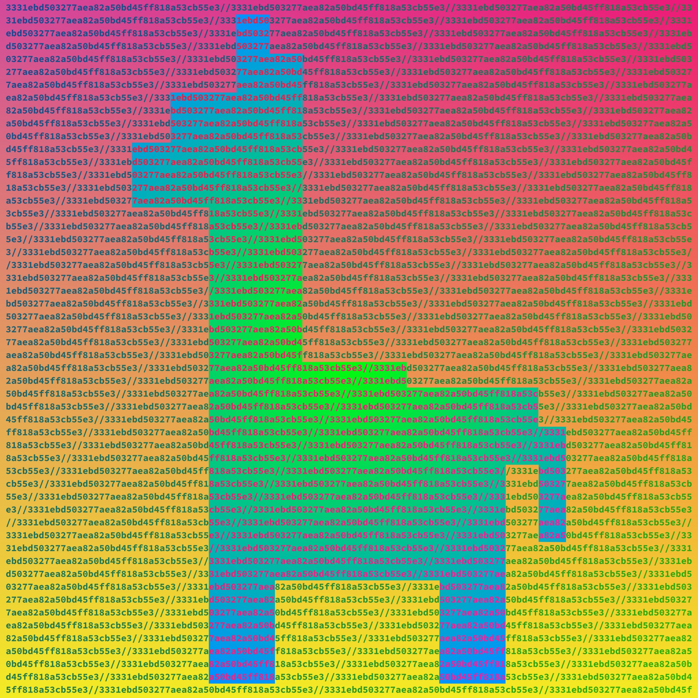

Tokens
=======

Tokens are an integral part of any cryptocurrency platform. They are tradeable assets, managed by smart contracts, holdable by any address. 

There are many different types of tokens, with their own value and use case. In this article, we're going to walk through the 4 main types of tokens, what they do, and why we need them.

How do tokens work?
----------------------
All tokens are simply complicated smart contracts. Owning Ether means having line in the blockchain history of receiving Ether. These contracts act more like a normal database you would see at a bank. Just as your bank's database says "x person's account has y amount of money", these contracts work the same way.

The smart contract maintains a data structure and a collection of everyone's balances. There is an array in the contract, that maps an address to a balance. So when you receive 1 Chainlink, the contract merely says: *add 1 to this address' balance*. This address can be a user or a contract. When your wallet says you own 1 of these tokens, it merely checks the contract for your balance, and tells you.

Because they are contracts, all token transactions must be paid in Ether. This is why the cost may be different. An Ether transfer costs ``~21,000 gas``, but a chainlink token transfer may cost ``~65,000 gas``. This must be paid in Ether only. This is also what I mean when I say the price of Ether is tied to the popularity of the network. You can't use one without the other. Be aware of this before attempting to make transfers you cannot pay for. This also means that anyone in the world anywhere can build and deploy a token.

There is also a permissioned element, that allows you to delegate control. Much as a bank will allow you to authorize someone to spend on your behalf, this works the same way. You can delegate permission to another address to spend a certain amount of money on your behalf, an *allowance*. This is often used by smart contracts such as uniswap. Let's assume you own ``100 BAT token``. If you want to trade for example: ``50 BAT`` for Ether, you would authorize the Uniswap contract to spend ``50 BAT`` and move it elsewhere. When you do, the BAT contract removes ``50 BAT`` from your balance, and also takes away ``50 BAT`` from Uniswap's allowance. This allows contracts to move funds around and do complicated things for you.

The way these contracts are built are known as *Token Standards*, a functional, minimum, and uniform specification for the token's functionality. There are many, but the two main I'll be discussing are Fungible (ERC-20) and Non-Fungible (ERC-721, NFT's). ERC-20 stands for Ethereum Request for Comments. 

ERC-20 (Fungible)
------------------

The `ERC-20 Token Stanard <https://ethereum.org/en/developers/docs/standards/tokens/erc-20/>`_ is all about fungibility. Fungibility is the concept of how two assets of the same class are interchangeable. Take out a dollar bill from your wallet. That $1 dollar bills is fungible. This means that it can be traded for another dollar bill at the bank and have the value be the same. It is replaceable. Ether is fungible, because all Ether is exactly the same and replaceable. From a uniqueness perspective, your Ether is exactly the same as someone elses, and therefore has exactly the same value.

New ones can be created and be exactly the same as previous ones, meaning they are cheap and easy to produce (gas wise). This is how most tokens are (Chainlink, BAT, Uniswap, etc.). 

Because they are all the same, they are often the ones used in governance in utility. For example, using a chainlink oracle. By sending chainlink, you are entitled to use their services based on how much. Given that these are in high demand, having all tokens be of equal value is important. The same goes with governance. You vote on something by depositing your tokens into a contract. The more tokens you have, the more voting power. This makes it efficient to determine the results by a simple tally for-or-against something. All of these things could theoretically be done with Non-Fungible tokens, but it would be a mess to implement.

ERC-721 (Non-Fungible) (NFT's)
-------------------------------

This is the one you've probably heard about. It's what NFT's are, Non-Fungible-Tokens. Unlike the ERC-20, every one of these is unique, because it has a tokenId, essentially a tracking number. Each one of these has what's known as a *"URI"* (Uniform-Resource-Indicator). This denotes its uniqueness, as no-two tokens can have the same one. This tokenId, is used to recover the information related to this token. If the token represents a GIF, then the Id is used to recover the paintaing.

However, this information is not stored on the chain. If your token is ownership of a GIF, it would be incredibly expensive and difficult to store on-chain. The token ID is merely used to identify a location, off chain, where the info is held. Let's take this GIF example again. Let's say the GIF you own is stored on a database somewhere, maintained by a company, that also faciliates auctions and sales. They generate some publicly-accessible API data about that GIF, its properties, and its ownership and put it out on the web. Your tokenId is the link to this data, which includes the location of the gif you own. This information will be unique, so it can't be reproduced. Let me show you an example. 

This is an image (shrunken) created by artist `HashHead <https://rarible.com/hashhead>`_, and available on `Rarible <https://rarible.com/token/0x60f80121c31a0d46b5279700f9df786054aa5ee5:878395?tab=details>`_. It's token ID is ``878395`` and the contract that keeps track of it is `0x60F80121C31A0d46B5279700f9DF786054aa5eE5 <https://etherscan.io/address/0x60f80121c31a0d46b5279700f9df786054aa5ee5#readContract>`_.

When we look up the tokenURI, the contract gives us `this link <https://bafybeigxtcy3bxztt5ohu4dcsuodwpnhluiu76d65uc4r3i55f6ysznxtq.ipfs.dweb.link/>`_. This URL is unique, and determined by a service known as the `Interplanetary File Service (IPFS) <https://ipfs.io>`_. It contains the following data (JSON)

.. code-block:: json 
	
	{
		"name": "SHA-Llama #9",
		"description": "SHA-Llama #9 of 10. Created using the SHA256 hash of the scaffold-level genome assembly of Lama glama (llama). Genome assembly can be found at https://www.ncbi.nlm.nih.gov/datasets/genomes/.",
		"image": "ipfs://ipfs/Qme5i8CawAVEvUNkHBgAq9JWBKAJHsqbeFScmJtbSBQkui/image.jpeg",
		"external_url": "https://rarible.com/token/0x60f80121c31a0d46b5279700f9df786054aa5ee5:878395",
		"attributes": [
			{
				"key": "Size",
				"trait_type": "Size",
				"value": "15000 x 15000 px"
			}
		]
	}

As you can see, there's a field called *image*. Visiting it pulls up the image I have displayed above. The point of this is that as the application Rarible hosts the image and a way to determine that you are the owner. Anyone can copy it, but the original version is there and identifiable. 

**"Couldn't I just download the image and make my own NFT out of it and then it's not unique anymore?"**
	So you could try, but you would run into a few problems:
		#. The link above, generated by the IPFS is unique, because it's a hash. This means it's procedurally generated based on the content its hosting, and even changing the data by one letter would create a totally different one. If you were to try and upload the exact same image to rarible, it wouldn't work because the resulting link, and therefore tokenID would be the same. You would have to alter the image or the name in some way, which would make it a different NFT. If you changed the name, the image would be the same but the link would be different. 
			- How that effects the value is a more complicated question. Part of what makes a painting valuable is recognizability. If you could copy the Mona Lisa exactly, but it's name had to be something like *Mona Lisa #2*, it wouldn't be worth much because it's not the original. 

		#. The site could theoretically put in a system to try and prevent you from uploading the same image. I don't know if any do but they could try.
		#. You could get sued for copyright infringement and/or theft of intellectual property . Not saying you would but it's always a possibility, especially if you tried to sell it. 
		#. You could try to upload it to another NFT platform, but there's always the risk that it would be less popular and not worth much. Someone else could also come after you again on that platform, because they can prove they created the same artwork somewhere else.

	NFT theft is a real issue, and one of the reasons that artwork is not always the best use of NFT's. This is why many have suggested updates to the protocol that would include identifying information on-chain.

	Unfortunately, this is one of the few parts of cryptocurrency that cannot always be decentralized, because it relies trust a central entity to mint and disperse new NFT's. This is a system that partly *relies on human enforcement*. Using this for non-artwork projects such as concert tickets or vaccine passports this system is not susceptible to this kind of forgery. This is because you wouldn't be able to just create a new platform for vaccine passports or concert tickets and have it be recognized. If you bought a ticketmaster ticket NFT, you couldn't just create your own ticket master and fake ticket, because the venue would check based on the ticketmaster contracts. 

	This is more of a technical explanation of how they work, now what they're capable of or why they matter. I've done that work `here <https://thecryptoconundrum.net/introduction/picking_coins.html#nft-s>`_

Stablecoins
-------------

Stablecoins are arguably one of the most essential aspects of the DeFi space, and an important aspect of increasing adoption. Like the name suggests, their value is *stable*. It is pegged to the value of a real world asset, and therefore doesn't fluctuate. Most of them are pegged to the **US Dollar**. They do a very good job of maintaining their value, and have never fluctuated more than 1 or 2 cents from them. They are ERC-20 tokens, and they can only be minted by first locking up other assets with an equal value. Some are centralized, and issued by trusted entities, and some are minted through oracle price appraisals and managed by DAO's. They have different systems, but all rely on 2 main sources to stay stable.

There is stability because people believe it is stable. I know it sounds circular, but hear me out. Like all cryptocurrencies, their price is determined by supply and demand; what people will buy and sell them for. They stay stable because nobody believes the price is going to dramatically rise or fall. Nobody buys for ``$0.98`` because nobody will sell it for that. Nobody sells for ``$1.02`` because nobody on the other side will buy it because they know it's only worth ``$1``. 

The more stablecoins there are, the better this system works. This is through what is known as *arbitrage*, and takes advantage of the nature of multiple coins and exchanges. It occurs when prices on two different platforms diverge, and you can buy low on one and sell high on another, for the same asset. If the value of *US-Dollar Coin ($USDC)* suddenly goes up to ``$1.005`` on *Uniswap*, but has stayed at ``$1`` on *Balancer*, then traders will immediately trade other stablecoins for USDC on *Balancer*, and sell it on *Uniswap* for a profit. This drives the price down on *Uniswap*, and back towards equilibrium. With more exchanges and coins, this makes it easier for arbitrage to occur and thus keeps more stable pressure on the coin.

The second thing keeping these coins stable, is that they are collateralized. This means that their value is minted only by locking up an equal value asset. For some, this locking and distribution is done through a central entity. This is how `Tether <https://tether.to>`_, operates. You send them fiat money, and they give you the `Tether Stablecoin <https://etherscan.io/token/0xdac17f958d2ee523a2206206994597c13d831ec7>`_. This is also how `US Dollar Coin <https://www.coinbase.com/price/usdc>`_ operates, operated by Coinbase. They will mint new tokens when receiving money, and burn it by paying back out in fiat.

Then there's **Dai**, a stablecoin controlled by Maker (a DAO), controlled entirely on chain. Dai is generated through a financial instrument called a *Collateralized Debt Position (CDP)*. Think of it like taking out a loan, except decentralized. To mint new Dai, a user must first deposit a crypto-asset into what is known as a *Maker Vault*. This is your collateral, and the protocol generates a debt, in Dai. The amount you deposit, is an overcollatoralization. This means you deposit more value than you receive back in Dai. This is a debt, and to get your collateral back you have to repay the outstanding Dai, plus a stability fee that accrues on your outstanding Dai. The reason you have to overcollateralize, is to ensure that Dai stays stable. If your only collateralized an exact amount, a rapid price crash of the underlying asset would severely devalue the Dai it generates. Only doing it this way allows the price to stay stable at ``$1`` even in the event of an Eth price crash. We just saw this occur when eth dropped from ``$4.4K`` to ``$2k`` but Dai didn't waver. If the amount of your collateral drops below the value of the your outstanding debt, it is automatically liquidated through an on-chain auction. Kind of like storage wars. If you don't pay your storage fees, they auction off what's inside it. The value of collateral deposits are determined by `oracles <https://thecryptoconundrum.net/introduction/important_terms.html#technology>`_. There is also a governance token, `Maker ($MKR) <https://makerdao.com/en/governance>`_, which is used for dao members to decide things like collateralization rate, oracle selection, and liquidation procedures. 

This is a very brief explanation. The long details of Maker are so complicated they could take an entire post. I suggest you check out the `whitepaper <https://makerdao.com/en/whitepaper>`_, for a fuller understanding.

Wrapped Tokens
---------------

Wrapped Tokens are an interesting use case for token standards. Creating one is known as tokenization, the digitization of a different digital asset onto the Ethereum blockchain. It is an ERC-20 version, of a different, non-native asset. Any cryptocurrency that wasn't already on the Ethereum blockchain, can be tokenized as a wrapped token. I'll give you the two most popular examples.

Wrapped Ether: 
	It's literally just `an ERC-20 version of Ether <https://weth.io/>`_. To get it you deposit Ether into the contract, and receive an exact amount of wrapped Ether (wETH). It works the other way as well, converting wrapped Ether back to regular Ether at a ``1:1`` ratio. However, you cannot use it to pay transaction fees. Its function is to make it easier for smart contracts to trade Ether. When some of the original decentralized exchanges were being built, the developers found it extremely difficult to build in support for both ``ERC-20 <-> ERC-20`` swaps and ``Ether <-> ERC-20`` swaps. By tokenizing Ether, they can build one set of protocols for all swaps, and make both yours and their lives easier. Because of its importance to decentralized exchanges, DeFi protocols, and smaller supply, it often has a much higher return for providing it as liquidity.

Wrapped Bitcoin:
	The `tokenization of Bitcoin <https://wbtc.network/>`_. If you've heard of the phrase "Bitcoin on Ethereum", this is what it refers to. It's an ERC-20 token that is exchangeable for Bitcoin at a ``1:1`` ratio. It was created to allow Bitcoin holders to participate in DeFi by lending it out and providing liquidity. It typically works by exchanging through a trusted custodian who holds both wrapped Bitcoin (wBTC) and regular Bitcoin (BTC). Trading in BTC means minting new wBTC, and exchanging back to regular BTC means burning wBTC. It is maintained by a DAO and has a fully verifiable system with proof-of-reserves, as every wBTC is backed by regular BTC. While this system is centralized now, there are people working on solutions to decentralize it later instead of trusted custodians.

Any asset can be wrapped, as long as someone is willing to act as custodian, and there are already many other wrapped coins such as: wrapped-monero (0XMR), wrapped-filecoin (WFIL), wrapped-Zcash (WZEC), etc. 

There is also a movement gaining popularity on what is known as a `security-token <https://thesecuritytokenstandard.org/>`_. These would represent the digitization of a real-world asset, or security such as a stock. It follows a different token standard known as ERC-1400. They are still very new and not widely adopted yet, so I may return to this article to update it if necesarry.

