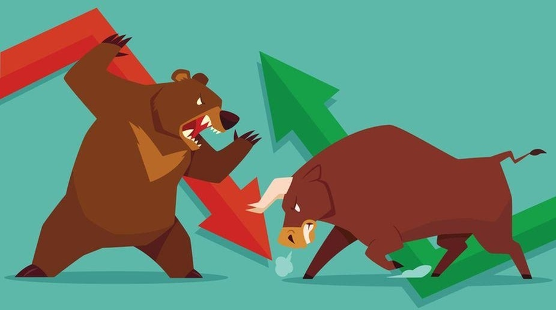

General Strategy
=================
So you've decided to take the plunge and bought some cryptocurrency. The big question is, what now? That's the question you need to answer for yourself, and will vary wildly depending on your risk tolerance, timeframe, and goals.

General Rules
--------------

There are a few rules that I think should generally apply to all trades. I'll explain each one in more detail below

#. Never Invest more than you are willing to lose.
#. Define your exit Strategy. 
#. Do your DD (Due-Dilligence) before buying.
#. Ensure your investment is safe.
#. Be confident.
#. Diversify.
#. Staking. Set it & forget it.

Let's talk about each one of those a little more in depth. 

Investing more than you are willing to lose
-----------------------------------------------

Prices won't go up for forever. We're in a bull-market right now (Summer 2021), and it's not hard to throw a stone and make a profit. At some point things will come back down. Understanding your tolerance for risk is a crucial part of being a successful investor. If prices go down and you begin to seriously sweat, then it may mean you are overleveraged. The goal of crypto investing is to make money. If your entire life savings are locked in one coin, you are taking a risk that might be too high. If you're willing to lose it all, then go for it. Otherwise, stick to spending money.

This is also why Dollar-Cost-Averaging is an often ideal strategy. By buying in in small and consistent amounts, you're building leverage without over-exposing yourself.

For Reference: 

Bull Market
	When the market is going up. Think of a bull. Their horns swing up when they attack. 

Bear Market. 
	When the market is going down. This is cause the bear-claw swipes down from the apex of its body.

