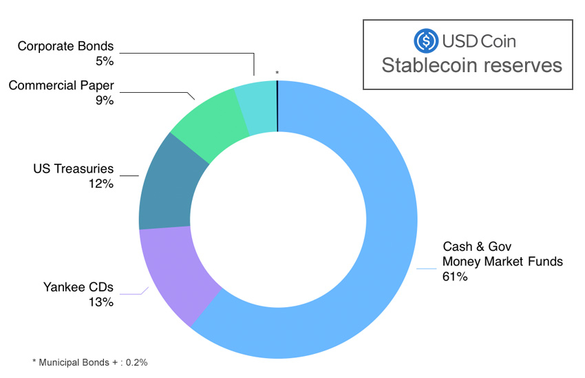
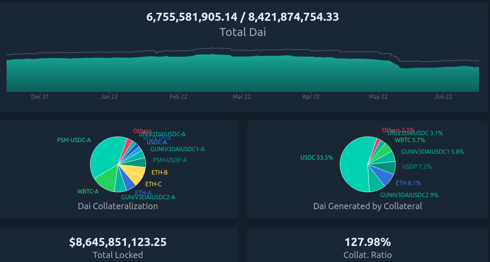
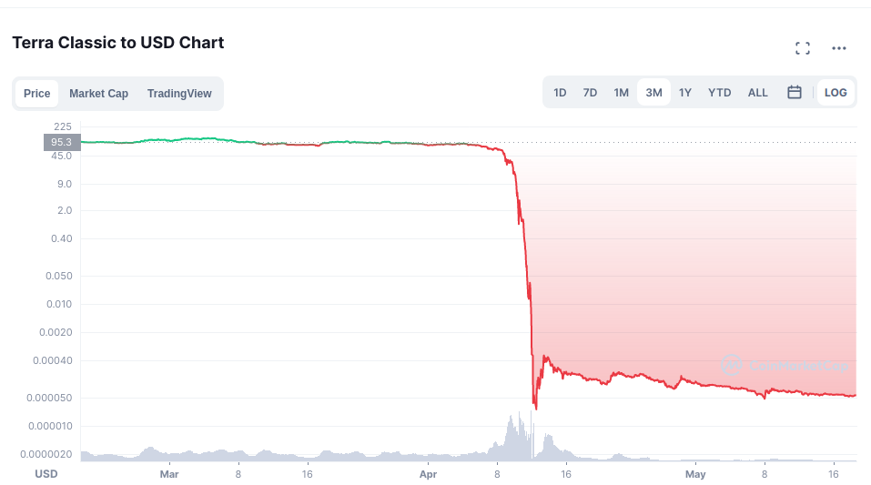
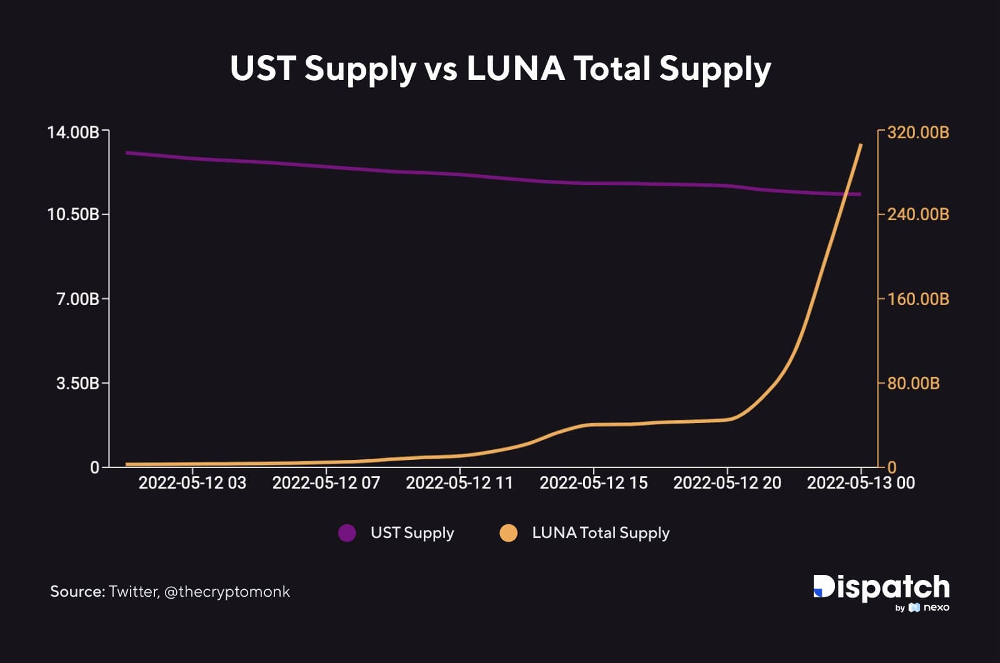
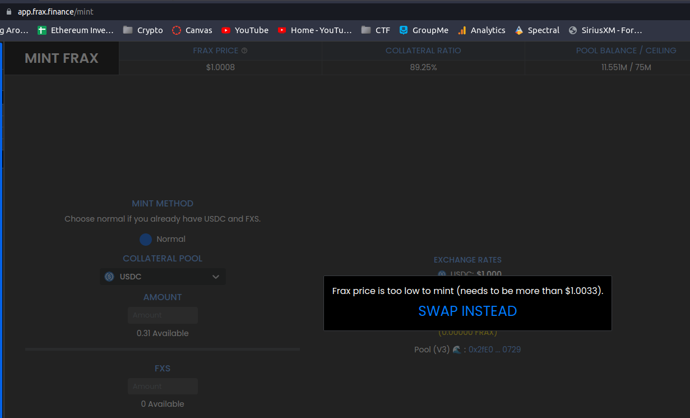

Stablecoins
==============

Introduction
---------------

Cryptocurrency markets are fickle. It's not uncommon to see ±10% swings in one day, with markets falling 50% in a week only to recover the week after. In addition to being a difficult investment, it makes it even tougher to use for its intended purpose, to exchange for goods and services. It's no surprise that businesses are hesitant to accept it for purchases when your $100 of Bitcoin today could be worth $75 tomorrow. In order to reach a critical point of mass adoption, crypto needs to become more stable. However, to make 1 BTC or 1 Eth worth $1 would mean radically changing the economics of the system with no guarantee is actually maintains that price. The solution isn't to change Ethereum or cryptocurrency's fundamentals, but rather to look to the applications of the blockchain itself for stability, Stablecoins. 

If you've followed the news in the last few years you've probably heard about stablecoins from one source or another. You may have heard about `tether and its rocky history <https://decrypt.co/54693/tether-controversy-brief-history>`_, or how `UST and LUNA crashed recently wiping out $40 Billion in crypto in one day <https://www.coindesk.com/layer2/2022/05/11/the-luna-and-ust-crash-explained-in-5-charts/>`_, but you might not of heard about more successful ones like `Dai <https://makerdao.com/>`_, the $6 Billion stablecoin run completely by an `On-Chain DAO <https://thecryptoconundrum.net/dapps/daos.html>`_ or `Frax <https://frax.finance/>`_ which is modelled after the current US-Economic System. Stablecoins play an essential role in the financial systems enabled by cryptocurrency. It's estimated that the stablecoin market alone comprises some `$160 Billion <https://www.reuters.com/business/finance/what-are-stablecoins-asset-rocking-cryptocurrency-market-2022-05-12/#:~:text=Stablecoins%20have%20a%20market%20cap,trillion%2C%20according%20to%20CoinMarketCap%20data.>`_, placing it in one of the `top 1/3 of economies on earth <https://worldpopulationreview.com/countries/countries-by-gdp>`_ meaning it's not going anywhere. So let's investigate what exactly these mystical financial instruments are and why they matter.

.. image:: images/stablecoins/stablecoin_market.png

What is a Stablecoin
-----------------------

Before we begin, it's important to define a stablecoin and how it operates. For all intensive purposes we can define a stablecoin as the follows

*Stablecoin - A cryptocurrency whose price does not fluctuate beyond a certain range, and which is typically pegged to the value of a real-world items such as a another currency or asset*. 

In most instances this asset is the US-Dollar, however you could make one that is pegged to another item such as a stock or something physical like an ounce of gold, as long as its price stays within an expected range. For the purposes of our explanations we're only going to focus on ones pegged to the US dollar. If the stablecoin has maintained its peg than it has stayed within its expected price-range. Since we're talking about relation to US-Dollars, this typically means that its price on the open-market stays within ``$0.995`` and ``$1.005 (± .5 cents)`` 

.. image:: images/stablecoins/usdc.png

How do they work
*****************

A stablecoin maintains its value through the use of a *peg*, I.E that it is tied in price to another asset somehow.

There are two kinds of pegs:

1. Hard Peg - When value is backed directly by some underlying asset. Think of it like the gold-standard. One dollar meant a certain direct amount of gold, so the value was always *hard-pegged* to something else, and one dollar always meant some amount of gold. In cryptocurrency it means ``1 stablecoin = 1 actual USD``. 

2. Soft Peg - This is more conceptual, and its when the value of the asset is more free-floating. There's no direct asset backing the currency, but its price stays within the expected range of the asset its tied to due to market forces. This is more like our current economic system. The US-dollar isn't backed by any hard asset, but rather is soft-pegged to it. When the item it's soft-pegged to goes up, so does the value of the currency by market-forces. 

Both of these systems have pros and cons. Of all the things I state on this website that I am **not**, one of them would be an *economist*, so i'm not going to go through all of them right now. Both of these peg systems can be used to maintain a stablecoins' price-stability. Now in general, you would think that a hard-peg is always preferable, because the value is backed by a real-world asset that maintains its value. However, achieving that is actually more difficult than you would expect, which is why we have soft-pegged assets.

Before we begin I want to tell you a story

Bank-Runs
----------

It's 1929 and you're an American citizen making the economically responsible move and saving your money. You go to your bank with $100 of hard-earned wages and deposit it. While you're there you see your friend also depositing their $100 paycheck they just got. In exchange they give you a little deposit slip showing you deposited $100 and giving back the slip to reclaim your money from the bank. You chose this bank because they offered you interest, maybe 5% annually, and you want to take advantage. The bank can afford this by loaning out part of your money to others in exchange for interest, and they give a little percent of that to you.

So now the bank has gotten $200 in deposits from you and your friend. However, the bank manager got greedy; of the $200 they got today, they loaned out $150 of it, so they only have $50 left in their reserves. Suddenly the guy they loaned the money to defaulted and can’t pay it back and they don’t have enough to cover both your balances. Now you and your friend both have deposit slips worth $100, but the bank only has enough money to pay out $50 to the first person who tries to withdraw. Whomever gets to the teller-window first can withdraw the $50, and salvage some their money, but whomever is second is stuck with a deposit-slip they can't exchange for anything. It’s now worthless. 

Other customers see these people racing eachother to withdraw their money and realize what's going on. Suddenly they're afraid that the bank won't have enough reserves to give them back their cash. Observers begin to panic and rush to the bank, enticing everyone they pass along the way until eventually the whole town is banging down the doors trying to recover whatever money they can. The people at the front of the mob get some or all of their money back, and those at the back get nothing. 

The frenzy subsides and the bank is out of money. Some people are left holding deposit slips, which can't be converted for real-money anymore, it is worthless and there's nothing you can do.

This is the story of the US' Great Depression, known as `a bank-run <https://www.investopedia.com/terms/b/bankrun.asp>`_. In the crypto-world it is perhaps the single greatest threat to any stablecoin. A bank run on your coin means almost 100% chance of death, and preventing it is crucial. For as long as cryptocurrency has been around, the most important issue has been creating a stablecoin capable of holding its value, even in the event of a bank-run. 

.. image:: images/stablecoins/bankRun.jpg
        :width: 500 px

As a result, the cryptocurrency community has come up with 4 designs for stablecoins:
1. Over-collateralization
2. Full-Collateralization
3. Partial-Collateralization
4. No-Collateralization

When you hear collateral, think *"backing"*, how much of some other asset is backing this stablecoin, such that you can redeem your stablecoin for it. Some coins it might be 1-to-1, others might be nothing. 

Let's look at how these all work

Full-collateralization (USDC & USDT)
---------------------------------------

This is the easiest to understand, which is why it's first. It's very simple

**For every 1 stablecoin in circulation, there exists 1 real US-Dollar somewhere else. If you lock up one USD in the real-world, you can create one stablecoin on the blockchain. If you burn (take out of supply) 1 stablecoin, you can redeem it for 1 USD somewhere else**

Since there is always a ``1 <--> 1`` relationship between the stablecoin supply and its backing then the price stays the same. If I can always redeem one stablecoin for exactly $1, then the price stays the same at $1. Nobody is willing to buy it for me for ``>$1``, and i'm not willing to sell it for ``<$1``. Therefore, since supply and demand is always at $1, then that's where the price stays. The system is built to absorb the shock of a `bank run <https://www.investopedia.com/terms/b/bankrun.asp>`_, where everyone tries to cash out their assets at once but you want people to be able to withdraw without it crashing the price. With full-collateralization, it doesn't matter how many people try to cash out or sell their stablecoins, since it is theoretically **always backed by and worth** one USD.

The problem with this model is that it relies on a centralized-entity to handle the US-Dollars. Some company somewhere in the real world needs to be responsible for collecting dollars from customers and issuing them stablecoins, and on the other side needs to be responsible for trading 1-stablecoin back for $1 in the real world. This is a more difficult task than it seems. The two main-players in this arena are `tether ($USDT) <https://tether.to/>`_ and `US-Dollar-Coin ($USDC) <https://www.circle.com/en/usdc>`_. 

The existence of these entities are centralization risks. If people are using stablecoins like Tether or USDC to pay for things or as collateral to take out loans, then the entire economy becomes on the underlying assumption that those companies will always be able to convert your stablecoins back to dollars. Now, you could be a well-run company that allows external auditors and reputable institutions to `audit your reserves and attest to their validity <https://www.centre.io/usdc-transparency>`_, but you're not required to do that, and its a difficult and expensive process and you run a business to make a profit. The system very quickly runs into problems because of one simple issue, people are untrustworthy. 

If you tell people you're fully-backed they may believe you, and if you start minting new stablecoins, people might just believe that and continue using your coin. WMaybe you collect all this money from people, and then you want to do something with it in the meantime, like investing in stocks or bonds to earn a modest yield. Yes your coin would be backed by something, but not dollars. If there's a bank run then you don't have the liquid reserve to pay people back and suddenly the stablecoin isn't worth anything anymore. What happens if the asset you're using like a stock drops in value, then you're suddenly unable to repay people who bought into your system and it's not worth anything. What happens if you just lie about how much collateral you actually had? Nobody would know otherwise. These are all legitimate concerns.

Decentralization is often the number-one priority in crypto, but coins like Tether and USDC are famously *not*. This is a problem, but raises questions about what level of decentralization people are willing to accept. The US-Dollar is backed by faith in the US-Government. Yes it's centralized, but also quite unlikely to collapse anytime in the near-future, so we accept this amount of centralization in exchange for stability. Centralized stablecoins like these are simply an extension of this concept.

This is the (crypto) conundrum (pun-intended), that *the most economically-secure way to maintain stability is not necesarrily the most likely to work successfully, or be the best*. The scenarios I have just described to you are not made up. USDC is run by a company called `Circle <https://www.circle.com/en/>`_. They have a very good reputation in the cryptocurrency community because they are transparent about their business. They perform regular audits of their reserves and their leaders are public and reputable figures. As a result, even in the worst of crashes USDC has never lost its peg. You can even `read their audits filed with the SEC <https://www.sec.gov/Archives/edgar/data/1876042/000110465922056979/tm2124445-8_s4a.htm#fCBS>`_.

On the other hand you have Tether (USDT). Tether has been mired in scandal for a long time. Tether was outted in the past over the discovery that it `lied about its reserves <https://www.bloomberg.com/news/features/2021-10-07/crypto-mystery-where-s-the-69-billion-backing-the-stablecoin-tether#:~:text=In%20February%202019%2C%20Tether%20revised,third%20parties%2C%20which%20may%20include>`_. While they did have some USD in their treasury, they weren't 100% backed at any time. Instead they used dubious legal-ese and sometimes outright lies to cover this up. They were taking the money people used to mint new tether, and putting it into assets like bonds. While bonds like US-Treasury are extremely low-risk, it still is a threat in the case of a bank-run that they wouldn't be able to cover the outstanding balances of the people who held it.

*Hold on, if it's not backed by anything, and people knew this, why has it stayed at $1 for the last few years?*

Because its being held up by faith in it through the free-market. Essentially, even though it's not backed, the trading of Tether on the free market can keep its price in check. I'm gonna explain this more when I talk about other coins so just hold tight. However, this also means that tether is extremely vulnerable not only to a bank-run, but a general loss in faith. If people stop believing in Tether being worth $1, then it stops being worth that. At this point, I would argue that tether is simply *too big to fail*. As of May-2022 (post-crash), Tether still has a market-cap of ``$73 Billion``, making it the third-largest cryptocurrency overall. The amount of loans that tether is used to collateralize, the amount of trades it provides liquidity for, etc. is so large that people are still using it because the effects of its decline could be potentially catastrophic. Do I think that is is sustainable? I'm not completely sure, but the precarity of tether and it's poor credibility are why I choose not to use it. 

I'm not going to go into a full history of Tether and USDC right now, but it's important to understand how it works before we talk about our next kind, Over-collateralization.

Over-collateralization (Dai & sUSD)
-------------------------------------

We've already established that having some kind of asset fully-backing our stablecoin is crucial in maintaining a peg, but what happens if we take it further and increase our backing. What would happen if we instead back all of our stablecoins at **2-to-1** or even **3-to-1**? It would make it more stable because it is even better at absorbing the impact of a bank-run or price-crash, because even if the price of the stablecoin dropped 50%, it would still be redeemable for $1 of USD right? In theory, yes. The issue is that no company wants to be responsible for that kind of overhead. The company needs to get money from somewhere and no customer wants to hand over $20 to Tether only to get $10 in crypto. Luckily, we have a way to perform the same basic functions as a company, without centralization risk, and entirely on-chain. These are the Over-collateralized stablecoins, such as `Dai <https://makerdao.com/>`_ and `sUSD <https://messari.io/asset/synthetix-usd/profile#:~:text=Synthetix%20USD%20was%20previously%20known,token%20on%20the%20Ethereum%20blockchain.>`_. 

In simplest terms, to allow the creation of these new stablecoins, you must first lock up some kind of collateral that is worth more than the amount of crypto you wish to receive. To mint ``100 Dai ($100)`` into existence, you first need to lock up **$250 of Ether or other Crypto**. You incur a *debt*, and when you repay your debt (plus some interest) you get your collateral back, much like a loan. When I burn (take out of existence) my 100 Dai, then the system releases my $250 of crypto back to me.

*Debts, Over-collateralization, loans, etc. This all sounds very scary and kind of sketchy. Why would I want to spend $250 to only get back what is essentially $100?*

So two things to remember. First, is that this is the process by which new stablecoins (sUSD and Dai) are created and removed from existence. As a consumer, you don't ever need to interact with this part of the process. You can simply purchase Dai or sUSDT on the open-market and do what you like with it without ever needing to deal with any of this. 

Second, to the people locking up their collateral, it is in fact a good deal, much like a loan. Let's say I have ``$1k Ether`` sitting around and I want to use it to do something, like buy something. Well I don't want to sell my Ether cause I think the price will go up, so if I sell it to buy a house well I miss out on growth. Instead I can do what's effectively taking out a loan in Dai, and then just pay back the loan at whatever the interest rate is. I pay back this loan in Dai, and get my ether back. When the loan is over all the Dai I had previously minted is now out of existence, keeping supply in check, and i've got my Ether back. 

*Sure that makes sense, but why do I need 250%, that's high especially when a down-payment on a house is only ~20%?* 

That is actually meant to protect not only you, but the protocol itself. By Over-collateralizing, you can put up riskier collateral. That way even if your collateral drops in value by a huge amount like 40%, your collateral is still worth more than your debt and you won't default. If the value of your collateral goes up then you get more time to repay your loan cause the collateral is rising faster than interest. As long as your collateral is worth more than your debt, you always come out ahead and never functionally have to pay it off. If your debt becomes greater than your collateral, then the system automatically liquidates your collateral for you, and uses it to pay off your debt automatically. I won't go into the complexities of how it does that but you can read about it `here <https://docs.makerdao.com/smart-contract-modules/dog-and-clipper-detailed-documentation>`_.

Normally a home has a lower interest rate because houses typically don't drop in value by 20%, and the bank can afford to give out risky loan because the other non-risky loans it gives out will ccover it if you default. This is why we have credit scores. But crypto doesn't have an entity like that looking at your history and risk of default, it needs a way to ensure that even if you can't pay your loan back or the price of crypto falls, it's always got enough in its reserves to back the stablecoin. 

As you can see from the above chart, there's 6.7B Dai in circulation, but backed by 8.4B in various forms of collateral. It's all auditable on-chain to show that all Dai can be redeemed by some form of equivalent collateral.

However Dai, sUSD, and even others like Frax rely on one other market-trick to maintain the price, **arbitrage**.

Arbitrage
************

Arbitrage is a financial maneuver where traders take advantage of the price discrepancies on multiple markets. For example, if I buy Ether at ``$1k/Eth`` on *Exchange-A*, and then sell it for ``$1.1k/Eth`` on *Exchange B*, then i've made a profit of *$100* on each Ether I bought and sold. However, since I've bought ether on one exchange, that should push the price up because of a higher-demand/lower-supply. Since I sold it on another exchange it pushes the price down because of higher-supply/lower-demand, until the prices converge back to each-other at ``$1050/Eth``

The same logic applies to stablecoins. Since there exists many different exchanges for crypto, and many different coins to exchange for, it makes it possible to use arbitrage to keep the prices within range. If the stablecoin starts trending below its peg to ``$0.99``, then I should start buying it because odds are I will be able to either sell it somewhere else for ``$1`` or exchange it for another stablecoin also worth ``$1``. When thousands of people start to do this with millions of dollars in fractions of seconds, the price never gets a chance to go off its peg. 

This is why its so important to have multiple stablecoins, of different types of collateral. The existence of multiple coins all on their peg is what enables arbitrage to work, since selling one asset means exchanging for another on-chain. It only works if you can exchange ``$0.99 of Dai`` for ``$1 of USDC``

.. image:: images/stablecoins/arbitrage.png

Governance
************

Since our stablecoins are entirely-decentralized, it needs to be governed somehow, so that changes can occur. This is where the second-token comes into play. Dai is run completely by a DAO, known as `MakerDAO <https://makerdao.com/en/>`_. Holders of the token can vote on changes to the protocol like what the collateral-rate should be or what rewards to pay out. 

Rewards
~~~~~~~~~~

Maintaining a stable-peg requires at least some hands-on policymaking. This is where MakerDAO comes in. You may remember that people paying back their Dai-loans pay interest, but I didn't mention where that interest goes to. Well, it goes back to the community. If I lock up my Dai, for varying amounts of time, I can earn rewards on it in the form of more Dai. If I make my Dai illiquid, then I get more Dai. This is an incentive system that is meant to incentivize you to not only think long-term, but to take Dai off the market and prevent supply from going too high. This is known as the *Dai-Savings-Rate (DSR)*, because its the rate of return I get for saving my Dai. The longer I save, the more I earn. But why does this matter? If the community feels the supply of Dai is too high, presenting an inflation risk, then they can increase the DSR to convince people to save, and thus lowering supply and bringing price up. If they think the demand for Dai is too low, then they can lower the DSR to convince people to use their Dai in the economy because its not economical to save. Since all these DSR rewards are being paid out of existing interest, it's not inflationary to pay out rewards because the amount of backing stays stable. Owning MakerDAO (the governance token) also plays a role in maintaining this peg, which I'm not going to go into too deep here. 

sUSD works a similar way, using its governance token `Synthetix <https://synthetix.io/>`_, and involving higher collateral-rates as high as 400%.

.. image:: images/stablecoins/dsr.png

This isn't an exhaustive explanation of how Dai works, but outlines the basic principals. If there is interest I may do a deeper dive into how Dai works later since it's quite intricate. 

**As of May-2022, neither Dai or sUSD have ever lost their peg (± .5 cents)**

No-Collateralization (UST & LUNA)
------------------------------------

Before We can explain Partial-Collateralization, it's actually more important to return to it after we discuss No-Collateralization. You're probably familiar with this, through the recent decline of the LUNA token and it's associated stablecoin Terra (UST), in which the price crashed from $100, to $0.0006 in a matter of days. It's what is known as an *algorithmic stablecoin*, because the stability of the coin is the result of algorithmic market-moves, rather than the existance of exogenous-collateral.

\*Notice the above chart is in *logarithmic* scale, and just how much the value of LUNA dropped in such a short period.

By why did this occur. Up until this point we've assumed that the outstanding stablecoins are backed by something. In the case of Dai, it's backed by Ether. Ether is a free-floating asset, meaning its price isn't free to fluctuate however it wants. To ensure Dai stays stable, this collateral is greater than the outstanding Dai. However, remember that this Ether is *locked* in a vault, a smart contract on the ethereum platform, and made illiquid. When you burn your Dai the ether unlocks, but the total amount of ether in existence never changes. The amount of liquid ether changes, but the total amount doesn't. Dai is a token on Ethereum and its developers and system isn't at all associated with Ether, so even if 100% of Dai collateral becomes unlocked at once, the ``120M Ether`` in existence stays as ``120M Ether``, no *new* ether is created, which is what keeps the price of Ether from crashing.

Now I want you to imagine if instead of releasing previously locked ether, we literally created new Ether out of thin air. For every ``1 Dai`` we burned, $1 of Ether is created out of thin air. Well if everyone tried to redeem their Dai all at once, the supply of Ether would explode. This explosion of supply causes inflation, and the price of Ether starts to go down, because there's a huge influx of newly created Ether into the system.

Let's imagine a system where there's a supply of ``100 Ether`` and ``1 Ether = $100 USD``, making ``1 Dai = .01 Ether``. Now let's assume I'm a consumer who wants to redeem ``1000 Dai``, which at our exchange rate gets us

*1000 * .01 = 100 Ether* - We've created 100 new Ether out of thin air, and our supply of Ether has gone from ``100 -> 200 Ether``. Now that we've literally doubled the supply of Ether, each one is worth half as much ($50/Ether). The issue is that we've committed to always trading ``1 Dai = $1 of Ether``, so in order to maintain that exchange rate, we must print twice as much ether. If another consumer comes along and tries to do the same exchange (1000 Dai --> Ether), they would end up minting **200 additional ether**. So now this second guy has doubled our exchange rate again to a supply of 400-ether, making each one worth $25/ether. The value of our ether is worth 1/4 of what it was. 

This is a bank run, and exactly what happened to LUNA. The LUNA system is simple, every 1 UST (the stablecoin) can be redeemed for $1 of LUNA, **regardless of the price of UST**, and vice-versa. If ``UST = $1`` and ``LUNA = $2``, then burning my 1 UST results in the minting of 0.5 new LUNA. If UST falls to $0.95, then I should be able to buy UST for $0.95, exchange it for $1 of LUNA, and sell the LUNA for $.05 of profit. This new demand for UST was expected to stabilize the price. However, it means that UST is backed only by a free-floating asset which has a price capable of fluctuating wildly. This is where the core issue comes from.

Since your 1 UST can always be redeemed for $1 of LUNA, if the price of LUNA goes down, every redemption of UST results in more LUNA being printed. Since LUNA is the only thing seemingly backing UST, if the market loses faith in LUNA, then it loses faith in UST as well, and the system begins to crumble. Imagine if Dai was backed only by MakerDAO (the governance token of Dai). If the price of MakerDAO started falling, then Dai would become worthless as well because the asset you redeem Dai for is rapidly declining in value.

Here's the series of events that actually happened:

1. The price of UST (stablecoin) begins to fall significantly below its peg of <$0.99 (the reason isn't important right now)
   
2. People who hold UST see this happening and begin to trade UST --> LUNA. Since there's sell pressure on UST, the price of it starts to decline beyond the peg even more.
   
3. Since tons of new LUNA are being created, the price begins to decline significantly.
   
4. Holders of UST see that the price of LUNA is dropping, so with every minute, their UST becomes convertible into a currency **rapidly** depreciating in value. If you're the last person to redeem your UST, then you'll be redeeming it for currency with no value.

5. UST holders are redeeming UST for new LUNA, inflating the supply of LUNA, while those who already exchanged are trying to sell to cut their losses. The price starts to rocket towards zero as massive sell-pressure and newly inflated supply makes each LUNA worth very little. 

6. The price of LUNA and UST is crashing, and everybody wants off the sinking ship. Since nobody wants to buy a coin whose value is rapidly declining, there's nothing to stop the downward trend.

7.  The dust settles. Billions of dollars of UST has been burned to create Trillions in new LUNA. Each LUNA is now worth fractions of a cent with nobody to buy. It is worthless

*"I'm confused. If 1 UST = $1 of LUNA regardless of the price, then why does everything suddenly lose all it's value"*

1 UST is only worth $1 of LUNA, **if there exists someone willing to buy that LUNA from you**. When the price starts crashing, there's nobody on the other end of the exchange willing to buy your LUNA off you. At that point you're stuck holding LUNA as you watch the price crash and burn.

This is how bank-runs work. Everyone is afraid of being the last one through the door and stuck holding the bag. In this case, the last guy to sell all their UST is stuck with a stablecoin not worth $1, and exchangeable for a coin worth nothing that nobody will buy from them. Nobody wants to be that guy so they all panic and head for the exit, making the situation worse.

This is the problem of uncollateralized systems, there's nothing ensuring that the asset you trade it for will keep its value. In both Dai and Tether/USDC, we can be confident that there is always a system to ensure that the asset you're exchanging your stablecoin for has value. The USD that you exchange USDC for isn't going to suddenly overnight lose 50% of its value, and if it does we've got bigger problems.

So we've now established that you need to have some form of collateral backing your stablecoin to prevent a bank-run, but the question is *how much?*. This is where fractional stablecoins come into play.

Partial-Collateralization (Frax)
-------------------------------------

Up to this point we've seen varying levels of collateralization, either completely-backed or overly-backed. Historically they've been proven-working ways of maintaining a peg to the US-Dollar. But acquiring collateral is hard. They require people who have money already and want to lock it up. The question then becomes, how can we continue to maintain a peg while decreasing the amount of required collateral? What is the least amount of collateral we can require and still be stable? This is where the second *algorithmic stablecoin* comes into the picture. It's time to talk about `Frax <https://frax.finance/>`_, standing for *Fractional-Reserve*.

Now before I continue, I would like to remind everyone that **I am not economist.** My economic knowledge is based on one macro-economics class I took in high-school and self-research. I say this because these coins rely on complex economic systems I am going to do my best to explain, and may not be 100% accurate. 

I'm gonna let the creator of Frax tell you a short story before I continue

.. raw:: html

    <iframe width="560" height="315" src="https://www.youtube.com/embed/w5_91cCWFEQ?start=818" title="YouTube video player" frameborder="0" allow="accelerometer; autoplay; clipboard-write; encrypted-media; gyroscope; picture-in-picture" allowfullscreen></iframe>

Frax is interesting because it is algorithmic, allowing it to maintain its peg by essentially *reacting* to the market in order to stabilize itself. The frax protocol watches its price from on-chain exchanges (Uniswap, sushiswap, etc.) and only takes action *if* the price is moving. If the price always stayed at $1 it would never do anything.

The US federal reserve is responsible for controlling the money supply of dollars in the United States. When there's too much money, and there's inflation, the federal-reserve contracts the supply to raise the value of a dollar. When the value of a dollar is rising too much and the economy is constricting, it increases the money supply to bring back to equilibrium. That is, in the briefest way possible how the US monetary policy works. We're seeing inflation right now because the federal-reserve printed a lot of money, which decreased the value of the individual dollar. The solution is to raise its value by decreasing the supply of dollars making each worth more. Frax is built upon the same idea. 

When the price of Frax is too high, then the system allows you to mint new Frax tokens, using some collateral, thus raising the supply and bringing the price back down. When the price of Frax is too low, it allows you to redeem your frax for another asset, decreasing the supply of Frax, and bringing the price back to equilibrium. These mechanisms are **only available** when the price starts to diverge from $1.

Look at this screenshot I took of the frax app

You'll notice that the price is *$1.0008*, well within their peg, so no minting is necesarry OR allowed since the price is stable.

Now notice how in the below image, the price is *$0.9998*, well within their peg, but not low enough to all redemptions.

.. image:: images/stablecoins/frax-redeem.png

Frax is unusual because it isn't just a singular-coin, but actually works on a two-token model.

1. FRAX - The stablecoin, with ``1 FRAX = 1 USDC = $1 USD``
   
2. FXS - Frax Shares - The governance token of the frax-ecosystem. It allows you to vote on changes to the protocol. FXS has no peg, and its value fluctuates based on current market supply and demand.

FXS however does play a critical role in maintaining the Frax peg, known as the collateralization-ratio.

Collateralization Ratio
**************************

The entire system works because of a single value known as the *collateralization-ratio (CR)*. Remember that Frax is only *partially-backed*, meaning that the CR is the percentage of backing. If there's ``$100M Frax`` in circulation, and the CR is ``75%``, then the Frax treasury will ``$75M USDC`` of collateral. The collateralization-ratio fluctuates based on the market conditions to create stability through market-incentives.

Minting and Burning
~~~~~~~~~~~~~~~~~~~~~

In order to mint ``1 FRAX``, you need to first put into the protocol $1 worth of other assets. However, unlike Dai or USDC only a fraction of this is actual collateral, the rest is actually FXS-Token. Let's say the collateralization-ratio is *80%*. In order to mint *1 FRAX*, I need to lock up ``$0.80 USDC`` and ``$0.20 of FXS``. However, that 20-cents of FXS is actually burned. At ``80% CR``, if I burn my 1 FRAX, then I get 80-cents of USDC and 20-cents of FXS.

*If sounds like you're saying the value of Frax is really backed by this other token FXS? How does that make it fractional?*

It's fractional because the FXS token is burned when creating new Frax and minted when destroying existing Frax. It's not backed because the total amount of money in the ecosystem is staying the same. If we have *$10*, it's always worth $10, but it is being represented as different instruments. These different instruments are what allows the money supply to fluctuate. Think of it like a bank-note from the US-Government. If I exchange my $10 for a bank-note, that note is still worth $10 because the government ensures the exchange-rate, it's just in a different form. However, that bank-note is illiquid. There's no medium by which to spend it. By trading those notes on the market to increase or decrease the money-supply, it allows the value of a dollar to oscillate back and forth over the range. When the price is too low, you sell notes for dollars. The value of money hasn't really changed, but there's less overall dollars in circulation which causes the value of remaining dollars to rise. When the supply is too high, you buy back the notes for dollars, increasing supply and lowering the price back to equilibrium.

*"You just explained why exchanging stablecoins for a free-floating asset is a bad idea, because it fails under a bank run. How is this not problematic?"*.

That's a good question, and it's because of the collateralization-ratio (CR). The CR can change to be higher or lower. If it goes up, then your FRAX returns higher collateral. At a CR of *80%*, 1 FRAX is redeemable for ``$0.80 USDC`` and ``$0.20 of FXS``, but if the CR goes up to *85%*, then redeeming frax gets you ``$0.85 USDC`` and ``$0.15 FXS``. This is the anti bank-run measure. 

**If the price of FXS starts to fall, then the CR is increased. As the CR gets higher, there's less of an incentive to run for the exit**. This slows down the creation of new FXS, and prevents the bank-run. People panic and exit because they're afraid they won't be able to recoup lost value. Since the CR is going up, and people can redeem their FRAX for larger amounts of USDC (another stablecoin), rather than the free-floating FRAX, there's no panic to run towards the exit and mint new FXS. This halts the downard pressure of FXS, and encourages people to buy FRAX, to exchange it for USDC. You now have reversed a price-crash of the stablecoin by curbing fears, and inducing demand. 

There are other automated systems as well which are meant to automatically re-collateralize the system and ensure that any monetary changes occur automatically. They are beyond the scope of this article but if there is enough reception I will revisit it later. There are other aspects of the Frax ecosystem such as the Frax-Price-Index (FPI) which maintains a stablecoin pegged to inflation of the US-Dollar via off-chain consumer-pricing reports. However, I won't go into too much detail here about it.

Why does this matter
-----------------------

If you've read this far you're probably thinking the following to yourself

*"Ok so we've got crypto that maintains a stable price in some other currency, but who cares. Why do I need to know all of this nonsense about collateral and what can I do with it?"*.

And that's a valid question. The stability of these coins matters when you think about how we as consumers use money.

It's not that Etherereum and other crypto isn't useful as a medium of exchange, but that there's a sense of stability in the dollar. While inflation occurs, it doesn't happen ``±10%`` in a day, and that people are able to make longer-term plans about their finances. 

People want to transact in dollars. People don't want to buy things in Ether or Bitcoin or any other cryptocurrency that fluctuates. I don't want to pay for groceries in Ether because the price could drop between the time I buy Ether and when I pay for my food, leaving me with less than I thought. If i'm a business I don't want to accept Ethererum either, because suddenly the amount the person just paid me for my goods/services is worth less and I don't break even anymore. If I take out a loan with some collateral, I don't want my collateral to rapidly depreciate and cause it to get liquidated. If I take out a loan in ETH, then ETH goes up ``+15%`` the next day, it suddenly became significantly more expensive for me to pay off my outstanding debt, which may no longer be sustainable at the given interest-rate plus appreciation. 

Nobody wants to make a long-term investment decision on an incredibly risky and fluctuating asset. If I keep my savings in a bank, in USD, i might get a high-yield return of ``0.5% APY``. If I take that same amount and keep it in stablecoins, I can use it on a decentralized-finance application and earn ``7% APY``. Since that value is in stablecoins pegged to the dollar, your only risk is inflation of the dollar outpacing your returns. The USD, and more importantly your savings, won't drop in value the way other crypto does.

Having stablecoins on-chain is what enables the rest of the ecosystem to work. Having a unit of account that is entirely-decentralized and on-chain is what makes loans, on-chain exchanges, other pegged-assets, financial instruments, basically the entire crypto-economy work. Let's say we have an options-trading protocol on-chain, where your are executing an options-contract that executes at a certain-price. In order for that contract to execute, the price of ether has to come from somewhere. The existence of stablecoins on-chain is what allows the self-contained economy to work. It allows us to actually determine the current price of Ether on-chain, instead of relying on an outside centralized-entity. This is significantly better than relying on off-chain information for security, speed, and cost. It gives us a way to quantify the size of this market in a way that makes sense, and makes the rest of the system work.

The US dollar is backed by faith in the US government, and while that may be a little low these days, the US dollar is still the world's reserve currency and isn't going anywhere anytime soon. 

Transacting in stablecoins means taking advantage of the relative-stability of fiat-currency while still preserving the benefits of using cryptocurrency like privacy, speed, low-fees, etc. Any financial instrument or action that exists in the real-world now becomes possible on the blockchain using stablecoins.

Downsides
-----------

Just as the US-dollar is controlled by the government, capable of doing whatever it wants, stablecoins too have their own issues.

As we just saw with Luna, these protocols aren't indestructible. They're created by people, often with greed and stupidity. There's no guarantee that any of these stablecoins hold their value indefinitely. Tether, Dai, Frax, and even USDC could all crash down tomorrow to ``$0`` if everyone decides they're not worth anything. Do *I* personally think that that is going to happen? No, but it's always a risk endemic to the system. The US government backs the value of the dollar, but comes with the baggage of centralized and often poor monetary-policy. Stablecoins come with their own risks.

Using stablecoins comes with the risk of all crypto, nobody to blame but yourself if you lose. It's something you need to be aware of.

Second, stablecoins are not the core instrument of the ecosystem. If you want to send ``$50 USDC`` to your friend, you need to pay a transaction fee first, in *Ether*. This requires you to hold Ether in your wallet, exposing you to its price fluctuations, just to spend your stablecoins. As fees decline to the point where transactions are fractions of pennies, even ``$1 of Ether`` will be enough to pay for all of the transactions you could ever want. Similarly, an improvement to the Ethereum protocol known as `account-abtraction <https://www.argent.xyz/blog/wtf-is-account-abstraction/>`_ will be implemented at some point which will allow users to potentially pay for transactions using their stablecoins rather than ether itself, eliminating the need to expose yourself to Ether's principal-risk.

.. image:: images/stablecoins/Gasfeeshistory.png

How to use stablecoins
--------------------------

Using stablecoins is very simple actually. If you have an Ethereum wallet, you also have a stablecoin wallet. You simply use your wallet of choice (metamask, coinbase wallet, etc.) and send your stablecoins there. You can buy most stablecoins on every major-exchange (Coinbase, Crypto.com, FTX, etc.). You then just use them in your wallet the same way you use any other crypto. I recommend checking out my article on `how to use crypto <https://thecryptoconundrum.net/ethereum_explained/usability.html>`_ for more info on that. Keep in mind that since stablecoins are Ethereum-Tokens, you will need to pay for all transactions with them using Ether at the moment, which needs to be in the same wallet as your stablecoins in order to spend them. If you want to send your stablecoins to someone else, you just get their wallet address and click send and boom it's there. Easy as pie.

.. image:: images/stablecoins/metamask.png
    :width: 300 px

Regulations and the future
-----------------------------

I think that a significant barrier for stablecoins and perhaps crypto writ-large going forward is going to be regulations. The US-government is currently (June 2022) strongly-considering regulating the stablecoin industry, which scares some people. On the one hand this is potentially quite good. For example, the Tether scandal rocked the crypto-world and is still now considered very dangerous but too-big to fail. Some regulators have proposed placing harder requirements on companies like Tether which act as centralized-issuers of stablecoins to ensure more transparency in their reserves. Companies like these are prime-targets for regulation, of which they could potentially be very useful, since they are actual physical entities within the united-states and subject to such jurisdiction. The question gets muddier when we focus on non-centralized stablecoins. For example, who actually owns MakerDAO, the organization behind Dai. There is no company that runs it, it's governed completely through on-chain voting. With no clear ringleader or organization to go after, there's no regulation in the world that can successfully prevent it from operating. 

The subject of regulation is an ongoing debate, of which I will undoubtedly write more about later. But for now, we can only wait and see. However, the risk of regulation doesn't scare me knowing that the international and decentralized nature of cryptocurrency makes typical regulations ineffective.

Conclusion
-------------

Stablecoins are strange. They're a dramatically different way of understanding economics, that is based off of hundreds of years of the finances that came before it. As Sam Kazemian, founder of Frax, said, it's like speedrunning the history of central-banking. We've been lead to believe only the government can be trusted with monetary-policy, but not anymore. Stablecoins are what allow us to achieve price-stability without ceding control over our money to a centralized service capable of `mucking it all up <https://thecryptoconundrum.net/ethereum_explained/web3.html>`_. It is amazing to see the multi-billions dollar economies that have been built, controlled by nobody. Stablecoins open up the crypto-ecosystem to all kinds of new possibilities that we haven't even seen and can't imagine. It is what allows our entire economy, our entire financial system, and all of its instruments and tools to suddenly exist in crypto. It is what makes DeFi special, and what will undoubtedly propel cryptocurrency into the future of mass adoption.

**I am not a financial advisor and nothing in this article should be construed as financial advice. I am not liable for any losses you may incur while investing in cryptocurrency. Cryptocurrency is a speculative investment and proper research should be done before investing at your own risk.**

This article took a long time to research, write, and edit. If you'd like to support me in helping create new educational content on cryptocurrency consider donating at the following address - `jhweintraub.eth (0xaB5409b0E5a66AcC9D63f668414539A60a5917C1) <https://etherscan.io/address/0xaB5409b0E5a66AcC9D63f668414539A60a5917C1>`_