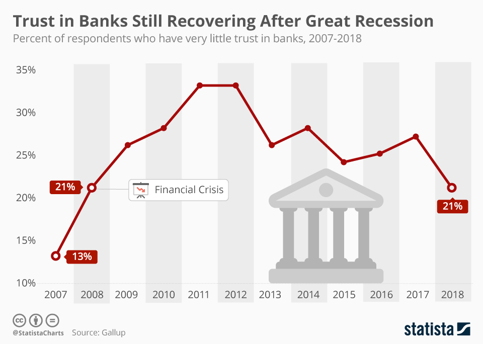
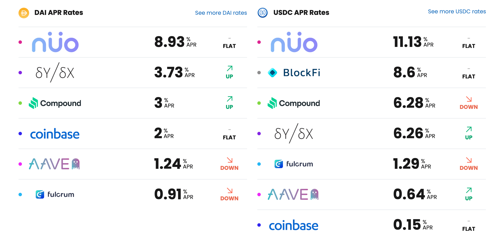
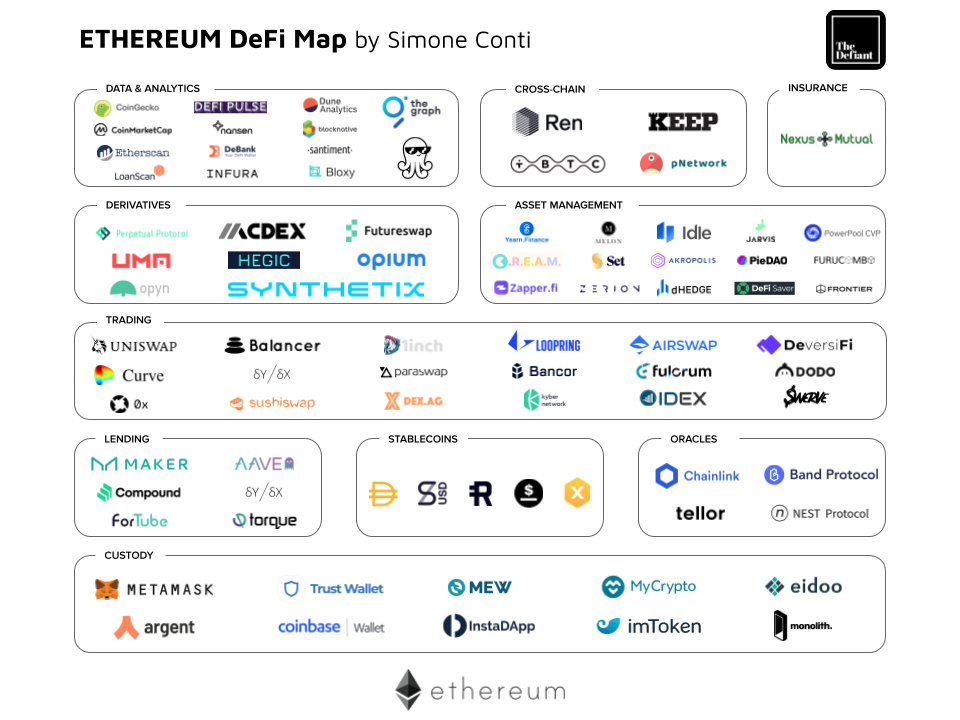
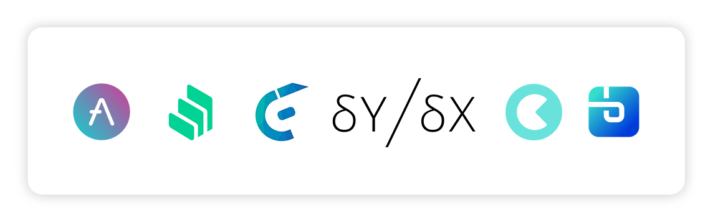
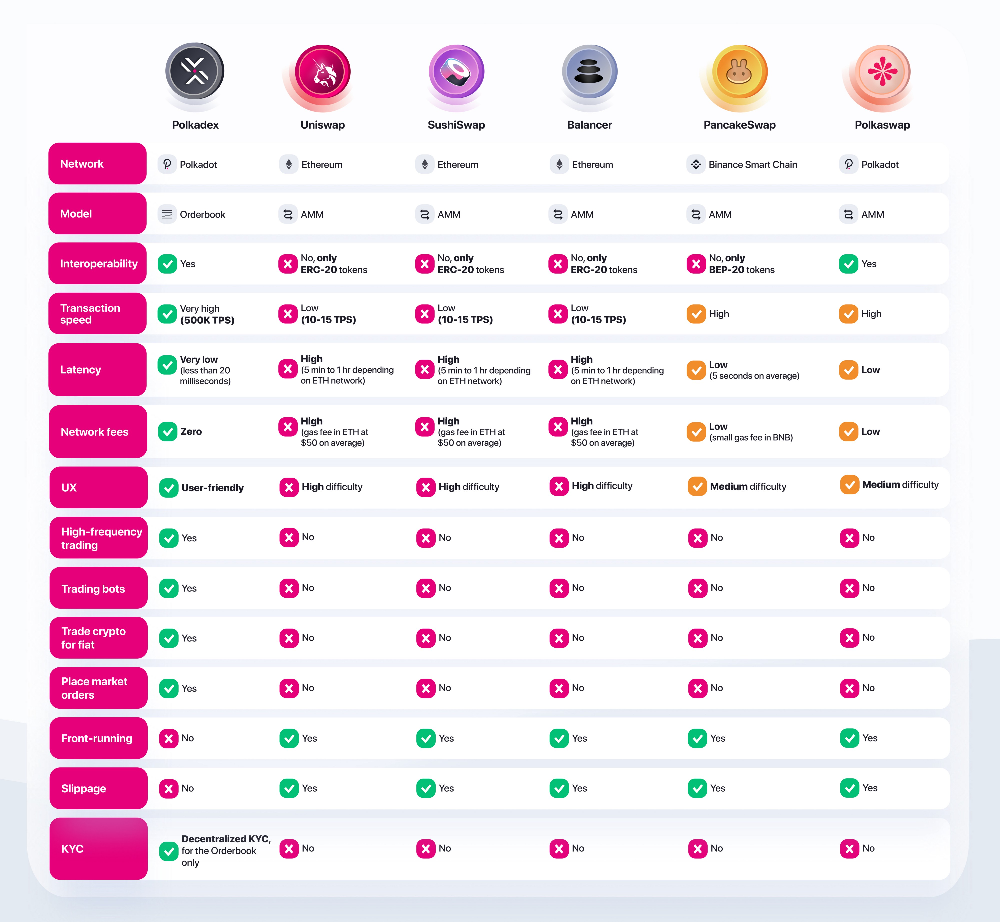
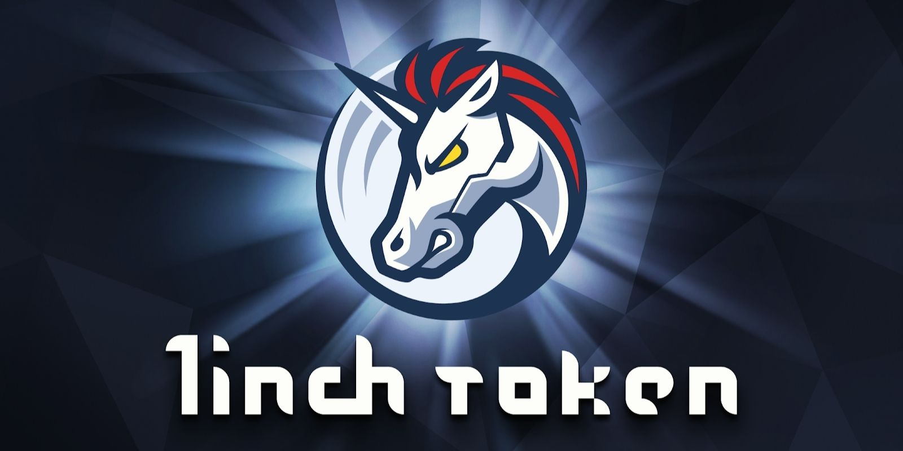
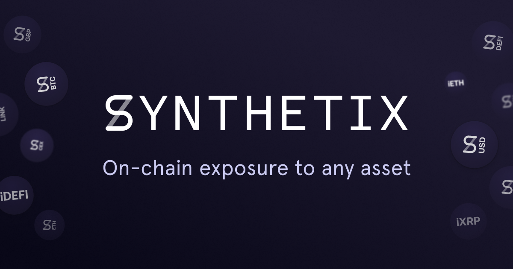
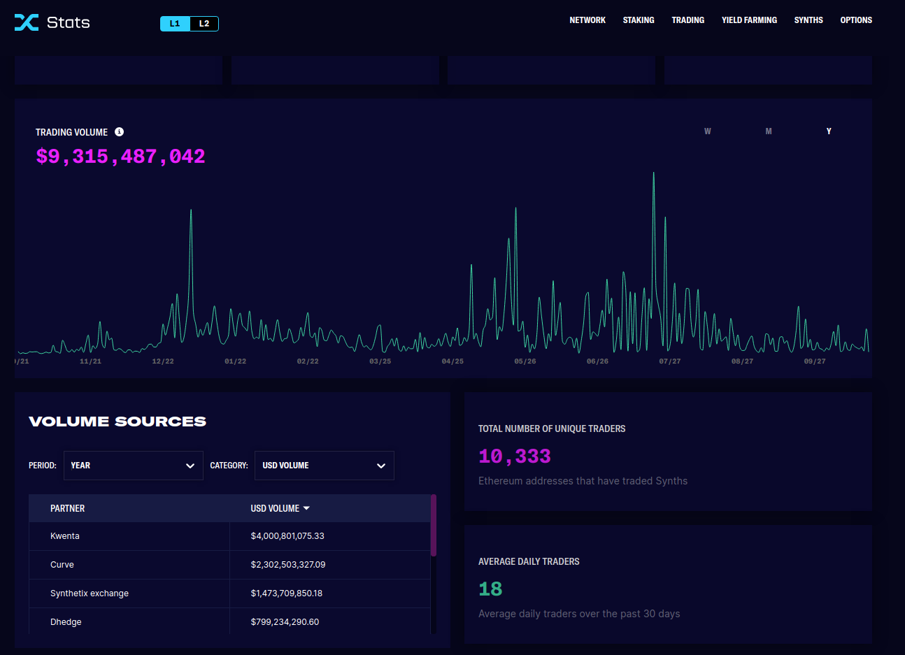
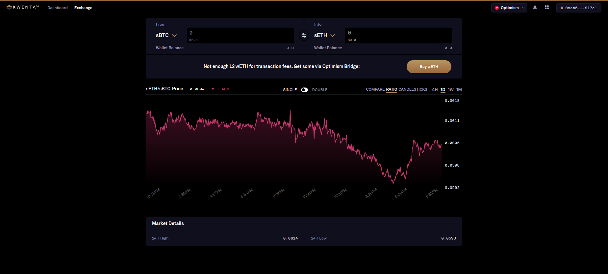

DeFi
======

Short for Decentralized Finance, some have heralded it as a new age of financial instruments. Others have called it a nothing-burger, perhaps destined to relative-obscurity in the history of failed-technology. And some have called it a ponzi-scheme, in much need of regulation and oversight. Which of those is it? The answer is kind of all of them unfortunately. Before I get into it let's address the elephant in the room...

*Is DeFi going to replace traditional banking and finance?*

**ABSOLUTELY NOT**. Anyone who tells you otherwise is either scamming you, misinformed, or simply an idiot. There is no world in which DeFi poses any significant threat to our current financial institutions. Bank of America, or the Bank of China, or BNB Paribas is not going to go belly-up because of Cryptocurrency or DeFi. However, that doesn't mean that DeFi isn't useful, or doesn't have a future. The two can co-exist. Banks are concerned about DeFi, but in a way that eats away at their margins, not one that takes the whole pie.

It is estimated that there is currently around `$100 Billion currently locked in DeFi <https://www.theblockcrypto.com/data/decentralized-finance/total-value-locked-tvl>`_, so regardless of what you think, it's clearly not going anywhere anytime soon.

What is DeFi?
--------------

Decentralized Finance, or DeFi, is the name of a series of blockchain-based-applications that emulate traditional financial services. Your bank, whether it Bank of America, Wells Fargo, anything is Centralized-Finance (CeFi). A lot of the services your bank may offer, can be reproduced in DeFi

Such as:
  **1. Borrowing** - Taking out loans

  **2. Lending** - People lend the bank money, which the bank loans out to other people

  **3. Custodial Services** - The bank holds your money, and in return for allowing them to loan it out, give you a small interest rate for keeping it in the bank.

There are also a variety of Financial instruments, many of which you see on wall street, which can be reproduced in DeFi as well.

Including:
  **1. Insurance** - Take out a policy against something occurring and get paid out in case it happens.

  **2. Asset Trading** - Cryptocurrencies, Stocks, currencies, precious metals and commodities, and financial derivatives can all be traded on the blockchain.

  **3. Options** - Trade options contracts on all of the assets listed above.

Why do we need DeFi?
------------------------

Trust
*******

People vs. Code
~~~~~~~~~~~~~~~~~

Cryptocurrency is all about trust. Everything you do in your life is a question of trust. When you drive down the road, you trust other drivers not to crash. You trust your car to work, and to not run off the road. You trust your insurance company to pay out the amount specified in your policy when you're in an accident. The caveat in all of this is that it relies on trusting *other-people*. You trust people you don't know to act properly, to do make good products, to do their job, and to give you the money you deserve. A world of Cryptocurrency means replacing that trust in people, with **trust in code**. It means removing the element of trust from the equation, and instead recognizing that you are in control of your own money.

Banks
~~~~~~~

It's no surprise that faith in traditional banking `is declining <https://www.wsj.com/articles/the-market-has-lost-faith-in-banks-11583509273>`_. Especially young people, are looking for `alternatives to traditional banking <https://www.cnbc.com/2018/09/14/a-new-generation-puts-its-trust-in-tech-over-traditional-banks.html>`_. The reason for this is the subject of much debate, but began as part of the 2008 financial crisis. Banks are constantly being exposed for a variety of problematic practices.

  1. `Wells Fargo paid $3 Billion for creating Fake Accounts to siphon money out of customers <https://www.cnn.com/2020/02/21/business/wells-fargo-settlement-doj-sec/index.html>`_
  2. `Wells Fargo paid $250 million for lying about its mortgage practices <https://www.businessinsider.com/wells-fargo-fined-250-million-regulators-says-2016-order-expired-2021-9#:~:text=Wells%20Fargo%20was%20fined%20%24250,CFPB%20consent%20order%20has%20expired&text=Wells%20Fargo%20was%20hit%20with,sales%20practices%20has%20now%20expired.>`_
  3. `Deutche Bank was fined $120 million for bribing foreign officials <https://www.forbes.com/sites/jonathanponciano/2021/01/08/deutsche-bank-fined-120-million-over-bribe-payments-to-foreign-officials/?sh=a5c83e25ad8b>`_
  4. `Apple Bank was fined $12.5 Million for failing to implement with anti-money-laundering orders <https://www.wsj.com/articles/new-york-bank-fined-for-anti-money-laundering-law-failures-11612200233>`_.
  5. `Capital One was fined $390 Million for willful and negligent violations of Anti-Money-Laundering (AML) laws <https://www.fincen.gov/news/news-releases/fincen-announces-390000000-enforcement-action-against-capital-one-national>`_.
  6. `Major wall street banks and hedge funds caused the 2008 housing bubble <https://www.investopedia.com/articles/economics/09/financial-crisis-review.asp>`_

I could spend hours linking 100 stories of how much major banks have paid over the years, as a result of their willful disregard for consumers. People are looking for new ways to protect their money, while also being able to save. I don't blame them.

Better Interest Rates
***********************

When you put your money in a savings account, you earn interest. A very small amount. If your bank is feeling generous, you may get `0.6% <https://www.bankrate.com/banking/savings/best-high-yield-interests-savings-accounts/>`_. But, the bank turns around and loans it out to someone else for %6. What happened to the other 5.4%? First it goes to the bank operating cost. This is understandable. But the rest, most of it, goes right back into the bank's profit. At least to me, that doesn't seem very fair. When you remove the massive administrative bloat, and the cost of operation, there's nothing to stop the profit from going right back to you.

You may have seen some extremely high interest rates on various sites like below

*Hold on. 11% interest? that can't possibly be real it has to be a scam!*

It does seem ridiculous, and while it doesn't paint the entire picture, interest rates of 5% are extremely common, and very-much legitimate. These platforms can give these rates because they're not paying executives `billions of dollars in bonuses <https://www.cbsnews.com/news/16b-of-bank-bailout-went-to-execs/>`_. The profit goes right back to you, the consumer and lender. There's no people to pay, servers to manage, compliance to follow, etc. and which cuts out the bloat.

Permission-less
****************

You are in control of your money. When you put your money in the bank, you relinquish control for security. But this trade-off is a false-choice. The bank, at any time, for any arbitrary reason, can lock you out. They can deny you your money and hold onto it until you prove to them you deserve it back. It is no longer your money. DeFi is freedom. It gives you back the chance to be in control of your money. You can keep it safe, without having to give up control to someone else. Only you have power over it. Only DeFi lets you do what you want, whenever you want, and wherever your heart desires. Nobody is watching, controlling, or censoring.

Banks and financial institutions are slow. It takes 1-3 days to send money from Venmo to my bank account. It takes days to send money between-banks, for sometimes high-fees, and with their approval. DeFi applications never close, work across all borders, and for little to no-fees like you deserve.

Applications and Use Cases
---------------------------

Borrowing and Lending
**********************

Access to Loans
~~~~~~~~~~~~~~~~~

When you think of DeFi, this is probably what you're imagining, Decentralized loans and other financial instruments. They allow anyone to borrow Cryptocurrency, using their existing assets as collateral. On the other side, anyone can provide their crypto as liquidity for borrowers, earning interest in return.

*Anyone can just borrow money? How does the protocol ensure that it gets paid back? Isn't that why banks use variable rates and reject people?*

You are correct. Banks can take on riskier loans because they can identify the person taking the loan, and their likelihood to default on it. DeFi protocols will give anyone a loan, with a caveat, they have to over-collateralize the loan at the point of sale. IE you need to provide enough collateral at the moment you take out the loan, and greater than the value of the loan itself (often 15-25% more).

*Hold on, If I want to borrow $100,000 in Crypto I need to put up $115,000? Isn't the point of taking out a loan because I need money now? Why would I take out a loan if I already had the money I needed?*

That's a good question. You would use this because you own crypto, but don't want to lose it because you think the price will appreciate. It's your collateral, much like when you take out a mortgage the house is collateral. The decision to over-collateralize is necessary to ensure that there's enough to cover the value of your loan should you default, and to protect you (and the protocol from price fluctuations). If the value of your collateral drops to the value of your outstanding debt, it will be liquidated automatically. DeFi, like all crypto, is built on the foundation of trust-in-code. IE, don't trust the people, but the code to never run out out of money, and to always get paid back.

Let's say I own ``$100,000 of Ether`` and wanted to start a business. I could sell my Ether, but I think the price will continue to go up. If I sell it, and the price moons, then I've missed out on a lot of profit. What you would do is borrow against your Ether, and take out a loan in a stable-coin like Dai or Tether ($1). You simply just spend the stable-coin on your venture and pay back the loan at the rate you took it out at. When you repay the loan you get the Ether back, and if it's appreciated, pocket the profit. Since you took out the loan in Dai, the price appreciation of Ether works to your advantage because you get back more than you took out.

There's a great story about this from the `Bankless Podcast/Newsletter <https://newsletter.banklesshq.com/p/how-to-pay-off-your-student-loans>`_. Perhaps either the most genius, or bone-headed move I've ever seen. The guy from the newsletter had a student loan he couldn't pay off, with a high interest rate. Having gotten lucky from the massive price-spikes in Ether, he had a lot to hold onto, but didn't want to sell it to pay off his loan, as he thought the price will continue to go up. Then he simply paid off his crypto loan, at a lower, fixed, and non-compounding interest rate than his student loan.

You would be correct to say that in the area of access to credit, traditional finance does have the upper hand. It is possible that in the future there will be ways to make this better. You could attach a DAO to access to loans, and use that to determine who to give loans to. Some companies are working on things like blockchain-based credit-scores and histories to make the loan process more akin to regular banking. It is a constantly evolving marketplace, of which nobody entirely knows where it will go in the future.

.. image:: images/defi/defi-lending.svg

Interest Rates
~~~~~~~~~~~~~~~

.. image:: images/defi/aave_rates.png

I won't go too deep into how it works, and might save it for a much more in-depth analysis later. However, I would like to do a brief explanation of the information above.

Each coin (or coin-pair) has its own liquidity pools on DeFi platforms. It is from this pool that money is lent and borrowed. While the amount borrowed can never exceed amount deposited, the amounts can come close, which means a lack of liquidity. When there's a lack of liquidity it makes it hard for others to get access to funds, at low rates. Therefore, the protocol will automatically adjust itself to incentivize people to deposit their coins, in exchange for interest on it. Look at Gemini Dollar. Of the ``$19.93M`` deposited by lenders, ``$16.05M`` has already been lent out. In order to make sure that there's adequate liquidity for people to continue-borrowing, they raised the interest-rate for lenders (4.84%). They may also then raise the rate for borrowers too, to keep the balance of supply and demand. Once liquidity increases to a better-level, the rate will go back down. If you look at the number below it too, it says *1.39% APR*. This is a special interest rate, that rewards you for contributing to the protocol. It pays out that *1.39%* interest in `Aave Tokens <https://www.coingecko.com/en/coins/aave>`_, the governance token of the protocol. If you are a customer of the service, they decided you should be entitled to vote in how it changes. This amount is stacked on-top of the interest rate your coin earns natively.

There is also a variable and stable-rate for lenders. The stable-rate is for short-term loans, which can be converted into long-term variable rates, which are lower. Even as a long-term borrower, you still earn Aave token rewards. If the token you earn from interest appreciates at a rate higher than your interest, you could benefit greatly. This system is meant to encourage long-term planning over short-term borrowing.

These protocols will let you use a variety of coins as collateral, with the list expanding everyday. This allows people to use things like Ether as collateral for a loan in Dai. As long as the price of Ether doesn't crash, automatically liquidating your collateral, it is fine.

When you lend out a token, the protocol also issues use new staked-tokens. They are used to represent your interest-bearing-loan and can be traded just like anything else. This gives it its own value on the open-market. To recover your lent-amount, you simply burn the tokens (take them out of supply).

Now you can begin to see why the banks are nervous about DeFi. They give anyone the chance to borrow, at interest rates lower than them, lend with higher-returns, and ensure that they always get paid, no matter who they lend to.

There are many protocols, but some of the largest include `Aave <https://aave.com>`_, `Compound <https://compound.finance/>`_, `Alchemix <https://compound.finance/>`_, `DyDx <https://dydx.exchange/>`_, etc.

Flash Loans
~~~~~~~~~~~~~

Unlike traditional banks, DeFi allows a financial maneuver called a flash loan. It is an *uncollateralized-loan*. Meaning, you can take out as much money as you want in a loan, with no interest, and no collateral, on the obligation you pay it back immediately. It works on a system where the protocol essentially only gives out the funds to someone who can prove they can pay it back immediately. How immediately? In the same transactions

This system is paying out `millions of dollars a day <https://news.bitcoin.com/zero-collateral-138-million-in-defi-flash-loans-issued-in-24-hours/>`_ with no chance of defaulting.

To keep it simple, a smart contract contains a list of steps to take.

.. image:: images/defi/ex_tx.png

It can do multiple things with a variety of other contracts, and settles up the values at the end of the transaction. In the `above transaction <https://etherscan.io/tx/0xecf2b09c78dfa80c6605d1b06f9b394a54704350d7792daa11fb615df6588057>`_, it first sends Ether from one person to a contract. The contract then makes another transaction sending a different token to that same address. Two different contract interactions, one transaction. The only limitation is how much gas you are willing to pay.

Flash loans use this same principle. The DeFi app will loan out any amount of money to a smart-contact, on the condition it repays it before the transaction ends. This means that the first thing the contract does is take out the loan, and the last thing is pay it back. What it does between those two things is up to you. The contract loaning out the funds watches to ensure that it's funds are re-payed, and if they're not the entire transaction gets cancelled, your gas is **not returned**, and the entire execution fails.

*What can I do in the span of 1 transaction? I have access to funds but for so little time I can't use it to gain interest on DeFi or appreciate in value?*

That is correct. The time you have it is very short. However, there are a lot of things you can do with it.

  1. **Arbitrage** - Taking advantage of price discrepancies between decentralized-exchanges to profit. Let's say there's a price-difference of $.10 (10 cents) on Eth->Dai pairs between Uniswap and Sushiswap. By buying and selling you can profit $.10 on each Dai you sell. This doesn't sound like a lot, but if you have access to ``$1M Dai`` from a flash loan, you could make a gross of ``$1.1M``, or ``$100,000`` after paying back the loan, and keep the profit.
  2. **Liquidity-Swaps** - You've taken out a loan, using your Ether as collateral. But you want to get that Ether back, to do something with it, and put something else up as collateral instead. The problem is you don't have enough cash-on-hand to pay back the loan. Using a complicated series of swaps, you can use a flash loan to pay off your debt, get some other token, put that up as collateral and take out a new loan, and then re-pay the flash-loan. This allows you to effectively swap your collateral without having to re-pay the loan at that moment in time.
  3. **Self-Liquidation** - Liquidation occurs when the value of your collateral drops to a point that it can't cover your outstanding debt. When it occurs, you lose a large chunk of your collateral, as well as paying an additional "liquidation penalty". If a liquidation of your collateral is approaching, because you can't pay off your loan, you want to avoid it. With a very complicated series of moves, you can utilize a flash loan to repay your-debt, and then use the recovered-collateral to pay off the flash-loan. This doesn't sound good. However, even if you lose your collateral paying back the flash loan, you will still be left with more crypto than had it been liquidated and penalized by the lending-protocol itself.
  4. **Hackers** - It's not so much a hack, as it is a by-product of the way many applications work. However, people have been able to make-off with `millions of dollars from DeFi protocols <https://coinmarketcap.com/alexandria/article/what-are-flash-loan-attacks>`_ by utilizing flash loans. It involves them gaining access to a very large amount of liquidity, and then using it to manipulate prices of tokens on the open-market. They then sell back the tokens and repay the flash loan, keeping the profit. Whether this flaw makes it a danger, or a feature is up to you, but it's clearly something to be wary of.

Flash loans are a difficult concept, and can require in-depth knowledge of coding and DeFi, so I won't spend too much time on it. I will leave this helpful explanatory video however, if you're interested in learning more.

.. raw:: html

    <iframe width="560" height="315" src="https://www.youtube-nocookie.com/embed/mCJUhnXQ76s" title="YouTube video player" frameborder="0" allow="accelerometer; autoplay; clipboard-write; encrypted-media; gyroscope; picture-in-picture" allowfullscreen></iframe>

Decentralized Exchanges (DEX)
*********************************

These are the backbone of what makes the crypto-ecosystem work. They allow you to trade your Ether, and thousands of tokens, for others in a permissionless and Decentralized way. I'm not going to go too much into how they work, as I've already done so in another article. You can read it `here <https://thecryptoconundrum.net/dapps/uniswap.html>`_. While various applications very slightly, they generally all utilize the same liquidity-pool model.

There are dozens, such as `Uniswap <https://uniswap.org>`_, `Sushiswap <https://sushi.com>`_, `Curve <https://curve.fi/>`_, `Balancer <https://balancer.fi/>`_, `Kyberswap <https://kyberswap.com/>`_, `1Inch <https://1inch.io/>`_, etc. There are also various dexes on different chains, such as `Pancakeswap <https://pancakeswap.finance/>`_ on the Binance smart chain, `Quickswap <https://quickswap.exchange/>`_ on Polygon, and `Serum <https://www.projectserum.com/>`_ on Solana.

1Inch
~~~~~~

I'd like to call out a specific protocol, while talking about Decentralized exchanges, called 1Inch. It is what's known as a dex-aggregator (Decentralized-exchange-aggregator). Because there's so many exchanges, and because they each maintain their own liquidity pools, with different prices and gas costs, it can be difficult to know exactly which one you should use to trade your tokens. 1Inch tries to solve this issue for you, by collecting information on all of them, as well as their own pools. It constantly monitors all of the dexes, looking for the best-price for your trade. It then shows you what the best exchange price is, or which might have the lowest gas-fee, etc.

It's a very powerful protocol and if you plan on swapping tokens, worth a try.

`1Inch Website <https://1inch.io>`_

Yield Farming
***************

There's a lot of different lending-platforms and exchanges that will earn you money over-time. The question then becomes, which one do you use? How do you decide which coin to lend-out? When do you switch? Is it worth paying swap-fees to try and lend a different token every 3 months? Finding the most profitable lending-system and token is a very important question. Sit and wait is a good strategy to make money, but if you can do it with more complexity, your yields can increase substantially. This is where yield farming comes into play.

Yield farming is the name for the practice of constantly switching between which tokens/coins you lend, and on which platforms, to constantly achieve the highest rate of return. It might mean lending Dai on Aave one month, and then Tether on Compound the next. Some people do it manually, constantly switching between protocols and coins. But this takes a lot of gas to do, and gets expensive. Others deploy bots to monitor and make trades on their behalf.

Then there's automated protocols like `Yearn Finance <https://yearn.finance/>`_. You simply deposit your coins, and the protocol will automatically make trades and swaps based on highest-yields of other protocols. It maximizes your yield based on it's pre-planned logic. It will use a complicated series of trading and lending strategies to maximize returns for lenders. I won't go into super deep logic here, as it's very long and complex, but that's the basic idea, and it's a very important protocol in DeFi, and a very solid way to earn interest on your stable-coins and other tokens.

.. image:: images/defi/yearn.jpg

Derivatives
***********

Asset Tokenization
~~~~~~~~~~~~~~~~~~~~~

The stock market dominates our economy. But, you play by the rules of the few who own the exchanges. Imagine if you could trade stocks, or any asset class, on the blockchain, with all the benefits that come with it. Stock markets close. They require your personal identifying-information. They have arbitrary power to list or deny whomever they want, and influence prices. Using a process called tokenization, all of its features can be done on the blockchain instead, using a derivative.

A derivative simply means the price of the asset is derived from the underlying asset it represents. In this case, its a tokenized-stock, known as a `"synthetic-asset" <https://cointelegraph.com/explained/crypto-synthetic-assets-explained>`_.

Follow me here:
  1. Take an asset. It could be a stock, a barrel of oil, a bar of gold, etc. and find out how much it's worth at any moment.
  2. Mint a token, on your blockchain of choice, who's value is a 1:1 representation of the asset it represents. If 1 share of Google stock is worth $420, then 1 tokenized-google-stock should cost the same.
  3. Let it be traded on the open market at that corresponding price. In this case, it's a decentralized exchange, or even a centralized-one.
  4. [Optional] Give people the option to redeem it back for an equivalent-value of another-coin or for its underlying asset.

The idea behind this is that you don't need to hold the underlying asset, so long as the asset you do hold can be redeemed for an equivalent-value at any time. You don't need to own any apple-stock as long as I know that at any time, I can trade my tokenized-stock for the ``$420`` it's worth.

This same model also gives access to shorts. A short means to bet against. IE when the price drops, your short goes up. This is beyond the realm of most-people and limited to wall-street-type investors. However, using an intricate mathematical model that makes all of this work, you could mint what is known as an *Inverse-Asset*. When the price of the regular-asset goes down, the inverse-asset price goes up.

Pros and Cons
~~~~~~~~~~~~~~

This has a lot of benefits:
  1. Tokenized-stocks can be traded anywhere, at any time. Over holidays, from foreign-countries, at-night when exchanges are closed.
  2. They can be traded anonymously. I can trade any other token I have for this new tokenized-asset on a decentralized-exchange, privately, as long as I have other coins to trade for it.
  3. Access to more assets. It gives anyone the ability to trade any asset, even those which might be restricted to special-parties, or outside the realm of the typical consumer. It's not easy for the average Joe to buy oil-futures.
  4. Wrapped-Tokens. Because any asset can be represented this way, that allows you to trade tokenized-forms of other coins. Want to gain exposure to Cardano but don't want to go through a centralized-exchange, or have to keep it in a wallet with all the key-management required? Just trade a wrapped-Solana.
  5. If it's tokenized, with established value, it can be used in DeFi. Imagine someday being able to borrow against your tokenized-stock as collateral.
  6. Lower Fees. Exchanges are businesses, and their fee structure is meant to net them the most profit possible. When a protocol has nobody to pay, the fees go way down.
  7. Allow you to buy and sell and convert it back to other crypto, in a decentralized, anonymous, and permission-less way.

Drawbacks
~~~~~~~~~~~

For the sake of fairness though, I would like to point out some justifiable cons of this system:
  1. Stock Splits - If a stock splits, the system in its current form does not give you any splits as well. It's likely that new protocols will solve this in the future, but for now it's an issue.
  2. Dividends - You don't currently get any. Once again, there are people working on ways to implement this, but in its current iteration does not support dividends.
  3. High Gas Fees - It is expensive to trade these assets currently, as network congestion has driven up transaction fees significantly. As these protocols migrate to `layer 2 <https://thecryptoconundrum.net/ethereum_explained/layer2.html>`_ this will become less of an issue over time.
  4. Crypto Security - Get hacked and lose all your stocks. Lose your seed-phrase and your stock is gone with it, unlike regular trading-platforms with account recovery tools.
  5. No fail-safe - Sometimes protocols get hacked, or bugs occur, or any number of things happen, and so your stocks would go away with it. It's a risk you need to be willing to be aware of.

Price-Stability
~~~~~~~~~~~~~~~~~

*How does the protocol manage to keep the price of the synthetic-asset aligned with the real-world asset?*

It does this two ways:
  1. Oracles. I talked about this in my article on `Chainlink <https://thecryptoconundrum.net/coins_explained/chainlink.html>`_. In order to create a synthetic-asset, you first must lock up collateral. The protocol takes the value of the collateral and mints you an equivalent-amount of tokens, using the real-world price it receives from the oracle. However, much like Aave and Compound, this amount must be overcollateralized. On Synthetix, that amount is *~750%*. This also works the other way, you can burn your tokens (take them out of circulation) in return for an equivalent-value based on **current** market conditions.
  2. Arbitragers. Because it can be redeemed by the same protocol that minted it, opportunistic investors can take advantage of a price-discrepancy between real-world-exchanges and decentralized-ones. If the value on the decentralized-exchange falls below the real-world exchange value, people will begin to buy it up, and essentially *"sell it back"* to the protocol for a higher value, and keep the profit. Reducing supply therefore causes price to rise, back in line with its off-chain equivalent. You can read more about `arbitragers in depth, here <https://thecryptoconundrum.net/dapps/uniswap.html#arbitrage>`_.

.. image:: images/defi/synths.png

*Wait what?! I need to put up 750% collateral to make this asset? That's obscene why on earth would I do that?*

No, you don't need to put up collateral to trade it, just to mint it. If all you're doing is buying and selling on the open-market then you don't need to collateralize anything. Just go about your business. This only applies to the people who are *minting* these assets. This is necessary to ensure that you provide enough collateral to cover massive price-shocks. It works like traditional debt. If you put up $750 to mint $100 of tokens, you get the $750 back when you pay off your $100 debt.

There is also reasons to provide collateral, you earn interest on it. Called "staking", not to be confused with "proof of stake", it means to contribute liquidity to the protocol for others. For every trade that occurs on their exchange `Kwenta <https://kwenta.io>`_, a ``0.3%`` fee is taken, and redistributed to the people who provide such liquidity as an incentive. If I provide 10% of all liquidity, then I get 10% of the trading fees. I know that a small fraction of 0.3% doesn't sound like a lot, but keep in mind, *0.3% of 1 Billion = $30 Million*, so an exchange doing billions of dollars of exchanges everyday can start to add up over time.

*So you're telling me there's billions of dollars in these "fake-assets" that isn't backed by their underlying-item being traded? How is this not a ponzi-scheme?*

Because it comes back to the basic-idea that **you don't need to hold the underlying asset, as long as you have an equivalent amount of its underlying value**. The protocol doesn't need to hold actual google-stock so long as people using it know that at whatever the price is, it can always be traded for its equivalent-value in dollars. This is why the collateralize rate is 750%, because even at massive price-spikes, there's still enough liquidity to ensure that people can cash-out.

*So How do I get in on this?*

The protocol currently making this work is known as `Synthetix <https://synthetix.io>`_. All you need to do is go to their Exchange, `Kwenta <https://kwenta.io>`_, and start trading. You might need to acquire some of their tokens though, like sUSD (Synthetic USD), their stable-coin first. This can be acquired from any Dex like Uniswap, or from them directly, by minting it and locking up collateral. Then you simply trade it on Kwenta for other assets. When you make a trade, the protocol burns (removes from circulation) your sUSD (or other asset), and mints (creates new tokens) equivalent-value tokens. This way you can always be sure you're transacting in dollars, and by burning/minting it prevents inflation. In current form, only `Synthetix-Token (SNX) <https://www.coingecko.com/en/coins/synthetix-network-token>`_ and Ether can be used as collateral to mint, but the protocol developers and community is working on expanding that list to many other assets as well.

Each token is a standard `fungible-ERC-20 <https://thecryptoconundrum.net/ethereum_explained/tokens.html#erc-20-fungible>`_.

I know this all seems very daunting and confusing, and it is. This is a difficult concept to grasp, but it will get easier.

Options and Contracts
***************************

Primer on Contracts
~~~~~~~~~~~~~~~~~~~~~~

Options trading is an interesting type of derivative, typically used in the stock market. It is commonly reserved for experienced investors with a lot of capital. They can multiply your net worth overnight, or send it down to zero. It does this by giving increased leverage to a trader to trade an asset in the future. I'm going to give a very brief overview of how options works, and then explain how it relates to crypto. The topic of options could cover a semester-long finance class, so I will try to keep it brief.

An option is simply a contract that says "on this given date, the holder has the ability to either buy or sell this given asset for a specified price". Let's say I hold an option on Bitcoin prices, and the exercise price (strike-price) is *$50k*, it expires on December 31 of the year, and is valid for 10 BTC. At any time before the expiration date, I can exercise the contract, and buy 10 Bitcoins, from the issuer of the option, for *$50k each*. At that point if Bitcoin is priced *>$50k* then I can sell it all and make a lot of profit. If it's lower than that, then I've lost money because the option is now worthless.

  ``Potential profit/loss = (Current Price - Strike Price) * (number of BTC in contract)``

An option to buy at a certain price is known as a *call*, and one to sell is known as a *put*.

You can let the option expire as well. If you exercise the option, you are obligated to purchase the full amount. However, you are under no obligation to exercise it.

You can also buy a **futures** contract. This works like an option, except you are obligated to buy it at the expiration date. There are also **perpetuals**. They are like futures, but with no set expiration date and can be traded whenever.

Each of these contracts has a price in and of itself, determined by the open-market. For example, an options contract that let's you buy 10 BTC at $50k might be valued at $500k, because 10 BTC * $50k = $500k. However, I can buy the contract for only $100,000. As the expiration date draws nearer, the price might fluctuate. If exercising the option would mean earning a profit (because current price is higher than what you buy it for), the contract will appreciate as people start to buy them, with the intent on exercising. I can then sell the contract, at an appreciated price, and profit, without having to exercise the contract itself. It gives me enhanced leverage, without having to pay a higher up-front cost. However, higher-leverage also means that if you're wrong, price movement in the other direction can have a very significant effect, and you can lose quite a lot.

Crypto Assets
~~~~~~~~~~~~~~~

All these contracts are, is a way to determine prices at which things are bought and sold. Given that Synthetix and other tokens allow us to trade a number of derivatives, that can be combined to produce contracts.

Apps like `Hegic <https://www.hegic.co/>`_ perform exactly this function. Using their protocol, you can trade options contracts for Ether and Bitcoin directly on-chain. Because an option contract is represented as an Ethereum-Token, they can be traded as well. Sometimes they are fungible-ERC-20, and sometimes NFT's.

`DyDx <https://dydx.exchange/>`_ is a perpetuals trading platform on Ethereum as well. Using similar ideas as the tokenization platforms, it allows you to trade perpetuals contracts (futures without an expiration date) on dozens of different cryptocurrencies. They also have access to things like margin and spot trading using various other coins as collateral.

Why?
~~~~

*Why would anyone use this? I can just buy crypto on Coinbase?*

A few reasons
  1. Increased leverage. Crypto is getting expensive. Ethereum and Bitcoin and many more. If you're like me, and is extremely confident that Ethereum will go to $10k someday, then you wanna get as much long-term exposure as you can. Using contracts and perpetuals can allow you access to higher-amounts of leverage on these investments. They come with significantly higher-risk, but also higher-reward.
  2. Gain exposure without selling other assets. If you think Ether is gonna go up, but don't wanna get rid of your exposure to Monero, you can use DyDx Monero as collateral for your Ethereum perpetual. Then if both go up you get your Monero back and profits from Ether.
  3. Access and Anonymity. A lot of high-leverage, complex instruments like these are typically not available to the population, only to wall street. This is your opportunity to get a piece of it.

Prediction Markets
*******************

These are a little bit more niche, but I'm including them because they're a very interesting use-case. Online Gambling is illegal in the united states. Prediction markets, essentially betting on the outcome of real-world-events, is not. They try to take advantage of the general-wisdom of the crowd. Using various systems of bonds and oracles, you can decentralize this entire process. Want to bet on the outcome of the next presidential election? Who's going to win the Oscar? will the price of Oil be above a certain amount? All done with crypto, anonymously, and securely.

Basically, the way it works is buying an outcome like a share. Let's say the question is "Will the price of Bitcoin be above $60k on this date at this time?". Your options are yes and no. For ``$0.52`` you can buy one-share of *yes*. For ``$0.42`` you buy *no*. When the day comes, if the answer to the question is *yes*, then each share of *yes* can be redeemed for $1. If you bought it at ``$0.52``, then that's ``$0.48`` profit on each one. If you held no, then it's worth nothing. As outcomes become more likely the prices flip. Shares of yes may go up or down based on how people feel about them, and they trade on the open-market. Lower price means the odds that it's right is lower, and thus a higher-payout if you're right.

.. image:: images/defi/prediction_markets.png

*How does it know what the real-world result is?*

This is actually the genius of the system. It doesn't, but relies on people to do so. When you create a prediction-market (a question), you have to specify where the information comes from, and who reports it. In some cases it might just be your friend, checking the price of Bitcoin on Coinbase.com, and reporting it to the prediction-market. The person you delegate to be the reporter is bonded. This means they have to put up a bond for the right to report the information. They get a small reward for doing so accurately. Let's say the price of Bitcoin was actually ``$59k``, but your friend decided to report it as ``$61k``, so that he could win his own bet. Anyone can go and submit a fraud-challenge to the market, contesting the results of the report. This person also has to put up a bond, and get community support. Without going into too much technical detail (because it's complicated and not necessary at this moment), if they get enough community support for their contesting the results, the report is overturned. Otherwise, their bond gets taken away for issuing false-contests.

There's also the option to get information from a variety of on-chain sources. For example, you could get the price of Bitcoin using Uniswap's current price for `Wrapped Bitcoin <https://wbtc.network/>`_. The Associated Press last year started publishing information, such as `results of the 2020 Election on the blockchain <https://cointelegraph.com/news/ap-news-publishes-us-presidential-election-results-on-the-blockchain>`_. You could simply point your prediction market there, looking for outcome, knowing the Associated Press is a trusted-entity.

.. image:: images/defi/pm_map.png

The Future of DeFi
--------------------

Financial Revolutions?
************************

I'll be honest with you. DeFi may be the future, but it is not going to overthrow financial systems. Banks will not collapse. Your grandmother is not going to put all her money into stable-coins on Compound and Yearn. Traditional banks and financial institutions will always have at least some benefits over DeFi. Aave and Compound are able to offer you high rates right now because compared to the rest of the financial system, and relative to demand the amount they hold is small. People will always continue to use banks because they are safe. The FDIC is not going anywhere, and they're too big to fail. The cash we hold in our bank accounts is liquid, and a massive world-wide network of communications between them makes it work well seamlessly. It has drawbacks though that DeFi solves.

Just because DeFi and crypto doesn't overthrow the world's financial systems like people talk about on Reddit, doesn't make it a failure. What it will do, is slowly chip away at the foundations. Over time, as it gets cheaper and easier to use, people will transition. People will start moving money, looking for better-rates. Every time there's another financial crisis, or a scandal on a bank, that trust goes down a little bit, and people look for alternatives like DeFi.

Will DeFi change the world? Maybe. It's possible that in a few years we see major banks getting in on the space, earning their own interest lending on these platforms.

Regulations
************
In the 1920's there was a `major bank-run that resulted in the great depression <https://www.fdic.gov/analysis/cfr/working-papers/2014/2014-01.pdf>`_. The cause was that the banks had been too liberal with credit. They lent out more money to people that had no business, and ended up giving out more than they had. Then, when everyone went to get their money out of the bank, there was nothing left. This is why the federal government stepped in and created the `Federal Deposit Insurance Commission (FDIC) <https://www.fdic.gov/>`_. I'm obviously simplifying a lot, but that's the idea. When left to their own devices the banks couldn't be trusted to do things right, to protect people.

Regulations exist to prevent negative externalities of the free-market. We have Dodd-Frank, Sarbanes-Oxley, FDIC, etc. because the banks got greedy, and because their greed and lack of oversight hurt a lot of people. But when you remove people from the equation, you don't need regulations any more. When everything is handled by the code, which is audit-able and transparent to all, anyone can see that it's clearly legitimate. You don't need the FDIC for crypto because the code prevents more money from being loaned than they have. It becomes impossible for a bank-run to end in disaster like in the past. It becomes impossible to siphon money out of, or to make bets you can't cover. Regulations of DeFi is a paradox in and of itself. It seeks to regulate, but regulate what exactly?

The reason we hear about regulations is because the Banks are afraid. The hedge funds and exchanges are afraid. Banks can't compete with DeFi interest rates. Hedge funds want to make you think only they can do what they do with contracts and options. Corporations and stock-exchanges don't want you trading derivatives of their stocks without them getting their cut. That's why they spend millions of dollars to `make you think crypto is dangerous <https://markets.businessinsider.com/news/currencies/crypto-regulation-financial-crisis-michael-hsu-occ-brian-brooks-basel-2021-09>`_. It's all a facade.

There is a viable argument to be made though, that **with regulation, comes legitimization.**

I am for government regulations on a lot of things. On traditional banking, oil companies, lobbying, big-tech, etc. But this is the one area where it doesn't fundamentally make sense to regulate the same way.

Government Bans
***************

Many people seem concerned by the idea that the US government is going to ban DeFi. I can't say I'm not one of those people. But in addition to it being incredibly unlikely, it's also nonsensical. Let's imagine for one moment that the US congress and the president passed a law outlawing DeFi. How would they do that? Nobody owns DeFi. It exists only on the blockchain. You can't shut down the blockchain, because no one person owns it. As long as one single node remains online then it's impossible. There are thousands of Ethereum nodes all over the world. They have neither the time nor the resources to track down where these nodes are, even if they could.

The government doesn't have the resources to track down every holder or owner of Cryptocurrency and make them get rid of it. They also couldn't even if they wanted to. Chainalysis tracing tech is inherently very limited in its scope, and doesn't work 100% of the time, especially with various precautions being taken.

*I have to use a website to interact with DeFi, couldn't the government censor the website?*

Nope:
  1. The websites used for DeFi is not the actual application, simply an interface to help generate the specific Cryptocurrency transaction you want to make. You could theoretically make your own transactions and gather all the info by-hand, on paper. It would be inefficient but you could do it.
  2. Many of the websites are hosted on something called the `Interplanetary File System <https://ipfs.io/>`_. It's a distributed data-storage-system that allows you to host your own files and websites. This puts it outside the bounds of what we think as traditional centralized-web-hosting. Much like how the government can't completely stop people from `torrenting <https://en.wikipedia.org/wiki/BitTorrent>`_. People will always just move to a different corner of the internet or the dark-net if threatened.
  3. Many of these sites are outside the US, where their regulatory authority ends.

For the current time-being, it does not seem like DeFi does not have enough opposition in government for anything resembling a ban to occur.

Taxes
******

*Do I need to pay taxes on gains made from DeFi?*

I'm not really sure, I'm not an accountant. I would imagine that to be the case. Cryptocurrencies are `considered securities <https://complyadvantage.com/knowledgebase/crypto-regulations/cryptocurrency-regulations-united-states/#:~:text=Cryptocurrency%20exchanges%20are%20legal%20in,Bank%20Secrecy%20Act%20(BSA).>`_ under current-law. This also means you currently, to my knowledge, would only pay taxes when converting back to fiat currency (dollars). This subject is constantly being changed and debated.

Closing Thoughts
-----------------

This article covered a lot of ground. It might well be the longest I've ever written. Yet, I have only scratched the surface of DeFi. I didn't talk about Stable-coins, Venture-Capital, Governance, and so many more things. The number of applications in the DeFi ecosystem is growing everyday.

It is a cliche, but DeFi really is the reason Ethereum will continue to reign supreme among cryptocurrencies, and someday overtake Bitcoin. With an estimated value of **~$100 Billion in 2021**, that number doesn't even include second and third order derivatives and contracts markets. DeFi clearly is not going anywhere. It is this simply enormous amount of money from which Ethereum derives its value. Ethereum's value is currently determined only by market-cap and price. However, when you take into account that this entire 12-figure financial space relies on one coin, Ether, the picture becomes a lot clearer. Because, remember, all transaction fees are paid in Ether. Even if you're depositing Dai into Aave, you still pay for that transaction with Ether. DeFi is the proverbial rocket-ship to help carry Ethereum to the forefront of Cryptocurrency, and to lead us into the future of finance.

This article took a lot of time to write, edit, and design. If you've enjoyed anything you've read here, please consider donating to help me continue to produce free-content. I do not sell ads or user data to preserve your privacy. You can send Ether or Tokens to `jhweintraub.eth (0xaB5409b0E5a66AcC9D63f668414539A60a5917C1) <https://etherscan.io/address/0xaB5409b0E5a66AcC9D63f668414539A60a5917C1>`_. If you would like to send me another coin, send me an email at *jhweintraub@gmail.com* and I'll respond with an address.

**I am NOT a financial advisor, an accountant, or a lawyer. All content here is not to be construed as financial advice and I am not liable for any risks you may incur or any laws you may break while investing in Cryptocurrency. Invest with caution and consult with an actual professional prior to any major financial decisions**

**I have NOT been compensated for promotion of any good or service expressly mentioned above. All opinions expressed are mine, and mine alone, and nothing here should be interpreted as advice.**
