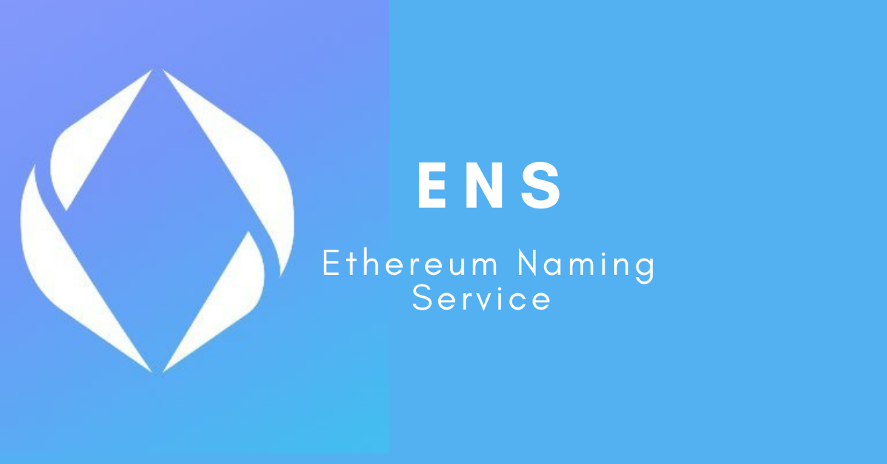
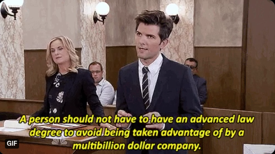

Ethereum Name Service
=======================

*Article Sponsored by* `Cyberpatch.news <https://www.cyberpatch.news/>`_. *Your weekly newletter on the state of the Cybersecurity industry and much more!*

Facebook made news recently when it was discovered that they `unilaterally revoked the "@metaverse" handle from an instagram user <https://arstechnica.com/tech-policy/2021/12/woman-lost-metaverse-instagram-handle-days-after-facebook-name-change/>`_. This user was an artist, who had held that username for almost a decade. Because Facebook didn't like that someone else had it, they decided to just take it. There was no negotiations, no dispute process, no compensation, and nothing the person could do. This is precisely the issue that Cryptocurrency aims to solve, and why we need services like the Ethereum-Name-Service. It is the reclamation of ownership by the individual, in a way that cannot be revoked or tampered without your consent, true digital-autonomy.

Unlike Venmo or Paypal, where you have a username, Cryptocurrency uses an address. You probably know what yours is, it's a long string of numbers and letters that look like jiberish. When you want to send cryptocurrency to people you need that long garbled-mess. 

`0xaB5409b0E5a66AcC9D63f668414539A60a5917C1 <https://etherscan.io/address/0xaB5409b0E5a66AcC9D63f668414539A60a5917C1>`_. 

If you mix up a single letter, the transaction goes to someone else, likely forever unretrievable. We could use a QR-Code, but that still deals with the problem of the address being properly-input.

If we want cryptocurrency to become a more widely-accepted and easy payment-mechanism, we can't be content with a system people don't understand. Interfaces need to change, become easier, and our decentralized-applications need to be integrated with this as well. Fortunately, there is a solution. `The Ethereum Name Service (ENS) <https://ens.domains>`_ brings usernames to Ethereum.

DNS
----

To understand ENS, we need to go back a little bit to an invention you've probably never heard of, but has undoubtedly affected your life: Internet Domain-Names. You've probably heard of these, they're the thing you buy when you've got a great idea for a startup and wanna register a website and wanna name it something cool like *ExplodingPenguins.com*. What you probably don't know, is how this seemingly-innocuous system underlies the entirety of global-internet communications, and without it, the internet in its current form would not exist.

Unfortunately, now things are going to get a bit technical, but I promise it will make sense. When you visit facebook.com, there is no such thing as "facebook.com". Computers are not capable of saying "this server is facebook.com". Instead, every computer in the world has something called an *IP-Address*. This is simply an identifier, interpretable by your computer, that identifies where the information you want is stored, and how to acquire it.

The IP-Address for facebook's main server is `31.13.65.36 <http://31.13.65.36>`_. When you connect to facebook, your computer opens up a connection to that IP-address, and requests the information you want, such as your home-feed. In the early days of the internet, when there weren't many sites, it was feasible to connect to websites like this. However, as the internet grew, it became unreasonable to expect people to interact that way. Thus, DNS was born.

DNS, Domain-Name-System, is simply a link connecting a human-readable string to an IP-address. It is how your computer is able to determine that when you say you want to go to "facebook.com", to connect to 31.13.65.36. Even on website-links, this system works under-the-hood. If your website needs to get data from an API, the underlying libraries will make a DNS-call to find out what the IP-address is and get the information. Given the interconnectivity of websites in the Internet-era, it is safe to say that without DNS, there is no internet.

.. image:: images/ens/dns.png

I'm not going to recap the entire history of DNS and it's use, because that subject could cover an entire semester-long graduate-level computer-science course. However, there are a few things about this system you do need to know, to understand why decentralization matters. 

First, the DNS-system is a strange mess of centralized/distributed/decentralized servers. Since each domain-name has a corresponding IP-address, the two-values need to be stored together. This leads to a lot of interesting ways to do so, the most common being a DNS-Server. This is simply a very powerful server whose only responsibility is to store DNS-records. When you want to do something, your computer makes a request to this DNS-server, known as a "resolver", saying "what is the IP-address for facebook.com". It is constantly updating, adding, and removing records as things change all-over the internet. However, sometimes the server you interact with deoesn't know the answer. Since no server can store *every* IP-address and host-name, sometimes it might redirect you to someone else who does. For example, this website is hosted on Github Servers [link needed]. However, I registered this domain using `GoDaddy <https://godaddy.com>`_. When someone wants to come see it, GoDaddy redirects them to Github's DNS-Servers, that they use for their-sites, and then to this page.

.. image:: images/ens/dns_chain.png

DNS Issues
------------

This is where tech-companies come in to play. Maintaining DNS-servers costs money, which is why sites charge you to register it, to pay their costs. Amazon owns a **LOT** of different services, and a lot of servers.As a result, Amazon is in the DNS-business as well. You host your site on their servers, and their DNS-system will handle the traffic-direction. Same with Google, Microsoft, Facebook, etc. This *can* have a lot of benefits, such as speed and cost. However, it also presents big risks associated with giving amazon that much power. It gives them the power to arbitrarily decide who gets what domains, to shut down and censor, and tons more. It might not be a big-deal, as you could migrate to another DNS-server, or even set one up yourself [link needed]. However, as i've highlighted before [link needed], centralization risks are real, and in the world of cryptocurrency should be avoided. You don't really own the name. Amazon owns the name, and rents it to you, for a fee.

The DNS system has centralization-bottlenecks. Since this system relies on various-servers for storing only specific-DNS records, your computer might get put on a bit of a wild-goose-chase. You can think of this like a heirarchy, operating from the top-down. When a DNS-resolver doesn't currently have a DNS-record, it might send you to the top of the heirarchy, working you way down through servers recursively until you find what you are looking for. Each step-up in the heirarchy is more important, because it is responsible for the activities of each server below it. If it were to fail, then every server underneath it would be innaccessible as well.

.. image:: images/ens/dns_heirarchy.png

The top of this chain-of-servers is known as the *Root-Server*. Trillions of requests flow through it everyday. If it were to fail, then virtually every part of the internet would be unable to function. It doesn't matter how distributed or decentralized everything else is, if things must still flow through this single-point of failure. Now, due to the severe risk that poses, it's maitenance is handled by an independent non-governmental-entity known as `ICANN <https://www.icann.org/>`_. Would anybody attempt to hack this central Root-Server, most-likely not, because it's too important to fail. But if it can be improved, then that would be better.

Digital-Autonomy
********************

Privacy is not always protected by DNS either. When you register, privacy is slightly preserved by default. Unless you specify in the record that you want it public knowledge that you are the owner, the only thing people see would be something like *"Record Owner: Amazon US-Server-1"*. However, there's nothing stopping Amazon from giving up your information to people who ask, like governments. You have to pay them as well, giving up some of your financial information and involving other third parties like banks and credit-card companies. The DNS-providers are certainly collecting analytic data on you as well.

It's an easy and ubiquitous argument, "This company isn't going to censor me or take anything away from me that's mine, I don't need cryptocurrency". If anything the recent scandal with facebook and metaverse shows precisely that. The risk isn't always political censorship, but that maybe you own a twitter-handle that someone else wants and you got lucky claiming it before they did. Perhaps you wanted to start a website called "JeffBezosKillsPuppies.com", and they decide to shut you down and take the domain. You might have agreed to that in the terms and conditions, but it shouldn't be there in the first place. I think Parks and Rec said it best

Much like physical-objects, only objects in the Crypto-world are your actual property. It cannot be taken without your consent. You are put back in control of your own property in the digital world to do with it what you see fit. Odds are most people might never be the victim of something like this, but its a risk that we take when we accept the services of these centralized-entities, and one that we should strive towards eliminating whenever possible. This is the true endgame of cryptocurrency, to reclaim your autonomy on the internet.

ENS - DNS on Ethereum
------------------------

The Ethereum-Name-Service, ENS, is simply this DNS system, but decentralized, and stored on the blockchain. The difference is that instead of linking website-names to IP-addresses, it links wallet-addresses to usernames. This is what I meant when I compared it to Venmo. My public-address is 
`0xaB5409b0E5a66AcC9D63f668414539A60a5917C1 <https://etherscan.io/address/0xaB5409b0E5a66AcC9D63f668414539A60a5917C1>`_. If you wanted to send me money, you would need that information. I could text it to you, or more likely would give you a QR-Code to scan. With ENS, all I would need to tell you is **jhweintraub.eth**. Your wallet will automatically convert that domain into its corresponding address, so that you can be sure you're sending cryptocurrency to the right place. It happens almost-instantly, in your wallet, without you having to do anything.

The ENS-system is simply a series of smart-contracts, keeping this information so that your wallet can utilize it. The mapping of a name -> address is stored over a variety of different contracts. They are known as resolvers, and each address has at least one-resolver. This is shown to you when you register the domain. It is not important if you only wish to use your domain for receiving cryptocurrency.

I'll show you how easy it is. Simply open up an ENS-enabled wallet, such as metamask, and click "send". Then simply type in the domain-name you want to send it to, and watch it pop up.

.. image:: images/ens/vitalik_1.png

Then simply confirm the transaction and watch it send, with no difficulty.

.. image:: images/ens/vitalik_2.png

If you're a developer, there's a publicly `available documentation <https://docs.ens.domains/>`_ as well for how to use the smart contracts. If you wanted to build a DeFi protocol with hard-coded values, you could instead use an ENS-Domain and let the contracts resolve it for you.

The system does even-more. Because ENS is just a system for resolving domain-names to information, there's tons of other things you can store on there. You could store a BTC or Dogecoin Address, a URL of your actual-website, your github page, or any other data you want.

.. image:: images/ens/ens_misc.png

This is where things get even more useful. If you're using an ENS-enabled browser, like `Brave <https://brave.com>`_, then you can use ENS as your regular DNS. If you set an ENS record for URL, then brave will automatically redirect you to the appropriate URL. One singular domain name can be used for your website, ethereum-wallet, Bitcoin-wallet, github profile, reddit, etc.

Each domain-name is an NFT. Yes, a non-fungible-token, much like the art you've heard about on TV, this means it's fully tradeable on the open-market. However, unlike nonsense-art, this is one of the practical uses for NFT's. It is unique, and non-reproduceable, meaning that only one NFT for a domain can exist at a time, and it belongs to you. You can have several of these at a time. Much like people who squatted on web-domains in the early-2000s, people are doing it here as well. I don't know if that's something you should do, or if the price of any particular domain will rise, but it's something that's happening.

You do have to pay to register a domain, around ``$5/year``. However, this is incredibly cheap by comparison. This .net domain costs me around ``$15/year`` on GoDaddy. Despite not having server-hosting-fees, this slight cost is needed to prevent-spamming. If there were no fee to maintain an ENS-domain, there would be nothing to stop squatters from trying to claim and squat on every-single domain possible, holding it hostage from well-meaning end-users like you and I. Financial payments makes it harder for this to be done on a larger-scale. The fee is minimal, and putting up *$25 (plus transaction fees)* to hold it for 5+ years is very reasonable.

It's entirely private too. Since all payments are made in Ether, there's nothing to tie-back you to the domain. Obviously if you register your unique real-world name like joe_bethersonton.eth, it might be a dead giveaway. But if you register something like *samoyed_fan57.eth*, there's no record anywhere linking back your identity, but still giving you the ability to identify yourself to people you want.

You also have the option to set a reverse-record, or primary ENS name. It's the opposite of the system. Where a regular-record links a domain-name to an address, the reverse-record links an address to a name. If you set ENS records to contain addresses of other cryptocurrencies this is useful. The reverse record designates one of your ENS names to represent your Ethereum account and act as your cross-platform web3 username and profile.

ENS Token and DAO
--------------------

This is probably where you probably heard about ENS for the first time, the airdrop. Recently the developers of ENS decided that the protocol should be handed over to the community, through a DAO [insert link]. The DAO would be responsible for maintaining the system, and updating it. However, in order for there to be a DAO, there must first be a token. Using a process called an *"airdrop"*, the developers were able to mint, and fairly distribute this new governance token to the masses. Using a complicated formula, and series of criteria, anyone who had registered an ENS-domain prior to November 1st, 2021 was able to claim `free $ENS tokens <https://claims.ens.domains/dashboard>`_. This ensures that people who contributed to its growth had a stake in how it is run. All funds acquired through domain-payments are dispersed at the DAO's discretion, typically to fund the further-development of ENS or other important `Ethereum-public-goods <https://medium.com/ethereum-optimism/retroactive-public-goods-funding-33c9b7d00f0c>`_.

Since most people aren't able to constantly read forums and vote on things, they also included a delegation mechanism. If you want, you can delegate your voting power to someone else, to vote on your behalf. There are `hundreds of different users and DAO's <https://discuss.ens.domains/t/ens-dao-delegate-applications/815>`_ with diverse backgrounds and opinions you can vote for, or anyone else in the Ethereum ecosystem you wish.

.. raw:: html

    

Registering a Domain
----------------------

Registering a domain is very easy. It must be done in Ether, but otherwise works just like any other domain. Simply visit `the website ens.domains <https://ens.domains>`_, and connect your favorite Ethereum-wallet. Then it's simply searching for the name, and then execute the listed steps to complete the registration transaction.

*\*Fees may vary based on current gas cost and network congestion*

.. image:: images/ens/ens_home.png

.. image:: images/ens/ens_name.png

Simply confirm your transaction, wait for it to execute, and then start using your new ENS-domain on `any ENS-enabled wallet. <https://ens.domains/#home-ecosystem>`_

Conclusion
-----------------

The invention of DNS, and its refinement over the decades is one of the things that helped enable the widespread growth of the internet. It has undoubtedly affected your life more than the iPhone or the apps you use on it. ENS marks the next phase of evolution both of DNS and cryptocurrency. It is a core protocol that will continue to help guide Ethereum, and all of cryptocurrency into the future, to help fold in new users. Its utility is endless, its community committed to its mission of decentralization and fairness, its tech strong and secure, and available to all. What kinds of development and applications it enables, and how it progresses only time will tell, but it remains another shining example of the future of Web3 is capable of.

