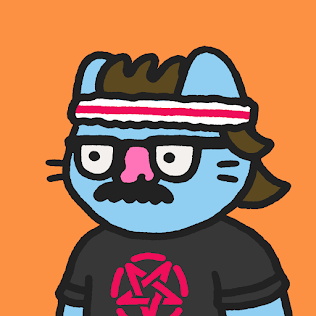

NFTs
==========

Let's get it right out of the way, **99% of NFT's are stupid**. They serve little to no actual value and are just plain ugly. People are taking them way too seriously, and unfortunately there's even more misinformation and nonsense being spewed about them to delegitimize the entire-space. I right clicked this image just to get it out of the way

.. image:: images/nfts/bored_ape_1.jpeg

This is ugly. In my opinion, this wouldn't be worth $1 if it were not an NFT, but that's the point. It's an entire system based on raw-economics, with applications far beyond what people are considering because media-outlets create eye-catching titles. But when we look a little-bit deeper, we can paint a much clearer picture of why they've exploded, where they're heading, and why we should care about NFT's. So let's talk, for real, about NFT's.

What is an NFT
----------------

An NFT stands for "Non-Fungible-Token". It is a token on the blockchain, typically Ethereum. However, it can exist on any smart-contract platform like Solana, Avalanche, Polygon, etc. **There are NO Bitcoin NFT's, because Bitcoin does not have smart contracts**.

It is the reclamation of "ownership" on the internet. If you recall from `my article on web3 <https://thecryptoconundrum.net/ethereum_explained/web3.html>`_, you don't really own anything online anymore. Using NFT's, you can truly own something, that cannot be taken away, and have everyone affirm that possession.

Fungibility
*************

*Fungibility - "the ability of a good or asset to be interchanged with other individual goods or assets of the same type"*

This means that when something is fungible, two or more items are the same. They can be swapped for each-other seamlessly. Take US-currency, a quarter is just a quarter. There are billions in circulation. All modern-coins are the same, and one can be swapped for another, with the exact same-value. Both are worth $0.25

On the other hand, you have non-fungible-items. These are items that are unique, and cannot be replaced. This would be like `a rare quarter <https://www.pcgs.com/prices/detail/washington-quarter/112/most-active>`_. Something about it has made it differentiable from others, such that it is completely unique and non-reproducible. The things that make it different, are what makes it valuable. Cryptocurrency itself, like Bitcoins or Ether, are fungible. All Ether that ever was or will be is exactly the same.

An NFT therefore means a blockchain-based token, with a unique-identifier. One contract can contain many non-fungible-tokens, each with their own *unique-identifier*. It could be a number, a letter, a string of characters, etc. as long as no-two have the same one. This is what creates non-fungibility.

The point of this, is to assign ownership of something, typically information. The NFT can be used to denote who owns what. Exactly "what" that is, is determined by the person creating the NFT, and identifiable with the NFT itself. Two people can have different NFT's, that are tracked by the same-contract, but reference different pieces of data.

Data References
******************

The referenced data, and the NFT itself **are not the same thing**. You have the data itself, and then the reference to the data so that people can find it. When you own an NFT, **you aren't owning the underlying data, you're owning the reference to where the data itself is stored**. Sometimes this data is stored in the NFT-contract itself, and sometimes it is stored off-chain. The storage medium is determined by the type of data being stored, and the creator of the contract.

You don't own this picture. The creator has stored the picture on a file-service-application known as the `"interplanetary-file-service" <https://ipfs.io/>`_. Your NFT contains `a link <https://bafybeidztah57s6ssxy7pnfunthocnk7kookptvtj2sc2hv4edj4pmruxy.ipfs.dweb.link/7981>`_, to find the data on the image-itself.

.. code-block:: json

  {
    "attributes": [
      {
        "trait_type": "Background",
        "value": "Tangerine"
      },
      {
        "trait_type": "Skin",
        "value": "Normal"
      },
      {
        "trait_type": "Body",
        "value": "Overalls"
      },
      {
        "trait_type": "Face",
        "value": "Winking"
      },
      {
        "trait_type": "Head",
        "value": "Jester's Hat"
      }
    ],
        "description": "A collection 8888 Cute Chubby Pudgy Penquins sliding around on the freezing ETH blockchain.",
        "image": "https://ipfs.io/ipfs/QmNf1UsmdGaMbpatQ6toXSkzDpizaGmC9zfunCyoz1enD5/penguin/7981.png",
        "name": "Pudgy Penguin #7981"
  }

The above image was Pudgy-Penguin #7981. The NFT contained the URL

`https://bafybeidztah57s6ssxy7pnfunthocnk7kookptvtj2sc2hv4edj4pmruxy.ipfs.dweb.link/7981 <https://bafybeidztah57s6ssxy7pnfunthocnk7kookptvtj2sc2hv4edj4pmruxy.ipfs.dweb.link/7981>`_

The Image itself was stored at the following location

`https://ipfs.io/ipfs/QmNf1UsmdGaMbpatQ6toXSkzDpizaGmC9zfunCyoz1enD5/penguin/7981.png <https://ipfs.io/ipfs/QmNf1UsmdGaMbpatQ6toXSkzDpizaGmC9zfunCyoz1enD5/penguin/7981.png>`_

Anyone can see this information, because the reference is stored on the blockchain.

*"So if you don't own the actual image, how is this not a scam. You own a receipt. It's ridiculous"*

That is correct, but obscures a lot of the nuance. Yes, sometimes the thing you are representing as an NFT is stored somewhere else. Anyone can see it, therefore anyone can download it.

But there's very specific reasons it was designed this way:

Data-Storage
~~~~~~~~~~~~~~~

Data storage on the blockchain is very expensive. Remember, that in a decentralized-system, every node must maintain a copy of *all* the data. While we think of images are very small amounts of data, they can get big. This is magnified by the sheer amount of NFT's being produced. That penguin image above is 301-Kilobytes. The original NES-Version of Super-Mario Bros was only `31-Kilobytes, 10% of the size <https://news.ycombinator.com/item?id=21213421>`_. At the scale of millions or billions of created-NFTs, the data-storage requirements become absolutely absurd for running a node.

This becomes even more apparent when you consider that any piece of data can be represented as an NFT. What happens if we try to make music-mp4's into NFT's, or video's, or E-Books, etc. The amount of data becomes unsustainable very-quickly. When that happens, decentralization decreases because ordinary users, only corporations and data-centers are capable of running nodes with that kind of hardware-capabilities. It is likely that in the future, as data-capacity increases, and with innovations like Sharding, that the underlying data will be able to be stored on-chain.

Some NFT's, however, are stored entirely-on-chain. For example, the `Ethereum-Name-Service <https://thecryptoconundrum.net/dapps/ens.html>`_. Because the NFT's for ENS represent text, the underlying data can be stored on-chain for relatively-cheap. It all depends on what the developer wants.

Transparency and Utility
~~~~~~~~~~~~~~~~~~~~~~~~~~~

I would categorize this as the difference between owning-something and showing-off. This is why art isn't the best-use of this technology. The benefit of an NFT is to prove that *you are the owner of a piece of data others find desirable.* You need a system that allows everyone to both see the desirable data, while affirming that you are its owner. Let's take a practical example, Concert Tickets.

Let's say you're going to a concert, and the tickets are NFT's, sent right to your wallet. It doesn't matter where the data is stored. The idea of "right clicking an NFT" doesn't make sense here, because there's no benefit to doing so. When you download an image NFT, the downloaded copy is exactly the same, down to the bit. There's no utility to it that would make downloading it worth anything. Now let's say you went to look at the metadata about someone's concert-ticket. You could copy and paste the data, but that wouldn't be worth anything. You would walk up to the ticket-checker and it would reject you because "John Doe has a ticket, but you need to prove that you are John Doe". You can prove that you are the owner of something, and then that can be verified.

Another example. The Bored Ape Yacht Club is stupid. BUT, it does have one benefit. When you own one of their NFT's, you get access to their membership club. If you have one of their NFT's in your wallet, when you go to the website, you get special access to the store and various pages. This store might include things like the ability to buy a piece of clothing with the NFT on it. You have to connect with your wallet (which is easy) to prove you own the NFT before accessing it. Verified ownership grants special-privileges. You could right-click the NFT, but because you don't own it, you don't get the special privileges.

.. image:: images/nfts/bored_ape_bag.webp
  :width: 300px

*"But if it's just a link, what's to stop me from making my own contract with all of the stolen links?"*

Nothing. There's nothing stopping you from duplicating the contract, and giving yourself all the NFT's. The issue is getting other people to care. The system only works because enough people believe it does. The NFT's have value because a large enough mass of people believe in a singular-contract being a legitimate source of ownership. If you copied all of the bored-apes, it wouldn't be worth anything because you wouldn't be able to convince people that that is the original source of the NFT's. If you can convince enough people that it is, then you could make money off of owning everything, but that is very difficult.

Usage
--------

The process of creating an NFT is known as *"minting"*. It is actual transaction, on the blockchain, that creates the token (with the URL) and gives it to the specified user. If you have an Ethereum wallet, you also have an NFT Wallet. The transaction fee for any action involving it (transferring, selling, destroying) must be paid in Ether.

Marketplaces
**************

Because of the ways that these contracts are written, it is possible to create a marketplace. This is what `OpenSea <https://opensea.io>`_ is for. OpenSea is an NFT-Marketplace. This means that it's a website that allows people to buy, sell, and auction-off their NFT's. I essentially give OpenSea's smart contracts the power to solicit bids for my token, and the authority to transfer the NFT to the winner on my-behalf.

They also have a feature that allows you to mint your NFT on their site, and they will store the image and do all the work for you. This can be good, because otherwise you would have to deploy your own contract from scratch, which for the non-technical user/programmer can be quite difficult.

However, it does retain some issues to be weary of:
  1. Censorship - OpenSea is a centralized marketplace. When you use it, you give them power to arbitrarily decide which NFT's they do and do not want to list. There are many examples of OpenSea `arbitrarily taking down NFT's, leaving the buyers/holders holding the bag with no recourse <https://decrypt.co/78788/pepe-the-frog-meme-nfts-opensea-copyright-dmca>`_. They will not allow you to post legal images of things like legal-pornography or things they think are copyrighted (like YouTube).

  2. Centralization - All the data is stored on OpenSea Servers. It is a centralized database, which has the risks discussed many-times before both for security and censorship. Preserving decentralization should always be priority in cryptocurrency.

  3. Fees - OpenSea takes a cut of every sale on their platform of 2.5%. Them acting as a middleman with such a fee structure is antithetical to the goals of web3, and can be a large pain in the side for people who make lots of sales. They do have systems to allow sellers to enable royalties on their sales, which is a benefit however.

Gaming
*******

You may have heard about these through the discussion on the "meta-verse". I'm not going to go on a diatribe about the meta-verse at this very moment, but there is slight overlap between the two.

First things first, just because something is Web3/NFT's, does not make it part of the metaverse. Just because it is the metaverse, that doesn't make it Web3/NFT's. They are two separate technologies that people are trying to incorporate together.

There are three cases for using NFT's in the video game space.

  1. Trading-Card Games - If you've ever played a card-game, like Pokemon or Magic the Gathering, this is the  most-common use-case. It means representing the cards as an NFT, and having to link your wallet to access it. By linking your wallet to the game, you can buy play the game with them. Cards can be bought or sold anonymously and directly, instead of having to go through the developer-marketplace, if they exist at all. Most importantly, once a card or item is created, it can't be changed. Your item cannot be improved, removed, or altered arbitrarily. This is done in games like `Gods Unchained <https://godsunchained.com/>`_, `Axie Infinity <https://axieinfinity.com/>`_, etc.

    I think Vitalik Buterin (Inventor of Ethereum) said it Best:

      “I happily played World of Warcaft during 2007-2010, but one day Blizzard removed the damage component from my beloved warlock’s Siphon Life spell. I cried myself to sleep, and on that day I realized what horrors centralized services can bring”.

      —Vitalik Buterin, actual quote.

  2. Cosmetics - These are the items that people complain about often. It is things like skins, that offer no effect on gameplay. They follow the same technical abilities as useable-items. They might take forms such as avatar-clothes, skins for weapons, etc.

  3. Metaverse - Applications like `Decentraland <https://decentraland.org/>`_ and `Somnium <https://somniumspace.com/>`_ that create digital worlds (much like `second-life <https://secondlife.com/>`_), and sell you items in it like land or houses. Each plot of land or item is an NFT that can be held or traded.

There are various benefits to allowing NFT's to be included into games:
  1. It allows individuals to make and benefit from the things they create. If you create an NFT of a skin you create for a game, you can market and sell it directly. You can earn royalties from sales of the item, etc. without relying on the developer.

  2. Items and accounts cannot be taken away from you or removed without any kind of explanation. This goes along with the anti-censorship properties that I discuss so often online. Transactions of these items can be done anonymously with cryptocurrency.

However, there are also a series of downsides to incorporating them into gaming:
  1. Greedy Developers - It's just another way that AAA gaming studios can price-gouge you for more money to gain access to items that should be included in the base game, or are purely cosmetic for additional-fees. There has been substantial push-back against this in the gaming-community `for justifiable-reasons <https://www.techtimes.com/articles/270187/20220106/gaming-nfts-why-people-hate-them.htm>`_.

  2. Hacks - If you get hacked and lose your NFT's or your wallet, there's no way to get your stuff back. Same with your account, there's no way to get your account back because identity is determined by wallet, not by username and password. There are solutions for this being developed and will be common in the future however.

  3. Centralization Bottlenecks - Even though it uses the ethereum-blockchain for the NFT's, if the game is hosted on a centalized-service, then it's not truly decentralized at all.

Financial Instruments
**************************

Since an NFT can represent any amount of information, it can be used to represent contracts, or other cryptocurrency itself. This has big implications for finance. Imagine some of the following

  1. Derivative Trading - A derivative such as a future or options contract is simply an agreement between you and someone else to buy or sell something in the future, at a pre-determined price. If you represent this ability as an NFT, you can trade the contract on the open-market for a fair-market-price. This opens up a large amount of financial-services in both cryptocurrency and traditional securities to average investors. Complex financial instruments are locked behind regulatory barriers or large financial-institutions for average-people, but available to large-banks, giving them an unfair advantage.

  2. Venture-Capital Divestment - If you've watched Sillicon Valley or financial news, you may be familiar with the concept of "divestment schedules". Using an application called `Revest Finance <https://revest.finance>`_, this investing/divesting schedule can be replaced by an NFT. Let's say that you are raising money for your application through an ICO. You give out tokens to investors but don't want them to be able to sell it until a certain point so as not to completely crash the price. You could put the funds into a revest-vault, and that vault is represented as an NFT. Only the NFT-holder can access the funds inside when the conditions have been met. It can be made non-tradeable to prevent them from selling it to someone else, etc.

Misc.
**********

I'm not going to list out every possible use for NFT's, but the point is that there's a LOT of different uses for this technology that is not art, and which will change the way we do things online.

  1. Royalties for artist and musicians selling their works.

  2. Tokenizing real world items like books and freely sharing them without censorship.

  3. Identity management - NFT's can be used to represent identity management online. Prove your identity to a service provider directly without a middle-man and with privacy. awards, badges, commendations, etc.

  4. `Domain Names <https://thecryptoconundrum.net/dapps/ens.html>`_

What is going on?
-------------------

If you're still reading up to this point, you're probably wondering why people care about all the art nonsense being spread. This is reasonable. That's a complex question to answer.

The simplest explanation, is that **it's all just mindless speculation. People are buying the jpeg's because they think they can sell them later, for a higher value than they bought it for.** In its current form, that is the entirety of the NFT market. It is merely a reflection of supply vs. demand. There is a limited supply of NFT's, but a much higher demand for them.

It `started with CryptoPunks <https://www.withotis.com/mag/cryptopunks-short-history>`_, then became `Bored Ape Yacht Club <https://www.rollingstone.com/culture/culture-news/bayc-bored-ape-yacht-club-nft-interview-1250461/>`_, and then Beeple `sold his art for ~$60M <https://www.theverge.com/2021/3/11/22325054/beeple-christies-nft-sale-cost-everydays-69-million>`_. A group of people saw this happening and started buying up as many NFT's as they could on the off-chance that they will be worth a lot of money someday. Some of them might, a lot of them won't.

*"But it's just a link to an image somewhere else, that I can right-click and save. Why do people think it's going to be worth anything"*

Well that's a question which you could spend an entire PhD on looking at the history of consumer-behavior. I think the more simple explanation is that it's backed by a new-technology, that people are really associating with it. It's not that people think this is a piece of art worthy of awe.

Rather, that it is that it is unique, and backed by a new and emerging-technology, and that someone else will find that exciting enough to pay for it.

*"So people are paying millions for art they know is ugly and has no value?"*

Kinda. Some people are legitimately buying them because they're rich and have nothing better to do. Most are trying to resell. But you should be extremely skeptical of how this market works. Remember that the nature of the blockchain is private. Nobody knows who the person behind an address is. As a result, it becomes possible to arbitrarily bid up the price of your NFT.

Here's what happens
  1. Acquire an NFT either through minting or purchasing

  2. List it on OpenSea or another NFT marketplace at price higher than what you paid. Nobody knows how much you paid already so you can list at whatever you want.

  3. Make a bunch of other wallets and bid on your NFT, or even buy it from yourself outright, raising the price each time. The marketplace doesn't know that they are the same person, only that there's a lot of activity on it.

  4. Unsuspecting user comes in, and sees a high demand that doesn't really exist. They say "wow there's a lot of demand, I should bid on it because obviously someone will buy it back from me".

  5. Stop bidding on your own NFT and let them win.

Congratulations, your meaningless piece of junk that isn't worth anything has now tripled in price. You weren't ever going to buy it but they don't know that.

This is happening `all over the place <https://nft.substack.com/p/the-specter-of-shill-bidding-around>`_.

*What do people mean when they talk about a "price-floor"?*

Before an NFT can be sold, it must be minted. This is often how developers make money on the initial sale.

The way this works, is that in order to execute the "mint" function of a contract, to create the NFT, you must also pay a fee in Ether. You submit a transaction, containing both the data of the NFT you want to create, and a value to spend (e.g. 1 Ether). This amount is set by the developer, and can increase. Every time a user mints a new NFT, the amount to mint a new NFT increases. So if the first NFT minted costs ``0.1 Ether``, if it increases by that same amount every time, by the time the 20th NFT is minted, it may cost ``20 Ether``.

This is part of the reason people think NFT's will increase in value. People get the false impression that because it costs a certain amount to mint, it must be valued *at at least as much as that*. If someone pays ``20 Ether`` to mint the NFT, they wouldn't sell it for any less than that. That's not how economics works, but that is the logic that is often applied to NFT investing.

*"So where do all these ridiculous prices come from?"*

Basic economics: Supply and Demand.

There is a limited supply of various NFT's, and people who want to buy them. Sometimes, as i've explained above, this perceived demand is manufactured, but sometimes is real. Why people want to buy them is up to the individual, but often because others want to buy it, and they think they can sell it for more than they bought it for. It's that simple.

Celebrities
*************

*"So why are all these celebrities and companies releasing NFT's then?"*

Because they know that people will buy them. It's a way to get their name in the news, and make money off while costing them nothing. It's that simple. Some artists are doing things like `Kings of Leon releasing NFT's of their album <https://www.rollingstone.com/pro/news/kings-of-leon-when-you-see-yourself-album-nft-crypto-1135192/>`_ because they can generate royalties from it, and screw over their record-producers.

Criticism
-----------

Energy Usage
**************

*"Each NFT transaction takes as much energy as Argentina Uses. That's not sustainable"*

Ethereum, the main cryptocurrency for NFT's does use a lot of energy, but in less than 6 months (Q2 or 2022), it will `reduce its energy usage by 99.5% <https://blog.ethereum.org/2021/05/18/country-power-no-more/>`_. This will be the **END** of the energy-debate. Bitcoin still uses a lot of it, but there are **NO NFT's on Bitcoin**, so it's a moot point.

Money-Laundering
******************

*"This sounds ripe for money-laundering, just jack up the price of a worthless NFT. We need to stop this now"*.

Yes, some people will use this for money laundering. It's possible. But it's also unlikely. Statistically, US Dollars are still `the most common source of money laundering funds <https://www.newsbtc.com/analysis/it-is-the-us-dollar-not-bitcoin-that-is-mostly-used-in-money-laundering/>`_.

Just because something might be used for illegal activity, doesn't mean it is bad for society and needs to be removed. Drug dealers drive cars, Nigerian Princes use email, and `Hitler also wore pants <https://en.wikipedia.org/wiki/Reductio_ad_Hitlerum>`_. The benefits to society gained from this technology, in my opinion, outweigh the potential risk of illegal activity.

Downloads
***********

*"I can just download this image and put it on facebook and nobody can stop me. This whole thing is so stupid"*

Yea, it is. But focusing on art as the ultimate end of this technology misses the point. Art was never the best use for the blockchain. Focusing on this kind of nonsense is what websites and news outlets want you to focus on because it generates revenue. Financial institutions want you to direct your outrage at it and associate it with everything cryptocurrency, because it poses a threat to their interests.

The simple fact is that a lot of people are being turned on to cryptocurrency and blockchain's potential because of these NFT's, and they will stay for the kind of benefits it offers beyond jpegs. With all of the possible applications of NFT's that i've discussed, to focus on the meaningless JPEGs is to willingly ignore the forest through the trees. Widen your view of what's possible.

Stupidity
***********

*"Fine, so the technology is useful, and has a lot of benefits, and should be allowed. But it doesn't change the fact that people are spending huge amounts of cash on absolute nonsense. You can't tell me that's reasonable"*

I don't have the appetite for the risks involved in investing in NFTs, which is why I don't do it. What people find desirable and want to spend money on isn't my business. As long as there's been economics, there's been people buying and selling things that aren't worth it. Don't overthink this. People can, and will, buy anything. People bought beanie-babies, pet-rocks, `Supreme Bricks <https://www.theguardian.com/technology/2016/sep/30/red-clay-brick-selling-for-up-to-1000-on-ebay>`_, Baseball Cards, etc. all with the expectation they would increase in value. This is just the next iteration of collecting for a new-generation. A lot of people are gonna lose money, but that's their fault for making a risky investment.

It's no secret i'm not a fan of all of the art NFT's. I think they detract from the real practical uses of the technology, and I don't invest in them. But someday the market will deflate, and we can get back to focusing on the real uses of the technology that matter.

The adult-industry for decades has been at the `forefront of technological innovations <https://www.businessinsider.com/the-producer-of-middle-men-talks-to-us-about-how-pornographers-invented-e-commerce-2010-8>`_. To write off the entire world of cryptocurrency because of NFT's is to say that back then digital e-commerce was pointless because it was being used for pornography. We still don't know what some of the applications will be. When the internet was built, nobody could have imagined search-engine-optimization, cloud-based-streaming, payment-processing in e-commerce, etc. Only time will tell what practical uses of this technology holds.

Conclusion
------------

It's very easy to look at what's going on in the world with NFT's today and write it off. There's a LOT of things being sold for inflated-prices, people being scammed, and just plain-stupidity. But it's essential that you look past the negative and try to focus on the potential. NFT's, when used correctly, create an entire world of potential for decentralized-ownership, that avoids the pitfalls of our current centralized-systems. Don't get caught up in the nonsense. If you think an NFT is ugly, don't buy it. If you think it is useful or just want to own it, then go for it. You don't have to do anything, but nobody can stop you from engaging in this world anyways. That's the strength of this technology. Don't write the entire technological ecosystem off because your friend spent their money on something you disagree with. Be safe, and good luck.
