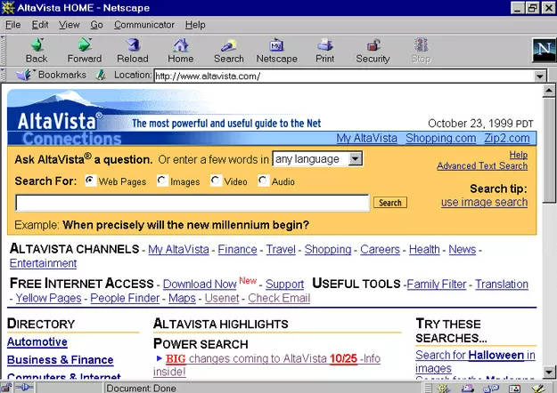
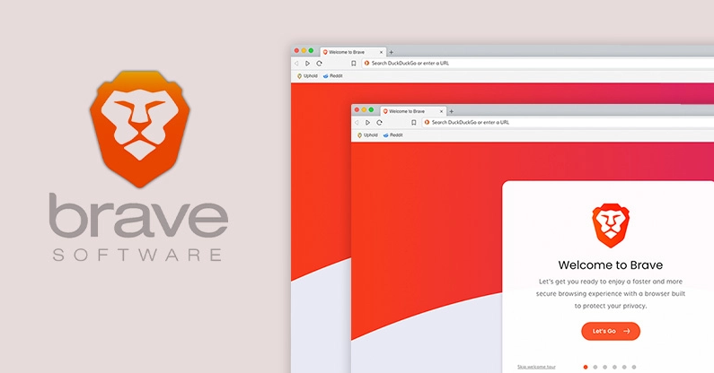
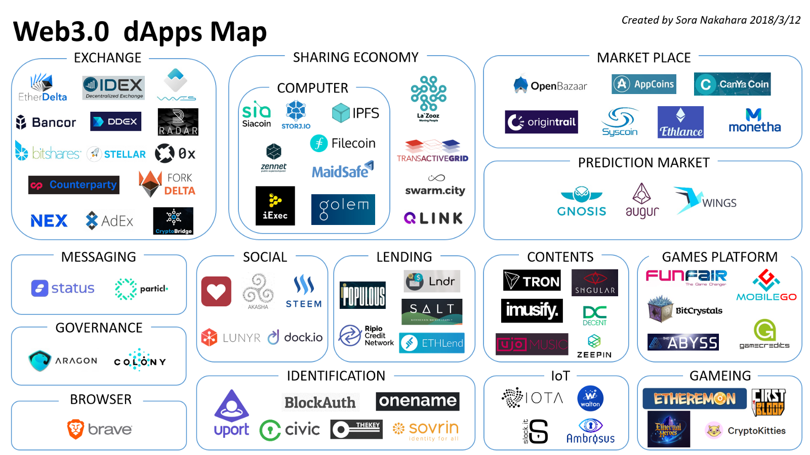
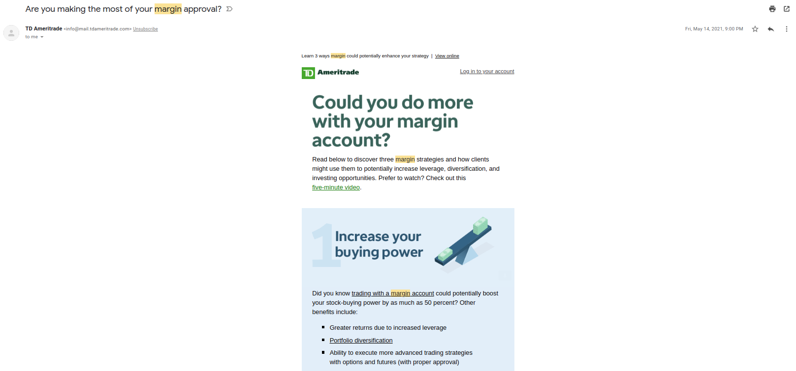

Web3
======

The 2021 Collin's Dictionary `word of the year is NFT <https://www.cnn.com/style/article/nft-word-of-the-year-collins-scli-intl-gbr/index.html>`_. NFT's have exploded in popularity, which in turn has kickstarted discussion on a larger collection of technology known as **Web3**. Billions of dollars have flown into the space, and caught the attention of everyone from lawmakers, to tech-executives, to professional-atheletes. But what exactly is Web3? Some have heralded Web3 as the future of the internet. Others have decried it as a series of Ponzi-schemes and frauds. Only the future will tell what the future of the internet holds, but for now it's worth discussing exactly what it is, and why it could potentially change the way we use the internet.

History of the Internet
------------------------

Web 1
********

The internet as many consumers known it, was created on `August 6, 1991 <https://www.google.com/search?q=http+creation+date&oq=http+creation+date&aqs=chrome..69i57.2051j0j9&sourceid=chrome&ie=UTF-8>`_, when Tim-Brenners Lee and his team at CERN invented the Hypertext-Transfer-Protocol (HTTP). It was the communication system that allowed servers to host information, and your computer to retrieve it. Using this and HTML, the file format that all websites are rendered in, the internet as we know it began to take shape. In the first few decades, the internet was crude. Servers hosted very basic static (unchanging) websites, like GeoCities. You went to the page, saw what was there, and that was about it. There were more interesting examples like web-forums and file-hosters, but design and functionality was very crude. Websites were independent, and there were no search-engines to link them together.

.. image:: images/web3/geocity2.jpg

Websites could be hosted locally for all to see, and there wasn't very much user-interaction. Most of it involved information being stored elsewhere, and people going to retrieve it. This is what we refer to as Web 1.0. It was the first generation of the internet, when its userbase was still a lot of nerds, and nobody really knew what kind of things would be capable. Many years would pass before complex applications started to form. The internet was a series of islands, controlled by people, and independent.

Web 2
*********

Starting around the turn of the century, the internet began to evolve. Amazon Web-Services (AWS) launched and allowed people to buy server-time over the internet. Websites like Google began to link pages together through search-engines, and suddenly information was easier to access than ever before. Financial Services started operating online like Banks, and accepting credit-cards. Applications like Facebook started to connect people, while also collecting personal information. Websites now allowed more user interactions, with more complex back-end systems to manage it all. Now you you can live your entire life online, from Banking, to shopping, to working, but at a cost. It resulted in the rise of the tech-giants we know today, as information and power consolidated. This has continued until today, and is known as the second-phase of the internet, the centralized Web2. However, this also when we saw the start of massive data-collection, and the problems it brings.

.. image:: images/web3/web2.jpg

The Problem with Web2
-----------------------

Facilitated by those centralized tech-giants, they have changed our world in immeasurable ways. As minor companies grew in size, they continued to collect more data, build more applications, and accrue more users, while creating many problems. The old addage in the privacy-community goes something like "If the service provided is free, you are the customer". We allowed centralized entities like Facebook and Google to give us free services and applications, at the cost of our personal-privacy. Information is collected, monetized, and used by questionable individuals, profiting off of your personal-information. Your data is collected, sold to advertisers, and `used to market to you <https://cbscreening.co.uk/news/post/your-personal-data-and-how-companies-use-it/>`_, `propagandize <https://www.washingtonpost.com/politics/2021/10/05/china-is-exploiting-search-engines-push-propaganda-about-origins-covid-19-study-finds/>`_, and `much more <https://www.security.org/resources/data-tech-companies-have/>`_.

Hosting things on the internet is expensive. The only way to make it economical, is to do it at an absolutely massive scale. This is why Amazon does AWS, and it has a lot of benefits. Hosting your website or business on AWS servers is SUBSTANTIALLY cheaper, more secure, and flexible than doing it in-house, which is why it is so popular. It is estimated that `between 30-40% of all websites are hosted on AWS <https://augustafreepress.com/what-is-aws-does-amazon-control-the-modern-day-internet/>`_. When AWS hosts all of these businesses' services, they also collect data on what they are doing. Even consumers utilizing those services are subject to this kind of data-collection. They can find out what you're using, what it's for, etc. and use it to market to you, sell it to anyone, or to steal ideas and products from competitors. The issue, is that there wasn't any kind of alternative system to allow these massive websites and applications to function. If you are a small business, you simply cannot afford to do all of your own web-hosting on-premises, so if you want to make a sufficiently-scalable website, you need to use AWS or some other cloud-provider (GCP, Azure, etc.). It is a system where cheap and useful services are available, but at the cost of your privacy and data, with no alternative. You might have a choice to use the services, but not really because any other alternative isn't feasible.

Censorship in many parts of the world is a big issue. As repressive governments crack-down on political dissent, it can be easy for big-corporations to cave to the demands governments of big international-markets. Amazon Web-Services is the largest cloud-provider, and hoster of websites in the world. They also `agreed to censor websites about the Chinese-President Xi-Jingping in order to do business there <https://www.aljazeera.com/economy/2021/12/20/amazon-silenced-criticism-of-xi-to-do-business-in-china-report>`_. Billions of people locked out of access to services and information and `propagandized <https://www.reuters.com/world/china/amazon-partnered-with-china-propaganda-arm-win-beijings-favor-document-shows-2021-12-17/>`_ by those same services that bring you your favorite website. When all information and data flows through centralized-services, it's easy for governments `to sever the link to it <https://adminhacks.com/bgp-internet-censorship.html>`_, and deny people access.

When we send money from one person to another, it requires a middleman. Western Union takes a `percentage fee <https://www.westernunion.com/content/dam/wu/EU/EN/feeTableRetailEN-ES.PDF>`_ of your transaction. It can cost a lot of money, and take days or weeks to send funds to the other side of the world, bound by business-hours. When you use a credit card it all flows through the providers, who takes their cut, forcing the extra cost onto you. They see everything that goes on and your privacy goes out the window. You wan't to do business on the internet, you don't have a choice but to do business with the credit-card oligopoly.

You don't truly own anything in Web2. You don't own the money in your bank account. The bank owns the money, and you place your trust in them, to give you the money they say they owe you. The only real-way to own something to hold the physical asset in your hand, like Cash. You don't really own your website-name, the DNS providers do, and rent it to you. You trust that they're not going to give it to someone else arbitrarily even though they promised it to you. At any given moment these sites and services can shut you down. Your access can be revoked, your identity taken-away, and your assets withheld without explanation or recourse.

*"You're completely paranoid and talking nonsense. My favorite website isn't going to censor me, especially if I've done nothing wrong."*

Your probably right about that. If you live in a first-world country, you're probably not going to get your internet cut by your government to prevent you from reading anti-government literature. But the problems with Centralized-services go so much deeper, and in ways people don't even think about.

A few Examples:

    1. Facebook made news recently when it was discovered that they unilaterally revoked the “@metaverse” handle from an instagram user. This user was an artist, who had held that username for almost a decade. Because Facebook didn’t like that someone else had it, they decided to just take it. There was no negotiations, no dispute process, no compensation, and nothing the person could do. They were shut down because they inadvertently got in the way of a trillion-dollar-company, with almost nothing they could do. In the terms and conditions of Twitter, Instagram, TikTok, etc. you give them the right to arbitrarily take away any handle you register, and give it to someone else. This is how celebrities get tags like "@JohnLegend" or "@MileyCyrus". They will take it from you, and give it to whomever they want without any recourse.
    
    2. Your credit score is an integral part of the modern-economy, and your chances of upward-mobility. We've already seen the carelessness and flagrant disregard companies like `Equifax <https://www.wired.com/story/equifax-breach-no-excuse/>`_ have for your data, and keeping it safe. It is estimated that ~1/3 of all people have `mistakes on their credit-score <https://www.cnbc.com/2021/06/11/how-to-fix-those-mistakes-on-your-credit-report.html#:~:text=It's%20not%20as%20uncommon%20as,1%20and%20April%201.>`_. This information is determined by a questionable system, and built by engineers with biases and no clear public-accountability. If something is wrong with your score, you can get it removed, but thousands of people have endured the horrors of trying to maneuver that system, and often completely unable. Yet, we have handed over our trust to these services for no apparent reason, to control some of the most important pieces of our information.

    3. `Wells Fargo paid $3 Billion for creating Fake Accounts to siphon money out of customers <https://www.cnn.com/2020/02/21/business/wells-fargo-settlement-doj-sec/index.html>`_. We're supposed to trust financial institutions, yet they time and time again demonstrate that they will do anything at your expense to meet their bottom-line. People's accounts get frozen `all the time <https://abc7ny.com/7-on-your-side-frozen-bank-account-chase-savings/10563609/>`_. If a bank "suspects you of comitting illegal activity", they can freeze your account to investigate. There is no transparency in this system, and often little recourse. What can you, an individual, do against an international multi-billion dollar banking institution? Nothing.

    4. Facebook tracks everything you do. They track your every keystroke, ad, and comment to create a psychological profile of you. They sell this information to advertisers to market to you, to politicians and research-firms to target you with ads, and to keep you engaged at all times. We don't even know the full-scale of what information is collected on you, to fill out their database. Everyone benefits from information about you, except for you. When you see an ad on a website, the publisher gets money, the data-provider (Google) gets money, and the advertiser gets your attention. Everyone wins except for you, when your data is monetized without your consent, and used to come after you, in the name of profit.

    5. Earlier this year OnlyFans decided they were going to start `banning pornography on their platform <https://fortune.com/2021/10/09/onlyfans-sex-workers-porn-ban-subscribers/>`_. Regardless of what you think about onlyfans, this was devastating news to many. Since most of their funds and revenue comes from the credit-card companies, when they decided they didn't want to associated with a pornography-company, OnlyFans was forced to take drastic-measures to get their revenue-source back. This put a lot of people financially at risk who were using onlyfans as a primary-revenue-stream. When we turn over control of financials to the centralized-financial-payment companies, they can hold obscene amounts of power over who is allowed to access it, and why. OnlyFans didn't break any laws, but the financial-payment companies decided to screw them over arbitrarily, leaving them up a creek.

    6. Venmo, Cashapp, and Paypal - The money in your Venmo account is not yours. It's Venmo's as they hold it in their bank-account, and then tell you how much money you have. You take your money, and give it to Venmo, and they tell you how you can use it, and who you can send it to. Money in your Venmo can't earn interest, but because it's in their bank-account, they do. You're trusting them with your money, but they get to earn interest on it, and you don't. Then they go a step further and sell the data on who you're sending money to to anonymous advertisers to do who-knows what with it.

    7. Apple maintains strict control over apps that are allowed on the app-store, with no ability to download third-party apps. As a result apps are turned away or forced to self-censor in order to access the market. Tumblr is going through this right now. On the IOS Tumblr app, they decided to `arbitrarily censor and remove posts/tags <https://www.theverge.com/2021/12/28/22856734/tumblr-censor-tags-ios-apple-guidelines>`_ covering a lot of topics including mental-health to make it more family-friend, as per apple requirements. This was done with no warning, no explanation, or details, and prevents people from being able to access important information or choose to opt-out of seeing others.

    8. You don't own any media in our current system, you only rent access which can be revoked at any time. If you buy a book, that book is your property. You can do whatever you want with it. It can never be taken away from you, and once you own it nobody can stop you from reading it, whenever or wherever you want. You can lend it to someone, copy it, etc. because it's yours. When books moved to the cloud on things like kindle, you no-longer own anything. If you "buy" an e-book on Amazon you're really buying access to the file that Amazon Prime owns. At any moment they can remove it from their server, or remove your individual access, and you get nothing. You cannot access it anymore. We've relinquished ownership of media in exchange for supposed convenience. I get that books can be cumbersome, and e-readers practical, but the logic stands. You can read the book as many times as you want, lend it to anyone for any amount of time, read it in any country at any time of day. It is your property. You don't own anything when you use centralized-services, you're trusting that they aren't going to screw you over. If I buy a subscription to netflix, I don't own any of the content i'm consuming, i'm just renting access. Netflix can, and will, shut you down if you try to go out of the country without a VPN, because they own it, not you. What happens if the E-Book company decides it doesn't wanna host books with themes like LGBTQ or other controversial subjects for whatever reason. They can remove the book and take away your access without any explanation of compensation.

    9. As a result of their actions in Ukraine, various Russian banks were `banned from the SWIFT payment system <https://www.cnn.com/2022/02/28/business/swift-sanctions-explainer/index.html>`_. This was devastating for various banks and their customers, who now were locked out of the global payment system. Consumers who had nothing to do with the invasion were punished by our economic system and denied access to services they need. This is a form of censorship that has 2nd and 3rd order effects we don't think about. Russia's actions in Ukraine are reprehensible, but this decision will hurt a lot of innocent civilians and cause significant economic problems. Cryptocurrency is an escape from this financial-system. Regardless of politics, war, etc. people will always have access to their money, financial-services, and cross-border payments without fail.

There are so many more examples you could come up with about how we as consumers are being screwed.

*"So all websites and tech-companies can't be trusted, banks are corrupt, and freedom of speech is dead. You sound like a raving-lunatic and should be medicated immediately."*

I know I sound like a loon when I talk about this, but the simple fact is that the last few years have shown us some of the horrors that can emerge when we turn over control of the internet to a few entities with no public-accountability. **BUT IT DOESN'T HAVE TO BE THIS WAY**.

This is where Web3 comes in.

Web3
-------

What is Web3
**************

Web3 is simply the next-phase of the evolution of the internet. It is a return to some of the principles that guided the early-internet, and seeks to remedy the issues of centralized-Web2. Where Web2 is defined by the *centralization* of the internet, Web3 is characterized by *decentralization*. It is an understanding that we can do everything we do on the internet now, but without having to relinquish control to centralized-entities, while empowering the consumer and allowing them to monetize themselves. It returns various freedoms and liberties back to the users, and empowers them to be actual contributors to the internet, rather than simply products.

When something is decentralized, it is more like a democracy. No singular entity controls it, and decisions are made by the people who use it. Some of this involves cryptocurrency, and some of it does not. It typically involves blockchain-technology, but does not necesarrily require it. When people say "Web3", what it really means is to take something centralized, and make it decentralized. It is the belief that everything we do online now, can be done without a middleman constantly watching, or taking their cut of the transaction. The internet can morph into a more-democratized space, free from the problems of centralization. Things become faster, more secure, free, private, and more, without creating such negative externalities. You are able to take back actual control of your data, your finances, your privacy, etc.

.. image:: images/web3/web3.png

Examples
***********

Finance
~~~~~~~~~

Let's take a simple example, finances. As I said before, your bank holds all the money, and gives you access to it when you request it. It is custodial. You only really have money when you have cash. Web3 is a return to that ownership of things no longer being custodial. When you use cryptocurrency, you are put back in charge of your own assets. Nobody else can access it, or prevent you from doing what you want. Only you can decide to physically hand someone cash. When you use a bank, you're asking the bank for permission to send money that you trust them with, to someone else.

Free applications and services exist because the corporation that run them collect and monetize your data. Some of this goes to paying bills, and the rest to just making money. If I build a website that performs a simple task, I have to pay AWS a bill every month to host it. If I give away the app for free, then to pay the bill I have to collect your data and sell it to make up the cost. Even though information about you is being sold, you aren't seeing a dime of that money. When you watch a youtube video, some of the revenue goes to the creator, but most goes to YouTube, and they can choose to demonetize whomever they want for no reason. When you create content, go to websites, do anything, you are contributing to the internet, but not being compensated for that.

Participation
~~~~~~~~~~~~~~~~~

Another example, data storage. You run an application like Arweave, Filecoin, GraphToken, etc. They provide decentralized data and storage for various applications. You serve content to people that request it. The protocol rewards you with cryptocurrency for expending the compute-power and storage-space. The data is stored over an international group of data-providers such as yourself. In exchange for being an active participant in the network, the cryptocurrency also gives you the power to decide how the protocol is governed. If you're part of a system, you get a say in how it operates. The system encourages people to be active contributors to its security and stability, and rewards you for doing so. You are being rewarded for making the internet a safer, more open, and stable space.

.. image:: images/web3/DAO.png

You've probably heard of something called "open-source software". This is simply software, including its source code, which is available to anyone, for free. Open-Source ranges from entire operating systems (Linux), to word-processing (OpenOffice), to simple code-snippets that perform `rudimentary tasks <https://qz.com/646467/how-one-programmer-broke-the-internet-by-deleting-a-tiny-piece-of-code/>`_. Almost every single code-base on the planet relies on some form of open-source software. Millions of people everyday release and update software, for free, to make the internet better. Yet, when massive companies like Microsoft, Apple, Amazon, etc. use them to generate revenue, the creators don't see a dime. Using cryptocurrency, through systems like `Gitcoin <https://gitcoin.co/>`_, developers and engineers can build things people need, while being compensated for their work. When code is available to all, it is better for security, efficiency, transparency, etc. However, so much of our internet is built upon the thankless goodwill of faceless engineers writing this software. Web3 is the opportunity to reward them for building the tools that make our internet-experiences possible without having to worry that someday they might give up.

Advertising
~~~~~~~~~~~~~~~~

What about advertising? When you advertise your website on through Google AdSense, they take most of the revenue. Even if your ad is being show on someone else's website, Google takes most of the money to provide that service. What if the middleman could be cut out, and you could be rewarded for looking at ads. Using applications like Brave's Basic-Attention-Token, you can. It connects advertisers directly to platforms and websites, and allows them to promote themselves directly, without relying on Google as a middleman.

If a website collects your data, you can be compensated for it with cryptocurrency. If you choose not to, then you don't get compensated. You are put back in control of your own data, and to whom you choose to give it to. Everytime you see an ad, the advertiser has to pay you a little bit of cryptocurrency for your time. When you watch a youtube ad, most of the revenue goes to YouTube, and a little bit to the consumer. Using this same system, your money could go directly to the content-creator, and to the viewer. It incentivizes you to look at advertisements.

Venture-Capital
~~~~~~~~~~~~~~~~~~

Another great example is venture-capital. Investing in new ventures is a great way to make money if the idea pans out. However, getting in on them is very difficult. In the US, you need to be an accredited investor with the government, which often requires lots of paperwork and high amounts of capital, which most people cannot afford. As a result, power over new businesses and ability to invest locks out many people, ceding control to venture-capital funds. Using cryptocurrency, anyone can raise money from ordinary people. You can crowdfund without needing to give a percent to KickStarter or GoFundMe. `People can contribute anonymously, and be instantly rewarded with governance-tokens and voting-power in the new protocol <https://www.coindesk.com/business/2022/01/06/will-daos-replace-crypto-venture-capital/>`_. Give money to causes you support without having to go through the banks, the crowdfunding-websites, government red-tape, etc. You probably read about `ConstitutionDAO <https://www.constitutiondao.com/>`_ online. A group of crypto-enthusiasts raised $40M to try and buy an antique copy of the US-Constitution which they planned to donate to a museum, so that a private-collector couldn't such keep a historically-significant artifact for themselves. They were unsuccessful but the fact remains that this technology enabled so many people to raise funds so quickly for something they found important, without the need for a middle-man is unparalleled.

NFT's, while many are stupid, do have significant role to play in this space. NFT's can be built so that when they're sold portions of the sale automatically go to the creator. There's no record-label or art-house needed to facilitate the exchange of money. Anyone can list their creations online to be sold and viewed by a wider audience than before. Let's revisit that idea of the E-Book. If you were to represent the book as a token, then you are its owner. Your wallet is the e-reader, and you own the book. It cannot be taken away from you, or restricted arbitrarily. You can give it to whomever you want for whatever reason, anonymously, and nobody can stop you. It cannot be removed by any publisher or centralized-server to prevent you from accessing it.

There's nothing in particular about this system that requires cryptocurrency. Decentralization does not require it, but it inherently aguments and enhances it. Its quite likely that many of the applications and uses for this tech that will change our world have not been invented yet. The technology is still very young, and has only been around since about 2016. It's difficult to say exactly what form some of this will take. Some things will be overtaken by crypto, and some will not. In some circles, crypto will be another options for various services. It will not make banks obsolete, but will act as a viable alternative to some of the services they offer. Which blockchain this will be done on is also anybody's best guess. Web3 does not perscribe itself to any particular-chain. Applications can be deployed on any, as they all offer some varying degree of decentralization. However, the community of people building these solutions is typically concerned with being as decentralized as possible.

Criticism
----------

As with all new technology, there's a fair share of criticism online about Web3, and about cryptocurrency as a whole. Some of it is warranted, and a very good chunk of it is not. I've already written another article about all of the criticism `of Ethereum <https://thecryptoconundrum.net/ethereum_explained/misconceptions.html>`_, but I think it's important to address some more of it here.

Conflict of Interest
************************

Whenever you read criticism of this, first ask yourself "who stands to lose the most from the adoption of Web3?". The obvious answer is, the centralized services. This isn't just cloud-providers like AWS, GCP, or Azure. It includes social-media like Facebook and Twitter, Advertisers like Google, payment-providers like banks and PayPal. There's a LOT of misinformation and hate being directed, often by the people who stand to lose the most.

Jack Dorsey, former CEO of Twitter recently made headlines for slamming Web3 and Ethereum. He fired off a bunch of fear-mongering tweets with no evidence or sources to back it up. In simpler words, the head of a massive centralized-technology company tried to idiotically discredit the technology that threatens his business-interest the most. If Web3 truly grows, and our data can be stored on blockchains or decentralized-servers, there is no longer a reason to use twitter. There's no benefit to using the services of a centralized-entity that collects your data and makes arbitrary and opaque censorship decisions. Complaining about Web3 being centralized when you built one of the world's largest centralized-entities is the pot calling the kettle black.

.. image:: images/web3/dorsey.png

Who is this centralized-entity? What power do they hold? How have they wielded this? What VC-funds have secretly backed ethereum in a damaging way? What evidence is there for any of this? Why can't you own anything in Web3? Why is our current system any better than centralized-control now? These are all questions that no attempt to answer are made at. Some currencies are controlled by powerful VC funds (Solana, Avalanche, Etc.), but it's wrong to apply that label to all cryptocurrencies without evidence.

A few people who are very critical of Web3, Ethereum, and Cryptocurrency:
    1. Jack Dorsey - Single largest shareholder of Twitter, a centralized social-media company that profits off of collecting and selling your data. He holds millions of dollars worth of Bitcoin, which are directly threatened by Ethereum. Since applications can't be built on top of Bitcoin, it doesn't pose any threat to Dorsey's stake in Twitter like Ethereum does. This is why he is so adamant about promoting it and denigrating Ethereum.

    2. `Michael Saylor <https://cointelegraph.com/news/microstrategy-ceo-seems-to-embrace-bitcoin-maximalism>`_ - CEO of Microstrategy, which has made a multi-billion dollar bet on Bitcoin being the dominant coin over Ethereum.

    3. `Charlie Munger <https://www.cnbc.com/2021/12/03/charlie-munger-wishes-cryptocurrency-didnt-exist-admires-chinas-ban.html>`_ - VP of Berkshire Hathaway, a large investment firm that has spent decades and billions of dollars betting against technology investments. Charlie Munger knows a lot about a lot of things, and is historically a good investor. But, he doesn't understand how technology works, and has no experience with it. You should take what he, and many other similar investors say with a large-dose of salt. Charlie Munger has `a history of trying to push around people in industries and areas he knows nothing about <https://www.cnn.com/2021/10/29/business/ucsb-munger-hall/index.html>`_

Notice how all of those people have a very perverse incentive to fight against Web3, and spread disinformation and paranoia. None of those people have any experience actually building in the Web3 ecosystem, and large stakes in its direct demise or competitors. Keep this in mind when you read about the "downsides of Web3 and Ethereum" online.

It's very easy to post nonsense on the internet, especially on Twitter, where the algorithms amplify it. The amount of evidence and refutation needed to prove it wrong is a task that few will take on, and that even fewer will see. It makes it very easy for nonsense, especially about cryptocurrency to spread.

*"But if everyone uses the same wallet then that's a centralized-entity controlling everything".*

Wallets are just vehicles for encryption libraries that have been around for decades. You could build your own wallet, and transactions from scratch relatively easily. These wallet apps aren't custodial. There is no back-end data collection where they see your balance or make decisions for you. It's all done client-side, so only you know what's going on. The cryptocurrency community cares very much about open-source, and the ability of the community to audit the code for any fuckery.

Are some cryptocurrencies centralized and controlled by venture-capital funds? Absolutely. Networks like Solana and Avelanche were funded through multi-billion dollar investments by VC-funds, who now hold incredible amounts of power over those networks. There is no evidence that this is the case for networks like Ethereum, which never did a private VC-sale, and whose entire history has been one of transparency and fairness [insert link]. When you read claims attacking Web3, or specific networks, ask yourself first what their evidence or source is, and where their incentives lie. Jack Dorsey is a well-known Bitcoin Maximalist. He, and many others online believe that Bitcoin is the only currency worth caring about, and have significant stake in ensuring all challengers to it fail. They will say anything to undermine the trust of other networks and technologies to ensure it doesn't get surpassed. Notice however, that almost all of their criticism won't revolve around the technology, or what potential it holds, but rather unsubstantiated conspiracies about who is controlling it from behind the curtain. Don't believe it.

Bitcoin is part of Web3. It's features of peer-to-peer money-exchange is valuable for the future, but its abilities are inherently limited. It cannot do anything other than send Bitcoin from one person to another, with its own limitations. You CANNOT built applications on Bitcoin like Ethereum or any other smart-contract platform, because it doesn't support it. Bitcoin alone does not threaten Twitter or AWS because it can't be used to run applications, or do anything else that Ethereum, or Solana, or even EOS could do. It benefits billionaires like Jack Dorsey and Elon Musk to promote things they have a financial stake in, but don't post any threat to their current revenue-streams and business-interests

.. image:: images/web3/meme.jpg
  :width: 300

There are plenty of other criticism of cryptocurrency and Web3 that i want to talk about. I'm going to drop this video because it does provide a good explanation of various topics, while also attempting to be neutral.

.. raw:: html

    <iframe width="560" height="315" src="https://www.youtube-nocookie.com/embed/v0V_zkng4go" title="YouTube video player" frameborder="0" allow="accelerometer; autoplay; clipboard-write; encrypted-media; gyroscope; picture-in-picture" allowfullscreen></iframe>

However, I do feel that the video is more critical of Crypto than accepting, and there are some other points I think it could benefit from a more thorough rebuttal.

Scams
*******

*"Every week something gets hacked or was a scam. There's no consumer protection with a lot of predatory behavior"*

A lot of people have been using the `Squid Game Token <https://www.bbc.com/news/business-59129466>`_ as proof that the space is ripe for people to be exploited, and the need for more consumer protections, or limitations to protect consumers. Johnny Harris is right, there's a lot of scams and people need to be protected, but it's naive to say this is a problem of cryptocurrency that necessitates counting it-out. Since the dawn of email people have been falling for Nigerian Princes. But, nobody ever took serious the idea that we should ban email, or put regulations on who's allowed to use it. If you commit a crime over email, that's still illegal. If you commit fraud through cryptocurrency, like rug-pulls and pump and dumps, it's still a crime. You still go to jail if you get caught. The IT community has spent decades working on more effective ways to prevent email-phishing and remediation, and while it's still a thing, we're better at dealing with it now than we were 2-decades ago. The same goes for cryptocurrency. What we need is public awareness and better training to prevent people from being scammed out of their money, not to write off the idea, and the realization that the benefits of the technology are greater than any individualized consequences that come from unscrupulous actors trying to abuse it.

Just because people are buying nonsense is not a reason we should write it off either. Obviously Dogecoin and Squidgame Token are ridiculous memes backed by nothing and a lot of people got hurt. But the problem isn't cryptocurrency it's human psychology. We're constantly looking for the next way to get money, and cryptocurrency gives a form of financial freedom that with it comes high risk. GoFundMe allowed people to crowdfund money, for whatever stupid purpose they wanted. When someone tried to raise money `to make Kylie Jenner a billionaire <https://www.businessinsider.com/kylie-jenner-gofundme-fans-crowdfunding-billionaire-2018-7>`_ nobody said "this is a stupid use of GoFundMe, we need to shut it down". Instead the conversation was, "this is ridiculous please don't donate to it" instead. This is the way it should be. Don't throw the baby out with the bathwater.

We've become accustomed to the idea that losing money is ok, if you do it in the stock market. Earlier this year, Robinhood approved me to trade **up to $50k of options-contracts on margin**. TD-Ameritrade has done the same. I am not an accredited investor, have no experience with options or serious stock-trading, no stable income-stream, or investment plan. Yet, Robinhood and the US government are ok with me losing $50k of money I do not have, on financial instruments I do not understand, betting against companies I've never heard of. Yet, to allow me to take the risk to lose $100 of money that I do own and lose it on cryptocurrency is the bigger problem in their, and many peoples', eyes. This is obviously nonsense. If people want to take financial risks, that is their perogative. They even send me emails saying "learn how to trade options in 5 minutes or less".

Investing carries risk, and we need to let people make their own mistakes on stupid investments. Nobody is going to stop you from spending $10k to invest in your friend's Uber for Horses app, because we've decided that that is ok. Cryptocurrency investing should be the same way. There's nothing wrong with saying "this is a safe cryptocurrency investment" or letting people take financial risk if they are aware of what they're doing. The solution is in public-awareness that can only come from organic growth.

Ponzi-Schemes and hacks
****************************

*"It's a pyramid scheme with the financial services at the top waiting for you to buy in so they can get rich"*

Most of crypto right now is being used as a speculative investment vehicle. People are buying it with the expectation that it can be sold again at a later date for more money. I'll admit that i'm part of that group. Everyone wants to make money. The difference is that the conversations typically forget that cryptocurrency is still a liquid asset. At any given moment you can trade cryptocurrency for a real-life object. You can send it to someone else for goods or services without a middleman, just like cash. You can use Bitcoin or Dogecoin or Ethereum to pay for things. When you use application on Ethereum you need to use Ethereum to pay for that transaction. People are trying to treat it like a stock, when it's not. It is more like a traditional currency or a commodity. It has value, but people need to use it first.

Stocks however, work the way that Johnny is critical of crypto for. When you buy a stock, you are buying part of something. But you're also betting that someone else will come along and buy it for what you sell it for. That's how the stock market works. There needs to be a buyer to every seller. If you buy a stock for $100, you're better that someone in the future will be willing to come along and buy it for $105, and they think someone after them will for $110, and so on forever. That's how investing works, and there's nothing wrong with that. But the difference is that I can't do anything with 1 share of Amazon. The share represents ownership of something, but ownership of what, and what value is derived from it? I don't get a cut of every package delivered. The company is too big to ever be bought or liquidated, and they don't give dividends. You don't get anything from owning the stock, only the expectation that someone in the future will come and buy it for more than you did, and that you can sell it to them.

As for CashApp and Paypal and Venmo getting into the Crypto game. I agree that's not good. You shouldn't use it not because of the misaligned incentives of the companies running it, but because that's not really using cryptocurrency. I've talked before about how when you use services like those, or Robinhood you don't really own cryptocurrency. But if you go through a reputable exchange, and move it into a wallet you control, there's nothing wrong with that. You are in control of the Bitcoin you own, and CashApp or PayPal don't benefit from that. Yes obviously Jack Dorsey benefits from you wanting to buy Bitcoin, but the same way you also do, because price is a reflection of supply and demand. The more people who want to buy the limited supply of crypto, the more likely your own value is going to rise. There's nothing wrong with that. The issue comes from when Jack Dorsey and Elon Musk or all the other tech moguls manage to benefit from holding it in a way that you don't, which isn't how this works. Everyone is on a level playing-field in the crypto-world. Obviously them giving you access to buy exposure to Bitcoin gets them rich. They're providing a service to the consumer. They make money through things like custodial-services in your money, and taking a cut of the amount of exposure to the asset you buy. It's not a scam, it's just a service. The issue isn't that they're giving you financial exposure to an asset, it's that you're not holding the asset itself.

Exchanges
**************

*"You're not interacting with cryptocurrency directly. You need these services to buy and sell cryptocurrency. They are centralized, and they get hacked all the time"*.

A lot of discourse seems to revolve around issues with exchanges, and their role in centralizing things, and their security. The issue is that we're still thinking about exchanges like we do financial-brokers, and not a on-ramp to crypto itself. When you buy a stock, you let a company like TD-Ameritrade handle it. They store the money and just give you access to things. We want to think that cryptocurrency is like that, that we need to keep our crypto on an exchange the same way. You could do that, but in reality crypto was meant to be stored by the individual. It was meant to be taken off of the exchange, and stored in a more secure wallet that you owned. Obviously yes you need to trust exchanges like Coinbase with financial information to buy the currency, but once you move it off the exchange, the world is your oyster. You can do whatever you want with it and nobody can stop you. You can buy cryptocurrency from your friend on the street, by you handing them cash and they sending you crypto. It's just like a currency-exchange booth at the airport. You need the vendor to get you the right type of currency, but once you leave the airport with cash, you're financially free.

.. image:: images/web3/exchanges.png

If you never convert it back to fiat-currency, you never need it. If I move to Europe, I convert all my money into Euros. If I never go back to the US, i never need to convert it back. One transaction and I was set. It's not unreasonable to think that in the future you could never have to convert it back to fiat. You get paid in crypto for a job, pay your bills or for goods and services with it, and that's the end. I'm not saying it will replace regular money, but it can coexist without needing to supplant it or rely entirely on it.

*Exchanges get hacked all the time or run off with people's money. What about the one in Japan that stole billions of dollars of Bitcoin, or in Turkey, or the Philippines, or everywhere else?*.

Yea, exchanges do get hacked. But you know what else does, literally every other technology company in the world. Cryptocurrency makes for a good target, but exchanges have security too. Thousands of people work in the space trying to help secure these digital assets. I myself have had the pleasure of working for one of these companies, providing solutions to help exchanges be more secure. To just say "well things get hacked" as an excuse is to be ignorant of the hard work of thousands of individuals in the cybersecurity community. Exchanges have insurance policies, backups, and very robust infrastructure to make it so that you can trust them if you want to.

As for ones that are scams, yes it happens. Sometimes unscrupulous people run off with money in fraud cases. But these are rare, and that's why we do have laws in countries like the US. US law requires cryptocurrency exchanges to register with the authorities so that things like that can't happen. Coinbase is a publicly-traded company with a well-known set of executives so that there are some exchanges you can trust. It's still a crime to commit that kind of fraud, and it is up to the consumer to decide which exchanges they do and don't trust.

Trusted Middlemen
*********************

*"Decentralization relies on slow cryptography that is innefficient by design and relies on a trusted third-party which puts you back at square one. You need a slow network that's hard to use without a middleman*

This is the last point, and that I don't think makes a lot of sense. Cryptography might have been slow 25 years ago, but computers are very fast and good at doing the specialized cryptography that these systems require.

It is estimated that a mid-range computer can verify `~38,500 ECDSA signatures per second <https://crypto.stackexchange.com/questions/60257/how-fast-a-middle-class-computer-can-verify-assymetric-signatures-like-ecdsa-r>`_, significantly more than the amount included in any blockchain-block. This same cryptography that enables the blockchain to work, is the same ones that also powers all of our other web-infrastructure. Asymmetric-RSA keys secure our communications through apps like WhatsApp and Telegram. AES and symmetric-encryption are utilized in fractions of seconds over the web. There's just no evidence that we need to rely on slower, older, and complex systems to have decentralized and trustless communication. At an average rate of ~12 seconds per block, Ethereum has created over 13 million blocks without any downside. Other chains like Solana can process transactions in increments of ~500ms, fractions of a second. This argument relies on zero evidence or analysis of how cryptography works in practice, or why the network needs to be slow or innefficient. The fact that it sometimes is is a reflection of the infancy of the technology. When the internet started we didn't begin with gigabit fiber-optics. It started with Dial-Up modems transmitting Kilobytes of information over the span of minutes and hours. As time went on, and infrastructure developed, we got better at transmitting and organizing, which allows us to be where we are today. We need to think about how cryptocurrency and Web3 will evolve over time, rather than how it is now.

It seems to be assumed that cryptocurrency exchanges are the only viable venue for storing or using cryptocurrency. Coinbase is not running the Ethereum network. It's people like you and I. Some of it on the cloud, but in reality anyone can operate a cryptocurrency node and have exactly as much power as the big corporations. The more people there are, the more secure it becomes and the better. Cryptocurrency does not rely on any entity to do anything. Coinbase could go away tomorrow and the blockchain would keep operating exactly the way it has for years. You need them for the sole reason of it makes it easier to buy cryptocurrency with a credit card. That is it.

Conclusion
-------------

The internet has fundamentally changed the way the world operates. The modern internet began as a way for nerds to share static walls of text. It was controlled by nobody, with no rules, structure, or powerful actors. What began as simple Geocities, morphed into the all-encompassing international network of servers. Everything we do involves the internet at one point or another. But, somewhere along the way we strayed from a vision of what the internet ought to be. We gave up some of our rights and freedoms, and submitted to vague and unaccountable corporate interests in the name of convenience. But it doesn't have to be that way anymore. Web3 represents at its core a return to the fundamentals of what made the internet so revolutionary in its time, a way to connect people to one another directly. Financial and personal freedom over your actions and data online. Reclaim your financial freedom to choose what you do with your money and how it is spent, and where. The future of Web3 is still yet to be written. Nobody really knows what forms and applications will come from it, and how it will impact our lives. Facebook began as a way for Mark Zuckerberg to rank girls on Harvard's campus, eventually morphing into the behemoth we know today. Whether apps like `Pickle Finance <https://pickle.finance>`_ or Filecoin or anything else will radically alter our idea of finance and communication remains to be seen. The future of Web3 is a blank canvas ripe for innovation, and which will change our society in ways we cannot imagine. Web3 isn't just about NFT's of apes and penguins, but a fundamental restructuring of our digital world away from corporations, and putting it back into the hands of you, the consumer, who makes it work in the first place.
