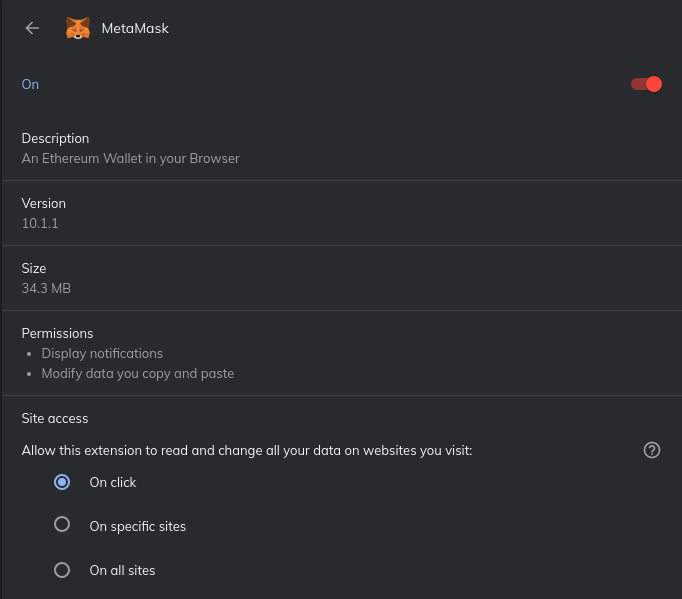
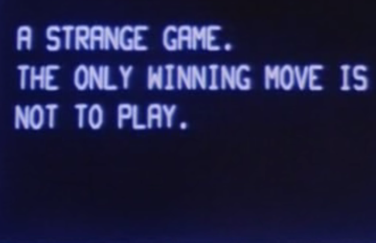

Protecting your Cryptocurrency
===============================

In 2013, James Howells accidentally `threw away his hard drive <https://www.cnbc.com/2021/01/15/uk-man-makes-last-ditch-effort-to-recover-lost-bitcoin-hard-drive.html#:~:text=LONDON%20%E2%80%94%20A%20British%20man%20who,out%20his%20home%20in%202013.>`_ containing $280 Million worth of Bitcoin. He proceeded to go to his local trash dump to try and recover it. He was unsuccessful.

Stefan Thomas had `$265 Million worth of Bitcoin <https://www.fool.com/investing/2021/06/18/the-man-who-lost-265-million/#:~:text=Many%20years%20ago%20Stefan%20Thomas,can't%20find%20his%20password.&text=Taylor%20Carmichael%20is%20a%20former%20attorney%20and%20filmmaker.>`_, and lost the password to his wallet. They are unrecoverable without it.

People have lost `their entire life savings <https://www.bbc.com/news/business-57983458>`_ to crypto-scammers.

Cryptocurrency's greatest asset, permissionlessness, is also its great weakness. Human Error is often the weakest part of any security system. Without taking proper steps to protect yourself, you could be at great risk. Investing in crypto could be like hitting the lottery someday. Don't lose your ticket. It's easy to laugh at these men and ask how they could be so careless. Their stories are not atypical. It is estimated that `nearly 4 million (out of 21 Million total) Bitcoins are irretrievably lost forever <https://decrypt.co/37171/lost-bitcoin-3-7-million-bitcoin-are-probably-gone-forever>`_. A little bit of planning, and foresight, could have saved them, and could save you.

How cryptocurrency is lost and stolen is the subject of heavy research. However, with some simple tips, you can protect yourself. I hope you pay close attention to what you're about to read, because it could save you a lot of money, and a lifetime of regret.

The risk
---------

Since sending cryptocurrency doesn't require any external users' permission, it can be easy for malicious actors to steal it. This is achieved by sending your funds to a malicious users' wallet. Once this happens, it's gone forever. This is due to the blockchain's irreversibility.

In order for someone to steal your cryptocurrency they have three options: wallet infiltration, extortion, and poor exchange security.

Wallet Security
-----------------

If you keep your coins off an exchange, then keeping them safe from intruders is paramount. The level of security is dependent on you and how many coins you are trying to secure. It's up to you but if you're protecting $1M of coins, extra precautions are probably necessary.

The first step to securing your coins is to decide how you want to store it. This is a crucial step, and so picking correctly is very important. Luckily, it's not too hard. There are several different kinds of wallet-types you can use.

Wallet Types
**************

Cold Wallet
	Cold storage is an offline wallet used for storing cryptocurrency. With cold storage, the digital wallet is stored on a platform that is not connected to the internet. This protects the wallet from unauthorized access, cyber hacks, and other vulnerabilities an internet-connected system is vulnerable to. It includes things such as Paper Wallets, to store your crypto long-term. This is similar to a long-term bank account. The cold wallet is merely a message for storing cryptocurrency keys. This means that even if you use it, you can still send cryptocurrency from somewhere else at any time. You would have to recover your cold wallet to access it afterwards however.

Hot Wallet
	A hot wallet is a piece of software, connected to the internet, used to send cryptocurrency. A hot wallet includes things like Mobile and Browser wallets, as they are readily available and pre-loaded with your encryption keys. These are recommended for cryptocurrency that you plan on spending, much like keeping cash in your physical wallet.

Mobile/Browser Wallet
	A piece of software on your phone/computer that lets you easily send cryptocurrency and interact with decentralized applications. For Bitcoin this includes applications such as `Bitcoin.com Wallet <https://wallet.bitcoin.com/>`_. For Ethereum this includes `Metamask <https://metamask.io/>`_.

Paper Wallet
	A form of cold wallet, used to store your cryptocurrency long-term. It is a physical entity that contains the instruction information needed to access your crypto in a hot wallet. It may contain your private-key, your mnemonic-seed phrase, etc. Many people write this on a piece of paper and put it somewhere secret. However, there are many products that will allow you to physically imprint it on a piece of metal, to water and fire-proof it.

Hardware Wallet
	A special kind of hot-wallet to store your crypto on a physical, and easily available, device. These are typically supplemental devices to accompany mobile/browser wallets. They store your cryptocurrency keys and are used as 2-factor-authentication devices for your cryptocurrency. Imagine a small flash-drive sized object on your keychain. When you want to send cryptocurrency, you first send a request to the device. This device has encrypted and stored your keys, and will use them to initiate your requested transaction upon confirmation. This adds an extra layer of in-person security much like google-2fa. The most popular include `Ledger Nano <https://www.ledger.com/>`_ and `Trezor Hardware Wallet <https://trezor.io/>`_.

Multi-signature Wallet
	This is a special kind of wallet, available on a variety of blockchains in different ways. It's an address that can be used to send and receive crypto. However, it requires the authorization of multiple other wallets before sending. When you send a cryptocurrency transaction, your wallet creates what's called a "digital signature", a cryptographic proof that you are the owner of certain coins. For normal wallets, this one signature is all you need to send a transaction. For multi-signature wallets this requires the input and approval of multiple addresses/wallets before initiating a transaction. This is orders of magnitude more secure because it would require an attacker infiltrating multiple wallets or extorting multiple people to steal the coins.

Attack Types
--------------

Extortion
***********

If you owned a $5M diamond, would you go around town telling everyone? Probably not, because it would put you personally at risk. Cryptocurrency works the same way. If someone robs you, no police or insurance company is going to be able to help you recover the funds.

$5 Wrench Attack
~~~~~~~~~~~~~~~~~~

.. image:: images/wrench_attack.png

Image Source: `XKCD <https://xkcd.com/538/>`_

We call this the *$5 wrench attack*. It is morbid, but also a very-real threat, and also the most painful. Luckily, it's easy to prevent, with some humility and subtlety.

Defenses:
	**1. DO NOT TELL ANYONE HOW MUCH YOU HAVE** - Do not tell your friends, people online, anyone you don't trust incredibly well how much you have. Money changes people, and you do not know what could happen. If you want, you can tell your friends you own crypto, but don't tell them how much, or what your wallet address is. It will be **HARD** to not want to gloat. You will want people to know that you were right, and hit it big. You must resist. You don't know what people are capable of, or who this information will get back to.

	**2. Fund Distribution** - Splitting your funds into multiple different wallets. Your mnemonic seed-phrase can be used to generate a large number of different addresses, all recoverable from the same key. It is a good idea to split your funds into multiple different addresses that can be recovered easily. This way, if you are wrench-attacked, you will only have to give up a small amount of your Crypto, to your attackers.

	**3. Multi-Signature Wallets** - By distributing the keys to multiple places/people you trust, you can remove your unilateral-ability to give up the funds. This would make it harder for someone to steal all the keys. Just be very careful with who you trust, and the ways they store it. Many large corporations and Non-Profit-Foundations use multi-sig wallets controlled by high ranking executives.

Ransomware
~~~~~~~~~~~~

A topic large in the news recently, ransomware is a very pervasive and *likely* threat. Attackers will demand payment in cryptocurrency, and you don't want to have to tap into your resvers in order to pay it. Avoiding ransomware is a topic that large corporations and experts have spent decades trying to educate people on. I'm not going to go into too much depth because it is outside the scope of this guide. There are a few good defense though.

Defenses:
	**1. Offline Backups** - Keep your seed phrases offline, or on an airgapped computer. An airgapped computer means one not, and typically never, connected to the internet.

	**2. Vigilance** - Be aware of the sites you go to, the things you download, etc. to prevent malware. Be sure to keep your antivirus software up to date.

Software Attacks
*****************

Malware
~~~~~~~~

Defenses:
	**1. Antivirus** - Use antivirus and keep it up to date to protect your computer.

	**2. Encrypt your seed-phrase** - If an attacker gets malware onto your computer, and is able to look through your files, one of the first things they will look for is cryptocurrency keys. Your software wallet will typically give you the option, at creation-time, to generate a file with your keys. Some applications, like MyEtherWallet, will let you use an additional password, in addition to your seed-phrase, to keep it secure. Or perhaps you are just going to keep it in a text file on your desktop. If you keep the keys on your computer, they should be encrypted in some way, with some password, to prevent attackers from stealing them.

Hot-Wallet Drive-By-attacks
~~~~~~~~~~~~~~~~~~~~~~~~~~~~~~

This is a broad topic as well, with no clear definition of what this entails. The best definition is that it is an attack that will take advantage of the browser or software-wallet to steal your funds.

Examples Include:
	**1. Clipboard Hijacking** - Websites and extensions like Metamask have access to your clipboard, where you copy things. An attacker's malicious website could alter your clipboard when you are attempting to copy an address to send crypto. If you wanted to send Ether to *vitalik.eth*, they could change it to *vitalic.eth*, a domain they own. By preying on your lack of attention to detail, they could redirect the intended funds to themselves.

	**2. Steal the key from the wallet itself** - Some websites will attempt to view your private-key and seed-phrase from Metamask. Pay close attention to the permissions these sites are asking for, and deny them if the site is sketchy.

Defenses:
	**1. Disabling metamask access by default** - For security reasons, it is suggested you alter metamask settings slightly. In your browser you should change the setting under "This can read and change site data" from *On All Sites* to *When you click the extension*. Metamask by default has this setting, which allows any website to access its features. Given that metamask can do things like view and alter things you copy, there lies the potential for drive-by attacks on malicious websites. By changing it to only have access when you click, this gives only selected sites access to metamask, when you click. This means you can choose to enable metamask only on trusted sites. This is best both for privacy and security.

	**2. Keep your wallet-software up to date** - Enable and update security-patches whenever possible.

	**3. Don't visit random and unknown websites** - Always be sure you used the correct web address when visiting.

Token Attacks
**************

Fake Token
~~~~~~~~~~~~

Anyone can create a token. It's just a smart contract. But, they can modify it to do whatever they want and don't have to disclose the source code. This has lead to a series of fake token attacks on unsuspecting users. If you use Dapps you might already have been targeted.

It works like This:
	1. The attacker creates a token with a weird name. Something you haven't heard of. They might include a link or info on the Etherscan page to get you to look it up, and fake legitimacy.
	2. They send it to you and lots of other people, typically automated list generated.
	3. It shows up in your wallet, and they wait for you to do something with it. Hopefully that you'll try to exchange it for something else on Uniswap, or send it somewhere else.
	4. Contract code activates a secret provision that transfers all of your wallet funds to themselves.

While the actual executable-code for a smart-contract is stored on the blockchain, the source code is not. The attackers take advantage of this to hide their malicious code from you,and hope you don't notice. The attackers will insert a hidden trap in their obscured-code. When you think you are transferring the tokens out of your wallet, you are actually activating the lines of code that send your entire wallet balance to them.

These can get very elaborate. I recently received one of these tokens where they had copied the entirety of a web page for another reputable token, but changed the name slightly, hoping nobody would notice. Air-dropped tokens are a thing, but are for reputable projects typically, and have a paper trail you can follow to ensure its legitimacy.

Defenses:
	**1. Do Not Engage** - Just ignore these tokens. **DO NOT** attempt to send them anywhere, approve any dapp to send them, or do anything else with it, as it will probably result in a draining of your funds.
	**2. Hide the tokens in your wallet** - If you wallet, such as Metamask, allows you to not hide certain tokens from display, then do so. Out of sight out of mind.

Dust Attack
~~~~~~~~~~~~

A dust attack is a different kind of attack. It doesn't try to steal your funds, but to identify you as the owner. It is common on many blockchains such as Bitcoin, Litecoin, Bitcoin Cash, and Dogecoin that use a `UTXO Model <https://www.investopedia.com/terms/u/utxo.asp#:~:text=UTXO%20or%20unspent%20transaction%20outputs,cash%20transaction%20at%20the%20store.>`_. At present it is not an issue with Ethereum.

This is because the value of a Bitcoin transaction is really the input from a bunch of other transactions' output. Meaning if you wanted to send someone 2 BTC, you would need to combine the amounts from a series of other transactions until the value ``>= 2``. I explain this concept in greater detail `here <https://thecryptoconundrum.net/ethereum_explained/developers_corner.html#accounts>`_.

.. image:: images/btc_tx.png

Dust is simply an incredibly small amount of cryptocurrency, sometimes in the amount of 1 satoshi (1 sat = 0.00000001 BTC). Dust is often left over in many account as a result of normal use. It comes from difficulty in properly estimating transaction fees, so that when sending out amounts you are left holding fractions of cents worth of coins. However, because this amount is so imperceptibly small, attackers can use it to their advantage. Attackers will send this dust to hundreds of thousands of addresses. Receiving anywhere from a couple of sats to a few hundred sats means that you are the victim of a dusting attack.

The idea is to send it to a variety of addresses, and wait for people to send the dust to other places, and connecting the dots. If the dust from multiple addresses is combined together into one larger address, then it makes sense the owner is the same person. Doing this on a larger scale, with a variety of information sources paints a picture. This allows the attackers to create a *web of information*, in order to deduce the identity of the owner. Once they have your identity, and your wallet address, it opens you up to a variety of other attacks such as `spearphishing <https://www.knowbe4.com/spear-phishing/#:~:text=Spear%20phishing%20is%20an%20email,attempting%20to%20steal%20confidential%20information.>`_, `ransomware <https://www.cisa.gov/stopransomware#:~:text=Ransomware%20is%20a%20form%20of,ransom%20in%20exchange%20for%20decryption.>`_ and `wrench attacks <https://thecryptoconundrum.net/investment-strategies/security.html#preventing-extortion>`_.

Defenses:
	**1. Do not engage** - Just ignore the small amounts of dust. **DO NOT USE IT** in your future transactions or attempt to send it anywhere. As the image above shows, simply not including it as the input one of your transactions is sufficient. Some wallets will allow you to flag these incoming dust transactions as *do not spend*. If available, you should turn that on.
	**2. Change addresses** - If you're worried, then you could consider changing your wallet address. Simply send all of your balance, minus the dust somewhere else.

Scams
*******

These are the ones you are most likely to be hurt by. Everybody thinks they wouldn't fall for the Nigerian Price, but if it didn't work they wouldn't use it. Nobody is going to give you free cryptocurrency. Trust nobody.

Double-Return Scam
~~~~~~~~~~~~~~~~~~~~

This is the oldest trick in the book, and yet people still fall for it everyday. It works very simply. A scam promotion advertises a "free" cryptocurrency air-drop. All you have to do it send some amount to a specific address, and they send you back twice as much. **NOBODY is ever going to be giving away cryptocurrency for free to you, just because you send it to them.** The scammers are sophisticated, and will do a lot of design to make it seem legitimate. Take this example of a fake apple-announcement from a few weeks ago.

.. image:: images/apple_scam.jpg

This scam takes advantage of your naivety, by preying on your fear of missing out. Once you send the crypto to their address, it is gone forever. It can't be rolled back like a bank transfer or anything else, and the scammers have taken off with your crypto. It is important to note, that many ICO's will use the "invest with cryptocurrency" model, by having you send them coins in exchange for their token. This is a legitimate way of investing in an ICO, but comes with the same risk of a rug-pull. That is a different issue than this, but requires a higher level of due-diligence.

**Defense** - Don't send your cryptocurrency to anyone you don't know or trust personally. Use critical thinking skills for 5-seconds before you send. If it's too good to be true, it is.

Pump and Dump
~~~~~~~~~~~~~~~

The pump and dump is a financial scam that's been present in the stock and financial world for decades. The most common way today takes two forms:
	**1.** The Shillers - Admins in chatrooms like Telegram or Discord will tell the name of a low-priced coin to their "members", often for a fee (or for free). They tell everyone to start buying the coin at whatever price they can, so the price goes through the roof, and to advertise it on social media. They make it sound like everyone will get in on the profits. In reality, these same admins already filled their bag with as much of it as possible, before telling their "cronies", only to leave them holding the bag when they sell at sky-high prices, and you to sell at a loss when the price crashes back to nothing.

	**2.** The Shilled - The people on social media being bombarded with advertisements for "THE NEXT SHIBA-INU MEMECOIN GUARANTEED 1000x MOON PROFIT". They rely on you FOMO'ing (Fear of Missing out) into the coin to drive up the price. Don't. Ignore it, and stick with your regular strategy for investing with proper DD (Due-Diligence).

Defenses:
	**1. Common sense** - Don't fall for the FOMO. This also falls under the investment rule of `being confident in your decisions <https://thecryptoconundrum.net/investment-strategies/confidence.html>`_.
	**2. Ignore the shill** - If a bot on telegram or discord invites you to their pump and dump-group, just ignore it and report the bot for spam.

The Fake Exchange
~~~~~~~~~~~~~~~~~~

Much like the Double-Return, these rely on your desire to get free stuff. Scammers will create an intricate *fake cryptocurrency-exchange"*. They'll send you a message on some platform telling you that you can get *"free 0.5 BTC when you sign up and make your first deposit"*. This is obviously false. Their plan relies on you signing up, so that they can harvest your credentials, hoping you use the same username/password on other major exchanges. They also require you to do things like first depositing the same amount you want to withdraw to ensure your legitimacy. If you do that, they will just harvest your crypto, and you will be out of luck.

Defenses:
	**1. Common Sense** - Nobody is giving out free Cryptocurrency.
	**2. Keep your guard up** - Don't give out your passwords or sensitive information to anybody.

.. image:: images/exchange_scam.png

Fake Wallets
~~~~~~~~~~~~~~

When interacting with cryptocurrency sites, always be sure to check the domain name and address closely. There exist a myriad of fake sites and applications to deceive you out of your crypto. A very successful one from earlier this year, involved a fake version of `metamask wallet <https://metamask.io>`_.

Scammers bought a Google-Ad for `a fake version of metamask <https://www.bleepingcomputer.com/news/security/metamask-phishing-steals-cryptocurrency-wallets-via-google-ads/>`_, hoping people would misinterpret it for the real one. They then recreated the interface, and waited for people to import their wallet via seed-phrase. The app would then send the credentials to the scammers, who would transfer your crypto back to themselves.

This same scam is `still occuring but on the google-play store via android apps <https://thenextweb.com/news/scam-alert-fake-metamask-app-google-play-stealing-users-ethers>`_.

Defenses:
	**1. Be extra vigilant when visiting links related to crypto** - If it's a site you visit frequently, bookmark it. Be sure to pay attention to the site when visiting and look for any changes or oddities in design.
	
	**2. Copy Links instead of typing them in** - A strategy known as *typo-squatting*, attackers could build a fake clone at *meramask.io* and wait for you to misspell the address, sending you to them and hoping you don't notice it's a fake.

Fake Customer Support
~~~~~~~~~~~~~~~~~~~~~~~

Fake support scams are all over twitter and other social media. You post a question hoping someone will help you, and a scammer pretending to be exchange or tech support offers to help. The catch, that they will ask for your seed-phrase. *If you give them your seed-phrase, they will be able to send all of your crypto, to themselves, without you*. As it says on every actual-exchange-website, "tech support will **NEVER** ask for your seed phrase".

Defenses:
	**1. NEVER GIVE YOUR SEED PHRASE TO ANYONE** - It will allow them to send crypto from your wallet on your behalf, to anyone. Actual tech support **WILL NEVER ASK FOR IT**. Applications and exchanges **DO NOT NEED IT to properly diagnose and resolve your issue**.

	**2. Tech support will not contact you** - This is especially true on social media. Be sure only to go through official channels on the exchange website or other legitimate support-channels for the application you need help with.

	**3. Hot vs. Cold Wallets** - Breaking up your crypto will ensure that scammers can't access it all at once even if your seed-phrases/keys are compromised.

Exchange Security
-------------------

This is probably the easiest, but also entails a lot of trust and risk. Much like your banking or email, use a very strong password. Do use 2-factor authentication, with an application like Google-Authenticator. If available, turn on white-list withdrawals. This means that the exchange will only allow withdrawals to predetermined, approved addresses. Use common sense to avoid phishing attacks. Follow all suggested procedures by your exchange.

Making Backups
----------------
There are hundreds, if not thousands, of stories of people losing the keys to their bitcoin, and rooting around in the trash. This is a very common problem. If you lose your keys, even with all of the computing power on earth running 24-hours a day, you would not be able to brute-force recover them, before the heat-death of the sun occurred.

That being the case, making backups is important. If you keep your keys on your computer, you should 100% keep them encrypted, and only decrypt them when you need it. Encrypted password managers like `KeePass <https://keepass.info/>`_, are great for this. Using the cloud is also on option. This can include private encrypted email addresses or cloud storage. Just make sure to encrypt it before uploading.

Consider using a paper wallet backup for any crypto-addresses you may use as well. If you're using long term-storage consider having 2 or 3 backups in various locations, stored with people and locations you trust. It is slightly more expensive, but buying a specialized metal-imprint is advised, to keep it fire and water proof. Consider buying a locked and hidden storage unit such as a safe or lock-box.

Some people have suggested getting a safe-deposit box at your local bank. This is an option, although it entails the risk of the bank locking you out of your own assets, making it worthless.

If you plan on a mix of both saving and spending, you should have one wallet meant for long-term storage, and one meant for everyday use.

This next part is a bit dark, but it **essential**. **Make sure there is someone else who knows how to access your crypt, should you be unable**. Accidents and unforseen events happen all the time. You may be saving for you and your spouse's retirement, but if you die unexpectedly, and they can't access it, it's as good as gone. Be sure to have a serious conversation with someone you trust about what to do if you were gone. Tell them where to find the keys, how to load them into a wallet, how to send it to an exchange, and how to convert it to your native currency. Then write it all down.

I'm sure this all sounds kind of paranoid and dark. It can be, to an extent. But a little planning can prevent a major catastrophe. It's no different than preventing yourself from being mugged. If you follow basic procedures and don't act stupid, you will be alright.

Closing Thoughts
------------------

Protecting yourself from scams and cyberattacks is difficult. But I think this one line from the hit 1983 move *War Games* sums it up pretty well.

Billions of Dollars, and thousands of Bitcoin, Ethereum, etc. have been lost due to poor-planning, and easily-avoidable scams. Once it is gone, it is gone forever. You will be forced to walk the earth for the remainder of your life, thinking about what could have been had you planned more carefully. Nobody wants that. I've managed to write out here a list of what I think are some of the most common attack vectors, and some ways to protect yourself. But, cybersecurity is an ever growing-field. It is a constant arms race between attackers and defenders, and the weakest link is always human error. The most way to protect yourself is simply to be vigilant. Be aware of your actions. Watch for scams and sketchy websites. Use antivirus and VPN's. A little bit of effort goes a long way.

**I am not liable for any losses you may incur through improper storage and distribution of your cryptocurrency. Invest and store at your own risk**
